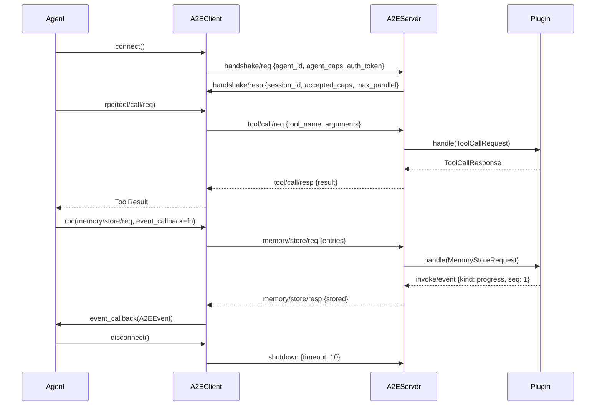

# Message Protocol

```text
a2e/caps/base/protocol.py — A2EMessage, MessageType, Handshake*, A2EError, A2EEvent
```

## Wire Format

A2E uses **NDJSON** (newline-delimited JSON) as its wire format. Each line is a self-contained JSON object representing one message. Compact JSON encoding (no extra whitespace) is used for efficiency.

```
{"a2e":"1.0","id":"a1b2c3","type":"tool/call/req","ts":1716123456.789,...}\n
{"a2e":"1.0","id":"d4e5f6","type":"tool/call/resp","ts":1716123457.012,...}\n
```

## A2EMessage Base

Every A2E message inherits from `A2EMessage` (Pydantic BaseModel):

| Field | Type | Description |
|-------|------|-------------|
| `type` | `str` | Message type identifier (e.g. `"tool/call/req"`) |
| `id` | `str` | UUID hex, auto-generated per message |
| `version` | `str` | Protocol version, always `"1.0"` |
| `ts` | `float` | Unix epoch timestamp |

Methods: `to_dict()` (serialize), `new_id()` (regenerate UUID).

## Protocol Versioning

Protocol version is `"1.0"`, described as a **strict superset of SCP 1.0** (Skill Call Protocol). Unknown message types degrade gracefully — the base type map covers SCP-compatible handshake/ping/pong/shutdown/error, and any unrecognized type falls back to a generic `A2EMessage`.

## Message Lifecycle



## Correlation

RPC requests are correlated by `req_id` — the client generates a UUID, the server copies it into the response. The client maintains a dict of `req_id -> queue.Queue`, so multiple concurrent RPCs can be in flight. Events reference their parent request via `req_id`.

## Event Streaming

`A2EEvent` (type: `invoke/event`) provides streaming mid-operation updates:

| Field | Type | Description |
|-------|------|-------------|
| `kind` | `EventKind` | `progress`, `artifact`, `log`, or `status` |
| `req_id` | `str` | Correlates to the originating request |
| `data` | `dict` | Payload (progress %, artifact content, log text, status message) |
| `seq` | `int` | Monotonic sequence number within the request |

Events are delivered before the final response, enabling progressive UI updates.

## Error Handling

`A2EError` is returned when a message cannot be processed:

| Field | Type | Description |
|-------|------|-------------|
| `req_id` | `str` | The failed request's ID |
| `code` | `A2EErrorCode` | Machine-readable error code |
| `message` | `str` | Human-readable error description |
| `detail` | `dict` | Additional structured context |
| `retryable` | `bool` | Whether the client should retry |
| `capability_name` | `str` | Which capability namespace failed |

See [Error Codes](/protocol-spec/error-codes) for the full list.

## Type Registry

Both client and server maintain a `type_registry` mapping type strings to Pydantic model classes. The base map (`A2E_BASE_TYPE_MAP`) covers core types:

| Type String | Model Class |
|------------|-------------|
| `handshake/req` | `HandshakeRequest` |
| `handshake/resp` | `HandshakeResponse` |
| `invoke/event` | `A2EEvent` |
| `ping` | `Ping` |
| `pong` | `Pong` |
| `shutdown` | `Shutdown` |
| `error` | `A2EError` |

Plugins extend this at startup by registering their own `TYPE_MAP` entries (e.g. `tool/call/req -> ToolCallRequest`).
