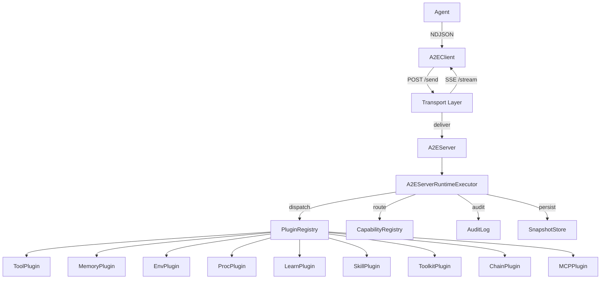

# Architecture Overview

The A2E architecture is organized into three clean layers — Protocol, Runtime, and Capability — that keep the wire format, the execution kernel, and the plugin ecosystem decoupled from each other. This separation means you can swap transports, extend capabilities, or inspect every message on the wire without touching the layers above or below.

## System Diagram



## Three-Layer Design

A2E is organized into three clean layers, each with a single responsibility:

### 1. Protocol Layer — Schemas and Messages

The wire protocol is defined entirely through Pydantic models. Every message is an `A2EMessage` with a `type` field (e.g. `tool/call/req`), a unique `id`, a protocol `version`, and a timestamp. Capability namespaces extend this base with their own request/response/event models and a `TYPE_MAP` dict that maps type strings to classes.

**Key files**: `a2e/caps/base/protocol.py`, `a2e/caps/*/protocol.py`

### 2. Runtime Layer — Server, Executor, Client

The runtime orchestrates message flow. The `A2EServer` accepts connections (HTTP or Direct), creates `Session` objects, and routes messages through the `A2EServerRuntimeExecutor`. The executor decodes NDJSON lines, dispatches to plugins based on the type registry, and sends responses back through the transport. The `A2EClient` provides an RPC interface with queue-based request correlation and event streaming.

**Key files**: `a2e/core/server/`, `a2e/core/client/`, `a2e/core/transports/`

### 3. Capability Layer — 9 Plugin Namespaces

All capability logic lives in plugins. Each namespace follows the same 3-file pattern:
- `protocol.py` — Pydantic message models + `TYPE_MAP`
- `plugin.py` — `A2EPlugin` subclass with abstract hooks
- `client.py` — High-level `*API` class wrapping `A2EClient`

**Key directories**: `a2e/caps/tools/`, `a2e/caps/memory/`, `a2e/caps/env/`, `a2e/caps/proc/`, `a2e/caps/learn/`, `a2e/caps/skills/`, `a2e/caps/toolkits/`, `a2e/caps/chains/`, `a2e/caps/mcp/`

## Key Design Patterns

### Plugin-Centric Philosophy

The host is a **thin execution kernel** — it loads, routes, and manages lifecycle. All capability-specific logic lives in dynamically loaded plugins. This means you can add new capabilities without touching the core runtime.

```python
# Plugin loading in A2EServerRuntimeExecutor._load_plugins()
mod = importlib.import_module(cls_path)       # e.g. "a2e.caps.tools.plugin"
cls = getattr(mod, class_name)                # e.g. "ToolPlugin"
plugin = cls()
plugin.setup(self, plugin_config)             # Inject config + audit_log
```

### Type Registry Pattern

Both client and server maintain a `type_registry` dict mapping `"namespace/verb"` strings to Pydantic model classes. Plugins extend this at startup via `supported_messages()`. This enables polymorphic decoding of NDJSON lines — the executor looks up the model class by the `type` field, then validates and instantiates.

### Transport Abstraction

`BaseTransport` defines `start()`, `send()`, `deliver()`, and handler slots. Two implementations:
- **DirectTransport** — in-memory queues, cross-wired for local testing and RL step loops
- **HTTPTransport** — POST /send + GET /stream (SSE) with session management, reconnection, and retry logic

### Session-Per-Connection Model

Each connection gets its own `Session` with an isolated `A2EServerRuntimeExecutor` and `DirectTransport`. HTTP mode uses `SessionManager` to create sessions on POST /session and wire SSE streams.

### RPC with Event Streaming

Client `rpc()` supports a progressive `event_callback` that receives `A2EEvent` messages (progress, artifact, log, status) before the final response. This enables streaming UI updates while waiting for long-running operations.

### Priority-Based Dispatch

Plugins declare a `priority` (int, default 0). When a message type has multiple handlers, the executor sorts by priority. **Exclusive** plugins get sole handling; non-exclusive plugins broadcast to all registered handlers.

## Opinionated Analysis

**Strengths:**
1. Clean separation of concerns — protocol, runtime, and capabilities are fully decoupled
2. Extensible without touching core — new capabilities are just plugins with a `TYPE_MAP`
3. Type-safe throughout — Pydantic v2 provides validation, serialization, and JSON schema generation
4. Transport-agnostic — the same client/server code works over HTTP or in-process
5. Audit by default — every plugin handler records timing, byte sizes, and success/error

**Risks:**
1. No authentication beyond a single `auth_token` — no OAuth, no mTLS, no RBAC
2. No test suite found in the repository — critical for a protocol implementation
3. Some cookbook tools have security issues (`python_eval_tool` uses bare `exec()`)
4. Debug artifacts in cookbook files (`pdb.set_trace()` left in `mcp_api.py`)
