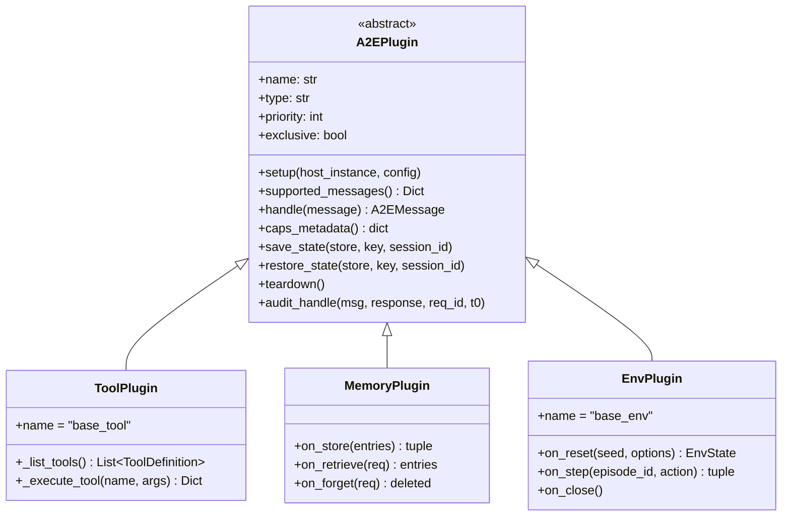
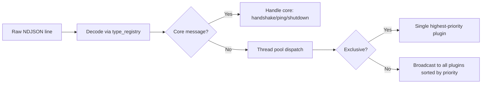

# Plugin System

```text
a2e/core/plugins/interface.py  — A2EPlugin ABC
a2e/core/plugins/registry.py   — PluginRegistry
a2e/core/plugins/schema.py     — PluginConfig, PluginMeta
a2e/core/server/executor.py    — Dynamic loading + dispatch
a2e/core/capabilities.py       — CapabilityRegistry
```

## Overview

A2E is a **plugin-centric runtime**. The host (server) is a thin execution kernel that loads, routes, and manages lifecycle. All capability-specific logic lives in plugins that are dynamically loaded from configuration.

## A2EPlugin Interface



### Class-Level Attributes

| Attribute | Type | Default | Description |
|-----------|------|---------|-------------|
| `name` | `str` | — | Unique plugin instance name |
| `type` | `str` | — | Capability type (matches `A2ECapability` enum) |
| `priority` | `int` | `0` | Higher = runs first in dispatch |
| `exclusive` | `bool` | `False` | If True, only this plugin handles its message types |

### Lifecycle Methods

| Method | Purpose |
|--------|---------|
| `setup(host_instance, config)` | Called at load time. Receives host reference and config dict. Extracts `audit_log` and `session_id` from config. |
| `supported_messages()` | **Abstract**. Returns `Dict[str, Type[BaseModel]]` mapping type strings to Pydantic model classes. |
| `handle(message)` | **Abstract**. Processes a decoded message, returns response `A2EMessage` or `None`. |
| `caps_metadata()` | Returns `{name, type, priority, exclusive}` for capability negotiation. |
| `save_state(store, key, session_id)` | Serializes plugin state to `SnapshotStore` under key `"plugin_name:key"`. |
| `restore_state(store, key, session_id)` | Restores from `SnapshotStore`. |
| `teardown()` | Lifecycle cleanup on shutdown. |

### Audit Integration

Every plugin handler should call `audit_handle(msg, response, req_id, t0)` after processing. This constructs an `AuditEntry` with:
- Timing: `duration_ms` from `t0`
- Byte sizes: `input_bytes`, `output_bytes`
- Success/error: `success` bool, `error_code` if failed

Audit failures are **caught and printed** — they never crash the plugin.

## Plugin Configuration

```yaml
plugins:
  - name: mytools          # Unique instance name
    type: tools             # Capability type
    cls: a2e.caps.tools.plugin.ToolPlugin  # Import path
    metadata:
      enabled: true
      priority: 0
      exclusive: false
      # ... plugin-specific config ...
```

**PluginConfig** fields:
| Field | Type | Description |
|-------|------|-------------|
| `name` | `str` | Unique instance name |
| `type` | `str` | Capability type string |
| `cls` | `str` | Dot-path import string |
| `metadata` | `PluginMeta` | `enabled`, `priority`, `exclusive` + extra fields |

## Dynamic Loading

The executor loads plugins at startup via `importlib`:

```python
# A2EServerRuntimeExecutor._load_plugins()
for plugin_config in config.plugins:
    if not plugin_config.metadata.enabled:
        continue
    module_path, class_name = plugin_config.cls.rsplit(".", 1)
    mod = importlib.import_module(module_path)
    cls = getattr(mod, class_name)
    plugin = cls()
    plugin.setup(self, plugin_config.metadata.model_dump())
    self._plugin_registry.register(plugin)
```

## Type Registry Building

After loading, each plugin's `supported_messages()` populates two structures:

```python
# type_registry: msg_type -> Pydantic model class
# type_to_plugins: msg_type -> sorted list of plugins (by priority)
```

This enables the executor to decode incoming NDJSON by looking up the model class, then route to the correct plugin(s).

## Message Dispatch



- **Exclusive mode**: Only the highest-priority plugin handles the message
- **Broadcast mode**: All registered plugins handle the message, sorted by priority
- Non-core messages are dispatched to a `ThreadPoolExecutor` for concurrent handling

## Plugin Registries

| Registry | Purpose | Key |
|----------|---------|-----|
| `PluginRegistry` | Name -> plugin instance | Plugin `name` |
| `CapabilityRegistry` | Capability string -> list of plugins | `A2ECapability` value |

The `CapabilityRegistry` is used during handshake to match agent-requested capabilities against loaded plugins.
