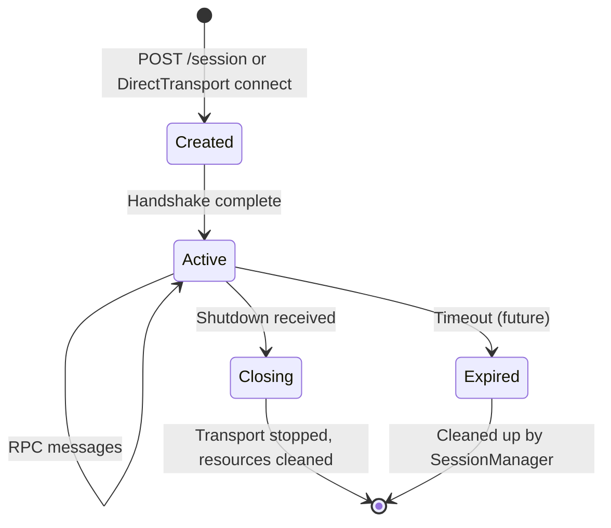

# Session Management

```text
a2e/core/server/session.py         — Session
a2e/core/server/session_manager.py — SessionManager
a2e/core/server/executor.py        — A2EServerRuntimeExecutor (per-session)
```

## Overview

Each agent connection gets its own `Session` with an isolated executor and transport. Sessions are created by `SessionManager` and persisted through the agent's lifecycle.

## Session Lifecycle



## Session Class

Each `Session` wraps:
- A **UUID** session ID (auto-generated)
- An `A2EServerRuntimeExecutor` (isolated message processing)
- A `DirectTransport` (internal communication channel)
- An `asyncio.Queue` for outbound messages (fed to SSE stream)

### Key Methods

| Method | Purpose |
|--------|---------|
| `bind_transport(transport)` | Wires executor output to the outbound queue |
| `stream()` | Async generator yielding from the outbound queue — used by the SSE endpoint |
| `close()` | Tears down executor, stops transport |

### Transport Binding

When a session binds a transport, the executor's output is wired to an `asyncio.Queue`:

```python
def bind_transport(self, transport):
    # Executor sends responses -> queue -> SSE stream
    transport.set_out_handler(lambda msg: self._outbound.put_nowait(msg))
```

This enables the HTTP SSE endpoint to yield responses as they arrive:

```python
async def stream_endpoint(session_id):
    session = session_manager.get(session_id)
    async for msg in session.stream():
        yield f"data: {msg}\n\n"
```

## SessionManager

Dict-based session storage with CRUD operations:

| Method | Returns | Description |
|--------|---------|-------------|
| `create()` | `Session` | Creates new session with fresh DirectTransport and executor |
| `get(session_id)` | `Session` or `None` | Retrieves by UUID |
| `delete(session_id)` | — | Removes and closes session |

### Session Creation (HTTP Mode)

Even in HTTP mode, the internal communication between FastAPI routes and the executor uses a `DirectTransport`:

```
Agent -> POST /send -> FastAPI route -> Session.transport.deliver(msg)
                                         -> Executor reads from transport
                                         -> Plugin.handle()
                                         -> Response -> Session.outbound queue
                                         -> SSE /stream -> Agent
```

### Session Creation (Direct Mode)

Direct mode creates two paired DirectTransports at server startup:

```python
# A2EServer._start_direct()
t_server = DirectTransport()
t_client = DirectTransport()
t_client.connect(t_server)

runtime = A2EServerRuntimeExecutor(config, transport=t_server)
runtime.start()

# Return t_client for the agent-side to use
return t_client
```

## Concurrency

- Each session's executor has its own `ThreadPoolExecutor` for non-core message dispatch
- The `asyncio.Queue` for outbound messages is thread-safe
- Multiple concurrent RPCs are supported within a session via request correlation (req_id)
