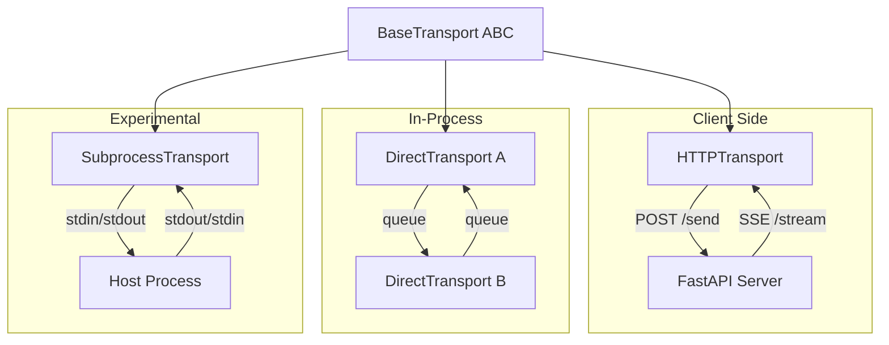

# Transport Layer

A2E decouples message delivery from message handling behind a transport abstraction. This lets you run agents over HTTP+SSE in production, DirectTransport in-process for testing and tight RL loops, or subprocess transport for sandboxed execution — all without changing a single line of agent or plugin code.

## Overview

A2E uses a **transport abstraction** to decouple message handling from the underlying communication mechanism. The `BaseTransport` ABC defines the interface, with two production implementations and one experimental.

## Component Diagram



## BaseTransport ABC

| Method | Purpose |
|--------|---------|
| `start()` | Initialize transport (async) |
| `send(msg)` | Send a message to the remote side |
| `deliver(msg)` | Queue an incoming message for the handler |
| `set_message_handler(handler)` | Set callback for incoming messages |
| `set_out_handler(handler)` | Set interceptor for outgoing messages |
| `stop()` | Graceful shutdown |

Two handler slots:
- `_handler` — Called when a message arrives from the remote side
- `_out_handler` — Called before a message is sent out (interception)

## DirectTransport

In-memory transport using two `queue.Queue(maxsize=1000)` instances. Designed for local testing, embedded execution, and RL step loops.

```python
from a2e.core.transports.direct import DirectTransport

t_server = DirectTransport()
t_client = DirectTransport()
t_client.connect(t_server)  # Cross-wires: client.out = server.in, server.out = client.in

# Each transport has a daemon reader thread that pops from _in_queue
# and invokes _handler. send() calls _out_handler directly.
```

**Key features**:
- Zero-copy in-process communication
- Queue-based backpressure (maxsize=1000)
- Daemon reader thread for async delivery
- `connect(other)` cross-wires two transports bidirectionally

## HTTPTransport

Client-side transport using HTTP POST for outgoing messages and Server-Sent Events (SSE) for incoming.

### Endpoints

| Direction | Method | Path | Description |
|-----------|--------|------|-------------|
| Outgoing | POST | `/send` | Send a message to the server |
| Incoming | GET | `/stream` | SSE stream of server responses |

### Session Management

Sessions are created via POST `/session` (or a `session_factory` callback). The session ID is sent as the `X-Session-Id` header on all subsequent requests.

### SSE Reader

A daemon thread reads the SSE stream with **exponential backoff reconnection** (max 30s delay). It parses `data:` fields from the SSE event stream and delivers them to the message handler.

### Retry Logic

| Config | Default | Description |
|--------|---------|-------------|
| `max_retries` | 3 | Maximum POST retry attempts |
| `retry_delay` | 1.0s | Base delay between retries (doubles each time) |

### Dual Mode

- **Event-driven**: Messages delivered via `_handler` callback
- **Pull mode**: Messages consumed via `lines()` iterator

### Interceptor

`set_interceptor(fn)` allows message transformation before sending (e.g. compression, signing).

## TransportConfig Factory

```yaml
transport:
  type: http
  config:
    base_url: "http://localhost:8765"
    send_path: "/send"
    stream_path: "/stream"
```

| Type | Class | Use Case |
|------|-------|----------|
| `http` | `HTTPTransport` | Network communication |
| `direct` | `DirectTransport` | In-process (injected programmatically) |
| `subprocess` | `SubprocessTransport` | Experimental — spawns host as subprocess |

```python
from a2e.core.transports import build_transport

transport = build_transport(config.transport, logger=my_logger)
```

::: warning
`DirectTransport` cannot be built from config alone — it requires programmatic `connect()` to wire the peer transport.
:::

## SubprocessTransport (Experimental)

Spawns the A2E host as a subprocess, communicating via stdin/stdout:

```python
# In a2e/experimental/core/transports/subprocess.py
class SubprocessTransport:
    def start(self, cmd=None):
        self._proc = subprocess.Popen(cmd or self._cmd, stdin=PIPE, stdout=PIPE)
        self._reader = Thread(target=self._read_loop, daemon=True)
```

- Line-buffered, thread-safe writes with lock
- `alive()` checks process status
- `stop()` sends graceful termination with 10s timeout, then kills

::: danger
SubprocessTransport is in `a2e/experimental/` — not production-ready.
:::
