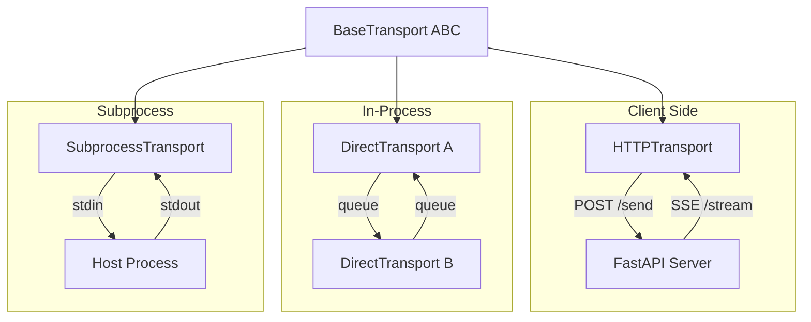

# Transport Layer

A2E decouples message delivery from message handling behind a transport abstraction. This lets you run agents over HTTP+SSE in production, DirectTransport in-process for testing and tight RL loops, or SubprocessTransport via stdin/stdout pipes for sandboxed execution — all without changing a single line of agent or plugin code.

## Overview

A2E uses a **transport abstraction** to decouple message handling from the underlying communication mechanism. The `BaseTransport` ABC defines the interface, with three implementations:

| Transport | Communication | Use Case |
|-----------|--------------|----------|
| `DirectTransport` | In-memory queue pair | Testing, RL step loops, embedded deployments |
| `HTTPTransport` | HTTP POST + SSE | Production network deployments |
| `SubprocessTransport` | stdin/stdout pipes | Subprocess host, Docker sidecars, CI/CD |

## Component Diagram



## BaseTransport ABC

| Method | Purpose |
|--------|---------|
| `start()` | Initialize transport (synchronous) |
| `send(msg)` | Send a message to the remote side |
| `deliver(msg)` | Queue an incoming message for the handler |
| `set_message_handler(handler)` | Set callback for incoming messages |
| `set_out_handler(handler)` | Set interceptor for outgoing messages |
| `alive()` | Check if transport is running |
| `stop()` | Graceful shutdown |

Two handler slots:
- `_handler` — Called when a message arrives from the remote side (via `deliver()` or reader thread)
- `_out_handler` — Called before a message is sent (interception). When unset, `send()` falls back to the internal queue wiring (for `DirectTransport`) or the subprocess pipe (for `SubprocessTransport`).

## DirectTransport

In-memory transport using two `queue.Queue(maxsize=1000)` instances. Designed for local testing, embedded execution, and RL step loops.

```python
from a2e.core.transports.direct import DirectTransport

t_server = DirectTransport(logger=logger)
t_client = DirectTransport(logger=logger)
t_server.connect(t_client)
# After connect():
#   t_server._out_queue = t_client._in_queue
#   t_client._out_queue = t_server._in_queue
```

**Key features**:
- Zero-copy in-process communication — no serialization overhead
- Queue-based backpressure (maxsize=1000, configurable)
- Daemon reader thread for async delivery
- `connect(other)` cross-wires two transports bidirectionally in one call
- `send()` priority: `_out_handler` first, then falls back to `_out_queue` (the wired peer)
- Non-blocking mode: `send(msg, block=False)` drops on queue full

### Usage pattern

```python
# Create wired pair
host_transport = DirectTransport(logger=logger)
agent_transport = DirectTransport(logger=logger)
host_transport.connect(agent_transport)

# Pass one to the host runtime, the other to the agent
executor = A2EServerRuntimeExecutor(config, host_transport, logger)
executor.start()

client = A2EClient(agent_transport, logger, agent_id="my-agent")
client.connect()
```

See `cookbook/agents/direct_agent.py` and `cookbook/servers/a2e_direct.py` for full examples.

## HTTPTransport

Client-side transport using HTTP POST for outgoing messages and Server-Sent Events (SSE) for incoming.

### Endpoints

| Direction | Method | Path | Description |
|-----------|--------|------|-------------|
| Outgoing | POST | `/send` | Send a message to the server |
| Incoming | GET | `/stream` | SSE stream of server responses |

### Session Management

Sessions are created via POST `/session` (or a `session_factory` callback). The session ID is sent as the `X-Session-Id` header on all subsequent requests.

### SSE Reader

A daemon thread reads the SSE stream with **exponential backoff reconnection** (max 30s delay). It parses `data:` fields from the SSE event stream and delivers them to the message handler.

### Retry Logic

| Config | Default | Description |
|--------|---------|-------------|
| `max_retries` | 3 | Maximum POST retry attempts |
| `retry_delay` | 1.0s | Base delay between retries (doubles each time) |

### Dual Mode

- **Event-driven**: Messages delivered via `_handler` callback
- **Pull mode**: Messages consumed via `lines()` iterator

### Interceptor

`set_interceptor(fn)` allows message transformation before sending (e.g. compression, signing).

## SubprocessTransport

Spawns an A2E host as a child process and communicates via line-delimited NDJSON over stdin/stdout pipes.

```python
from a2e.core.transports.subprocess import SubprocessTransport

transport = SubprocessTransport(
    command=["python3", "-m", "my_host_module"],
    logger=logger,
    env={"PYTHONUNBUFFERED": "1"},
    cwd="/app",
)
transport.start()
```

**Key features**:
- Thread-safe writes with write lock
- Daemon reader thread consuming stdout line-by-line
- Graceful shutdown: close stdin → wait 3s → SIGTERM → wait 2s → SIGKILL
- Custom env vars and working directory
- `alive()` checks subprocess health

### Usage pattern

```python
# Launch host as subprocess
transport = SubprocessTransport(
    command=["python3", "-c", "import sys; ..."],
    logger=logger,
)
client = A2EClient(transport, logger, agent_id="sub-agent")

client.connect()
latency = client.ping()
print(f"Session: {client._session_id}, Ping: {latency:.2f}ms")
client.disconnect()
transport.stop()
```

See `cookbook/agents/subprocess_agent.py` for a complete example.

## TransportConfig Factory

The `build_transport()` function creates a transport from configuration:

```yaml
# HTTP
transport:
  type: http
  config:
    base_url: "http://localhost:8765"
    send_path: "/send"
    stream_path: "/stream"

# Direct (must be wired programmatically — see note below)
# transport:
#   type: direct
#   config: {}

# Subprocess
# transport:
#   type: subprocess
#   config:
#     command: "python3 -c '...'"
#     env:
#       PYTHONUNBUFFERED: "1"
#     cwd: "/app"
```

| Type | Class | Use Case |
|------|-------|----------|
| `http` | `HTTPTransport` | Network communication (production) |
| `direct` | `DirectTransport` | In-process (injected programmatically) |
| `subprocess` / `stdio` | `SubprocessTransport` | stdin/stdout subprocess |

```python
from a2e.core.transports import build_transport

transport = build_transport(config.transport, logger=my_logger)
```

::: warning
`DirectTransport` cannot be built from config alone — it requires programmatic `connect()` to wire the peer transport. Use `DirectTransportConfig` directly when wiring manually.
:::

## TransportConfig Models

```python
from a2e.core.transports import (
    HTTPTransportConfig,
    DirectTransportConfig,
    SubprocessTransportConfig,
)
```

### HTTPTransportConfig

| Field | Type | Default | Description |
|-------|------|---------|-------------|
| `base_url` | `HttpUrl` | required | Base URL of A2E server |
| `send_path` | `str` | `"/send"` | POST endpoint for sending messages |
| `stream_path` | `str` | `"/stream"` | SSE endpoint for receiving messages |

### DirectTransportConfig

| Field | Type | Default | Description |
|-------|------|---------|-------------|
| *(none)* | — | — | No config needed — wired programmatically |

### SubprocessTransportConfig

| Field | Type | Default | Description |
|-------|------|---------|-------------|
| `command` | `Optional[str]` | `None` | Command to launch subprocess |
| `env` | `Optional[dict[str, str]]` | `None` | Environment variables for subprocess |
| `cwd` | `Optional[str]` | `None` | Working directory for subprocess |

## Testing

Transport tests are in `a2e/tests/unittest/`:

| Test file | Tests | Coverage |
|-----------|-------|----------|
| `test_transport_direct.py` | 47 | Init, lifecycle, connect wiring, messaging, out-handler priority, queue fallback, overflow, thread safety, edge cases |
| `test_transport_subprocess.py` | 29 | Lifecycle, send/receive, JSON/unicode/empty/very-long messages, concurrent sends, process management, error handling, SIGTERM-ignoring processes |

Both test suites run with `pytest a2e/tests/unittest/test_transport_*.py`.
