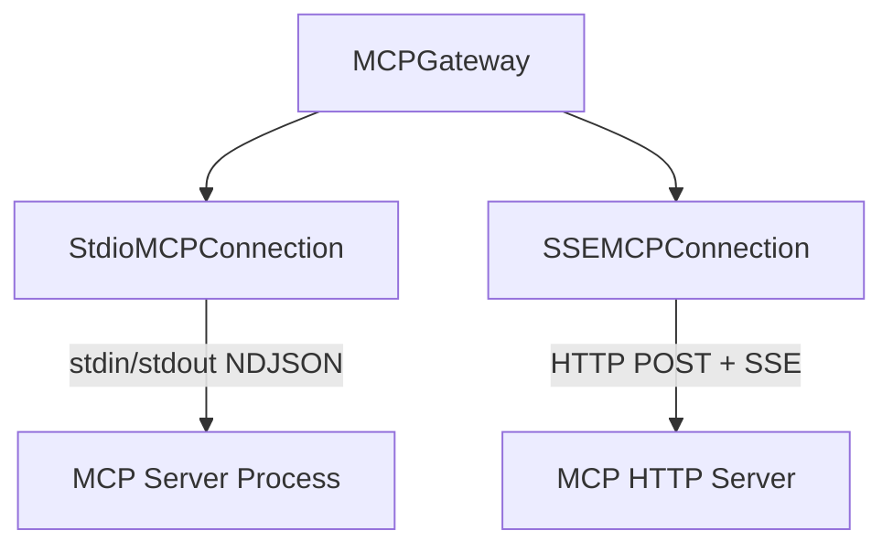

# MCP Bridge

The Model Context Protocol (MCP) is a growing ecosystem of tool servers for databases, file systems, web APIs, and more. A2E's MCP bridge makes every MCP server available as a native A2E capability — configure the server endpoint once, and the agent calls its tools through the standard `mcp/call_tool` message, no adapter code needed.

## Overview

The **MCP (Model Context Protocol) Bridge** connects A2E to the external MCP ecosystem. It acts as a gateway between A2E agents and MCP servers, exposing MCP tools, resources, and prompts through the A2E protocol.

## Protocol Messages (19 types)

| Type String | Category | Direction |
|-------------|----------|-----------|
| `mcp/server/register/req` | Server Management | Agent → Host |
| `mcp/server/register/resp` | Server Management | Host → Agent |
| `mcp/server/list/req` | Server Management | Agent → Host |
| `mcp/server/list/resp` | Server Management | Host → Agent |
| `mcp/server/unregister/req` | Server Management | Agent → Host |
| `mcp/server/unregister/resp` | Server Management | Host → Agent |
| `mcp/server/push` | Server-Initiated | Host → Agent |
| `mcp/resource/list/req` | Resources | Agent → Host |
| `mcp/resource/list/resp` | Resources | Host → Agent |
| `mcp/resource/read/req` | Resources | Agent → Host |
| `mcp/resource/read/resp` | Resources | Host → Agent |
| `mcp/resource/subscribe/req` | Resources | Agent → Host |
| `mcp/resource/subscribe/resp` | Resources | Host → Agent |
| `mcp/prompt/list/req` | Prompts | Agent → Host |
| `mcp/prompt/list/resp` | Prompts | Host → Agent |
| `mcp/prompt/get/req` | Prompts | Agent → Host |
| `mcp/prompt/get/resp` | Prompts | Host → Agent |
| `mcp/sampling/req` | Sampling | Host → Agent |
| `mcp/sampling/resp` | Sampling | Agent → Host |
| `mcp/roots/list/req` | Roots | Host → Agent |
| `mcp/roots/list/resp` | Roots | Agent → Host |

### Key Models

**MCPServerConfig**:
| Field | Type | Description |
|-------|------|-------------|
| `server_id` | `str` | Unique server identifier |
| `name` | `str` | Display name |
| `transport` | `MCPTransport` | `STDIO`, `SSE`, or `WS` |
| `cmd` | `list[str]` | Stdio command |
| `cwd` | `str` | Working directory |
| `env` | `dict` | Environment variables |
| `url` | `str` | SSE/WS URL |
| `headers` | `dict` | HTTP headers |
| `timeout` | `float` | Request timeout |
| `auto_reconnect` | `bool` | Auto-reconnect on disconnect |
| `tool_allow_list` | `list[str]` | Allowed tool names |
| `resource_allow_list` | `list[str]` | Allowed resource URIs |

**MCPResource**:
| Field | Type | Description |
|-------|------|-------------|
| `uri` | `str` | Resource URI |
| `name` | `str` | Display name |
| `description` | `str` | Description |
| `mime_type` | `str` | MIME type |
| `server_id` | `str` | Originating server |
| `annotations` | `dict` | MCP annotations |

**MCPErrorCode**: `server_not_found`, `unavailable`, `tool_not_found`, `resource_not_found`, `prompt_not_found`, `transport_error`, `protocol_error`, `sampling_refused`, `capability_missing`.

## MCPGateway

The `MCPGateway` (951 lines) is the core of the bridge. It manages a connection pool of MCP servers and provides aggregation across all connections.

### Connection Types



**MCPConnection (ABC)**: Base class with JSON-RPC 2.0 helpers, request/response correlation, caching for tools/resources/prompts.

- `call(method, params, timeout)` → JSON-RPC request
- `notify(method, params)` → JSON-RPC notification
- `_do_initialize()` → MCP handshake (initialize + initialized + cache)
- `call_tool(tool_name, arguments)` → MCP tools/call
- `read_resource(uri)` → MCP resources/read
- `get_prompt(name, arguments)` → MCP prompts/get

**StdioMCPConnection**: Spawns subprocess, NDJSON over stdin/stdout, daemon reader thread, auto-reconnect.

**SSEMCPConnection**: HTTP+SSE transport. First SSE "endpoint" event provides the POST URL. Posts JSON-RPC to that URL.

### Gateway Operations

| Method | Description |
|--------|-------------|
| `register(config)` | Create connection, connect, sync tools into host registry |
| `unregister(server_id)` | Remove tools, disconnect |
| `list_servers()` | Aggregate server info across connections |
| `list_resources()` | Aggregate resources across connections |
| `read_resource(uri)` | Route to correct connection by URI prefix |
| `list_prompts()` | Aggregate prompts across connections |
| `get_prompt(name, args)` | Route to connection with matching prompt |
| `handle_sampling_response()` | Forward agent LLM reply back to MCP server |
| `shutdown()` | Unregister all connections |

### Tool Syncing

When a server is registered, its tools are synced into the host's `ToolRegistry` with **namespaced names**: `server_id__tool_name`. The tool runner is closure-bound to the specific connection:

```python
def _sync_tools(self, conn):
    for tool in conn.tools:
        namespaced_name = f"{conn.server_id}__{tool.name}"
        self.tool_registry.register(namespaced_name, tool, runner=conn.call_tool)
```

### Push Callbacks

- `_on_push`: Forwards MCP notifications as `MCPServerPush`, re-syncs on `tools/list_changed`
- `_on_sampling`: Forwards MCP `createMessage` requests to the A2E agent
- `_on_roots_req`: Immediately responds with configured roots list

## MCPPlugin

Delegates all operations to the `MCPGateway`:

```python
class MCPPlugin(A2EPlugin):
    name = "mcp"
    priority = 10

    # 10-branch dispatcher by msg.type
    # Server: list, register, unregister
    # Resources: list, read, subscribe
    # Prompts: list, get
    # Roots: list
    # Sampling: response forwarding
```

## MCPAPI (Client)

```python
from a2e.caps.mcp.client import MCPAPI

mcp = MCPAPI(client)

# List registered servers
servers = mcp.list_servers()

# Register a new MCP server
info = mcp.register_server("my_server", MCPServerConfig(
    server_id="my_server",
    name="My Tools",
    transport="stdio",
    cmd=["python", "-m", "my_mcp_server"]
))

# List tools from a specific server
tools = mcp.list_tools("my_server")

# Find which servers provide a tool
server_names = mcp.find_tool("read_file")

# Call a tool (routes by strategy)
result = mcp.call_tool(
    tool_name="read_file",
    arguments={"path": "/data/file.txt"},
    strategy="first",
    tool_api=my_tool_api
)
```

**Tool index**: `MCPAPI` maintains `_tool_index` mapping `tool_name -> [server_names]` for routing.
