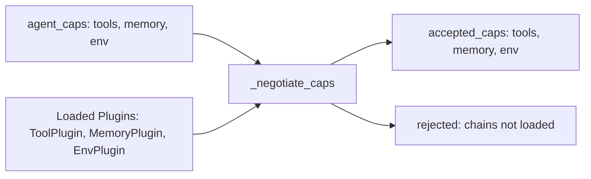

# Capability Negotiation

```text
a2e/caps/base/protocol.py — A2ECapability enum, Capability model
a2e/core/server/executor.py — _negotiate_caps()
```

## Overview

Capability negotiation occurs during the handshake. The agent declares which capabilities it wants to use (`agent_caps`), and the host matches these against its loaded plugins to produce `accepted_caps`.

## Process



1. Agent sends `agent_caps` list (e.g. `["tools", "memory", "env"]`)
2. Host looks up each capability in `CapabilityRegistry`
3. If matching plugins exist → `Capability(enabled=True)`
4. If no matching plugins → capability is omitted or `Capability(enabled=False)`
5. Response includes all negotiated results

## A2ECapability Enum

All standard capability names:

| Enum Value | String | Plugin Type | Description |
|-----------|--------|-------------|-------------|
| `SKILL` | `"skill"` | `SkillPlugin` | Sandboxed skill execution |
| `TOOLS` | `"tools"` | `ToolPlugin` | Primitive tool execution |
| `TOOLKITS` | `"toolkits"` | `ToolkitPlugin` | Tool bundle management |
| `ENV` | `"env"` | `EnvPlugin` | RL environment interaction |
| `PROC` | `"proc"` | `ProcPlugin` | Long-running process management |
| `MEMORY` | `"memory"` | `MemoryPlugin` | 3-tier memory system |
| `LEARNING` | `"learning"` | `LearnPlugin` | Feedback and adaptation |
| `CHAINS` | `"chains"` | `ChainPlugin` | DAG pipeline execution |
| `MCP` | `"mcp"` | `MCPPlugin` | MCP protocol bridge |
| `MULTI_AGENT` | `"multi_agent"` | — | Multi-agent coordination (future) |

## Negotiation Rules

1. **Agent requests, host decides**: The host only enables capabilities that have loaded plugins
2. **Plugin type mapping**: Each plugin declares a `type` field matching an `A2ECapability` value
3. **Multiple plugins per capability**: Multiple plugins can serve the same capability (priority-based dispatch)
4. **Exclusive plugins**: If a plugin is `exclusive=True`, it gets sole handling of its message types
5. **Priority ordering**: Plugins with higher `priority` are preferred for dispatch ordering

## Capability Metadata

Each `Capability` object in the response carries metadata:

```json
{
  "capability": "tools",
  "enabled": true,
  "metadata": {
    "name": "mytools",
    "type": "tools",
    "priority": 0,
    "exclusive": false
  }
}
```

## After Negotiation

Once capabilities are negotiated:
- The client builds a `_capability_map` for quick lookup
- The executor's type registry is fully populated
- Only messages for accepted capabilities will be processed
- Messages for rejected capabilities return `A2EError` with `capability_missing`

## Example

Agent requests:
```python
agent_caps = ["tools", "memory", "env", "chains"]
```

Host has loaded: `ToolPlugin`, `MemoryPlugin`, `EnvPlugin` (no `ChainPlugin`)

Result:
```python
accepted_caps = [
    Capability(capability="tools", enabled=True, metadata={...}),
    Capability(capability="memory", enabled=True, metadata={...}),
    Capability(capability="env", enabled=True, metadata={...}),
    Capability(capability="chains", enabled=False, metadata={"reason": "no plugin loaded"})
]
```
