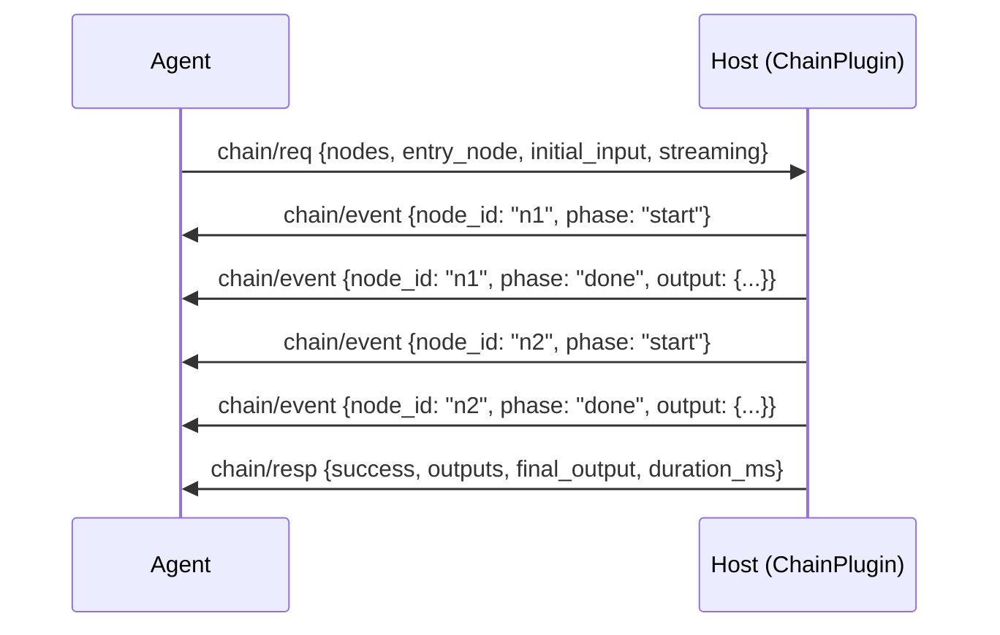

# Chains Capability Specification

## Capability Identity

| Property | Value |
|----------|-------|
| Enum | `A2ECapability.CHAINS` |
| String | `"chains"` |
| Plugin Type | `ChainPlugin` |
| Plugin Priority | `10` |
| Namespace | `chain/*` |
| Message Count | 3 |

## Overview

The **chains** capability provides multi-step skill/tool pipeline execution declared as a Directed Acyclic Graph (DAG). The host executes the chain, passing outputs from upstream nodes as inputs to downstream nodes. Chains enable complex workflow orchestration with parallel execution, conditional branching, and fan-out patterns.

**Chain node types:**
- `skill` — Invoke a skill by name
- `tool` — Call a native tool
- `proc` — Spawn a process (via proc capability)
- `branch` — Conditional fork (if/else on a JMESPath expression)
- `map` — Fan-out: apply one node to a list of items in parallel

## Protocol Flow



## Message Types (3)

### chain/req — ChainRequest

Agent → Host. Execute a skill/tool chain.

| Field | Type | Required | Default | Description |
|-------|------|----------|---------|-------------|
| `type` | `str` | Yes | `"chain/req"` | Message type identifier |
| `id` | `str` | Yes | auto UUID | Message UUID |
| `version` | `str` | Yes | `"1.0"` | Protocol version |
| `ts` | `float` | Yes | auto | Unix epoch timestamp |
| `session_id` | `str` | Yes | `""` | Session from HandshakeResponse |
| `chain_id` | `str` | No | auto hex[:8] | Chain identifier |
| `nodes` | `list[dict]` | Yes | `[]` | List of ChainNode dicts (must form valid DAG) |
| `entry_node` | `str` | Yes | `""` | node_id of the first node to execute |
| `initial_input` | `dict` | No | `{}` | Seed input available to all nodes as `$.input` |
| `correlation_id` | `str` | No | `""` | Ties to agent turn/trajectory |
| `streaming` | `bool` | No | `True` | Emit ChainEvent messages during execution |
| `timeout` | `int` | No | `300` | Chain wall-clock limit (seconds) |

### chain/event — ChainEvent

Host → Agent. Progress update during chain execution. Extends `A2EEvent`.

| Field | Type | Required | Default | Description |
|-------|------|----------|---------|-------------|
| `type` | `str` | Yes | `"chain/event"` | Message type identifier |
| `id` | `str` | Yes | auto UUID | Message UUID |
| `version` | `str` | Yes | `"1.0"` | Protocol version |
| `ts` | `float` | Yes | auto | Unix epoch timestamp |
| `req_id` | `str` | Yes | `""` | Correlates to ChainRequest ID |
| `node_id` | `str` | Yes | `""` | Which node the event pertains to |
| `phase` | `str` | Yes | `"start"` | Execution phase (see Phases below) |
| `output` | `Any` | No | `None` | Node output (populated when phase="done") |
| `error` | `str` | No | `""` | Error message (populated when phase="error") |
| `seq` | `int` | Yes | `0` | Monotonic sequence number |

**Phase values:**

| Phase | Description |
|-------|-------------|
| `start` | Node execution has begun |
| `done` | Node completed successfully |
| `skip` | Node was skipped (branch condition) |
| `error` | Node execution failed |

### chain/resp — ChainResponse

Host → Agent. Final result of the full chain.

| Field | Type | Required | Default | Description |
|-------|------|----------|---------|-------------|
| `type` | `str` | Yes | `"chain/resp"` | Message type identifier |
| `id` | `str` | Yes | auto UUID | Message UUID |
| `version` | `str` | Yes | `"1.0"` | Protocol version |
| `ts` | `float` | Yes | auto | Unix epoch timestamp |
| `req_id` | `str` | Yes | `""` | Echoes request ID |
| `chain_id` | `str` | Yes | `""` | Chain identifier |
| `success` | `bool` | Yes | `False` | Whether all nodes completed without error |
| `outputs` | `dict` | Yes | `{}` | Map of `node_id → output` for all completed nodes |
| `final_output` | `Any` | No | `None` | Output of the terminal node(s) |
| `duration_ms` | `int` | Yes | `0` | Total chain execution time |
| `nodes_run` | `int` | Yes | `0` | Number of nodes executed |
| `error` | `dict` | No | `None` | Error details if chain failed |

## Data Models

### ChainNode

| Field | Type | Required | Default | Description |
|-------|------|----------|---------|-------------|
| `node_id` | `str` | Yes | — | Unique node identifier within the chain |
| `kind` | `str` | Yes | — | Node type: `skill`, `tool`, `branch`, `map` |
| `name` | `str` | No | `""` | Skill name or tool name to invoke |
| `input` | `dict` | No | `{}` | Static input values |
| `input_map` | `dict` | No | `{}` | Input templates: keys are input field names, values are JMESPath expressions evaluated against chain context |
| `condition` | `str` | No | `""` | JMESPath boolean expression (branch nodes) |
| `true_node` | `str` | No | `""` | node_id to run if condition is True (branch) |
| `false_node` | `str` | No | `""` | node_id to run if condition is False (branch) |
| `items_path` | `str` | No | `""` | JMESPath → list to iterate (map nodes) |
| `map_node` | `str` | No | `""` | node_id to apply to each item (map nodes) |
| `next_node` | `str` | No | `""` | Default successor node_id |
| `on_error` | `str` | No | `"abort"` | Error handling: `abort`, `skip`, or a `node_id` |

## Error Codes — ChainErrorCode

| Code | Enum Value | Description | Retryable |
|------|------------|-------------|-----------|
| `chain_cycle` | `CHAIN_CYCLE` | DAG contains a cycle | No |
| `chain_node_error` | `CHAIN_NODE_ERROR` | A node execution failed | Depends |

## Execution Model

### Dependency Resolution

The chain executor uses a thread-based scheduler:

1. **Build node index**: Map `node_id → ChainNode`
2. **Track state**: `completed`, `running`, `failed` sets
3. **Evaluate readiness**: A node can run when all its dependencies (nodes that appear in its `input_map`) are in `completed`
4. **Resolve inputs**: Merge static `input` with resolved `input_map` values
5. **Parallel execution**: Ready nodes spawn on daemon threads
6. **Poll loop**: Check for newly-ready nodes every 10ms

### Node Execution Types

| Kind | Execution |
|------|-----------|
| `tool` | Calls `host.tool_registry.get(name).runner(input, callback)` |
| `proc` | Spawns process via `host.get_plugin("proc")`, blocks until completion |
| `skill` | Calls skill execution (requires skill capability) |

### Terminal Node Detection

A node is "terminal" if no other node lists it as a dependency. The last terminal node's output becomes `final_output`.

## Wire Examples

### Simple Linear Chain

```json
{"type":"chain/req","id":"c1","version":"1.0","ts":1716123456.789,"session_id":"s1","chain_id":"abc123","nodes":[{"node_id":"read","kind":"tool","name":"read_file","input":{"path":"/data/input.txt"},"input_map":{},"next_node":"summarize","on_error":"abort"},{"node_id":"summarize","kind":"skill","name":"text_summarizer","input":{},"input_map":{"text":"read.output"},"on_error":"abort"}],"entry_node":"read","initial_input":{},"streaming":true,"timeout":300}
```

### Branch Node

```json
{"node_id":"check","kind":"branch","condition":"length(output.items) > `0`","true_node":"process","false_node":"skip_log"}
```

### Map Node (Fan-out)

```json
{"node_id":"batch","kind":"map","items_path":"input.files","map_node":"process_file"}
```

## Security Considerations

1. **Cycle detection**: Host must validate DAG before execution (reject cycles)
2. **Node count limits**: Host should enforce maximum nodes per chain
3. **Timeout enforcement**: Chain-level timeout prevents infinite execution
4. **Error propagation**: `on_error` policy determines how node failures affect downstream nodes
5. **Thread isolation**: Node execution runs in daemon threads; chain timeout can kill stuck threads
