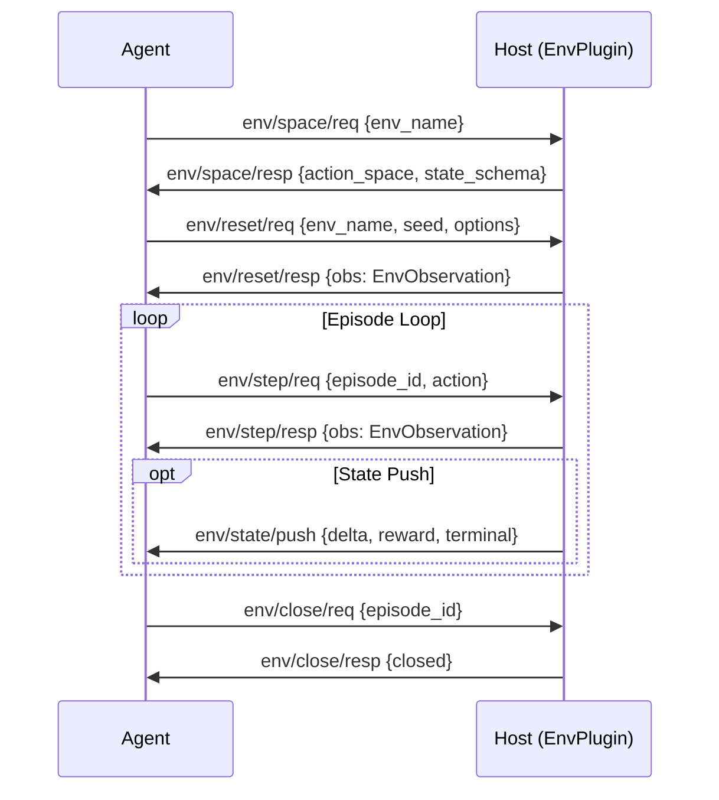

# Environment Capability Specification

## Capability Identity

| Property | Value |
|----------|-------|
| Enum | `A2ECapability.ENV` |
| String | `"env"` |
| Plugin Type | `EnvPlugin` |
| Namespace | `env/*` |
| Message Count | 15 |

## Overview

The **environment** capability provides RL-style (Reinforcement Learning) step-wise interaction between Agent and Environment. It defines the core primitives for agentic loops: reset an episode, take a step, observe state, and receive rewards.

**Core primitives:**
- `reset` — Initialize a new episode, return initial state
- `step` — Execute action, receive (next_state, reward, done, info)
- `observe` — Read-only current state without acting

**Extended primitives:**
- `close` — Terminate an episode early
- `spaces` — Discover action/state space definitions
- `render` — Retrieve visual/multimodal representation
- `plan` — Get environment-suggested affordances/actions
- `batch_step` — Execute multiple steps in parallel

**Server-initiated:**
- `state/push` — Incremental state update pushed to agent

**Cross-capability integration:**
- Each `env/step` interaction can be auto-recorded as an (s, a, r, s', done) tuple in the ExperienceBuffer
- Reward signals can be forwarded to the learning subsystem (`learn/*`)
- Enables RL training loops, simulations, and CUA/browser environments

## Protocol Flow



## Message Types (15)

### Reset (2)

#### env/reset/req — EnvResetRequest

Agent → Host. Initialize a new episode.

| Field | Type | Required | Default | Description |
|-------|------|----------|---------|-------------|
| `type` | `str` | Yes | `"env/reset/req"` | Message type |
| `id` | `str` | Yes | auto | Message UUID |
| `version` | `str` | Yes | `"1.0"` | Protocol version |
| `ts` | `float` | Yes | auto | Timestamp |
| `env_name` | `str` | Yes | — | Environment identifier |
| `seed` | `int` | No | `None` | Random seed for reproducibility |
| `options` | `dict[str, Any]` | No | `{}` | Environment-specific options |

#### env/reset/resp — EnvResetResponse

Host → Agent. Returns initial observation.

| Field | Type | Required | Default | Description |
|-------|------|----------|---------|-------------|
| `type` | `str` | Yes | `"env/reset/resp"` | Message type |
| `id` | `str` | Yes | auto | Message UUID |
| `version` | `str` | Yes | `"1.0"` | Protocol version |
| `ts` | `float` | Yes | auto | Timestamp |
| `req_id` | `str` | Yes | `""` | Echoes request ID |
| `obs` | `EnvObservation` | Yes | — | Initial observation |

### Step (2) — Core RL Primitive

#### env/step/req — EnvStepRequest

Agent → Host. Execute an action in the environment.

| Field | Type | Required | Default | Description |
|-------|------|----------|---------|-------------|
| `type` | `str` | Yes | `"env/step/req"` | Message type |
| `id` | `str` | Yes | auto | Message UUID |
| `version` | `str` | Yes | `"1.0"` | Protocol version |
| `ts` | `float` | Yes | auto | Timestamp |
| `episode_id` | `str` | Yes | — | Active episode identifier |
| `action` | `dict[str, Any]` | Yes | — | Action to execute |

#### env/step/resp — EnvStepResponse

Host → Agent. Returns observation after action.

| Field | Type | Required | Default | Description |
|-------|------|----------|---------|-------------|
| `type` | `str` | Yes | `"env/step/resp"` | Message type |
| `id` | `str` | Yes | auto | Message UUID |
| `version` | `str` | Yes | `"1.0"` | Protocol version |
| `ts` | `float` | Yes | auto | Timestamp |
| `req_id` | `str` | Yes | `""` | Echoes request ID |
| `obs` | `EnvObservation` | Yes | — | Post-action observation |

### Observe (2) — Read-only State

#### env/observe/req — EnvObserveRequest

Agent → Host. Retrieve current state without acting.

| Field | Type | Required | Default | Description |
|-------|------|----------|---------|-------------|
| `type` | `str` | Yes | `"env/observe/req"` | Message type |
| `id` | `str` | Yes | auto | Message UUID |
| `version` | `str` | Yes | `"1.0"` | Protocol version |
| `ts` | `float` | Yes | auto | Timestamp |
| `episode_id` | `str` | Yes | — | Episode to observe |

#### env/observe/resp — EnvObserveResponse

Host → Agent. Returns current observation.

| Field | Type | Required | Default | Description |
|-------|------|----------|---------|-------------|
| `type` | `str` | Yes | `"env/observe/resp"` | Message type |
| `id` | `str` | Yes | auto | Message UUID |
| `version` | `str` | Yes | `"1.0"` | Protocol version |
| `ts` | `float` | Yes | auto | Timestamp |
| `req_id` | `str` | Yes | `""` | Echoes request ID |
| `obs` | `EnvObservation` | Yes | — | Current observation |

### Close (2) — End Episode

#### env/close/req — EnvCloseRequest

Agent → Host. Terminate an episode early.

| Field | Type | Required | Default | Description |
|-------|------|----------|---------|-------------|
| `type` | `str` | Yes | `"env/close/req"` | Message type |
| `id` | `str` | Yes | auto | Message UUID |
| `version` | `str` | Yes | `"1.0"` | Protocol version |
| `ts` | `float` | Yes | auto | Timestamp |
| `episode_id` | `str` | Yes | — | Episode to close |

#### env/close/resp — EnvCloseResponse

Host → Agent.

| Field | Type | Required | Default | Description |
|-------|------|----------|---------|-------------|
| `type` | `str` | Yes | `"env/close/resp"` | Message type |
| `id` | `str` | Yes | auto | Message UUID |
| `version` | `str` | Yes | `"1.0"` | Protocol version |
| `ts` | `float` | Yes | auto | Timestamp |
| `closed` | `bool` | Yes | `True` | Whether close succeeded |

### Spaces (2) — Action/State Discovery

#### env/space/req — EnvSpacesRequest

Agent → Host. Discover action and state space definitions.

| Field | Type | Required | Default | Description |
|-------|------|----------|---------|-------------|
| `type` | `str` | Yes | `"env/space/req"` | Message type |
| `id` | `str` | Yes | auto | Message UUID |
| `version` | `str` | Yes | `"1.0"` | Protocol version |
| `ts` | `float` | Yes | auto | Timestamp |
| `env_name` | `str` | Yes | — | Environment identifier |

#### env/space/resp — EnvSpacesResponse

Host → Agent.

| Field | Type | Required | Default | Description |
|-------|------|----------|---------|-------------|
| `type` | `str` | Yes | `"env/space/resp"` | Message type |
| `id` | `str` | Yes | auto | Message UUID |
| `version` | `str` | Yes | `"1.0"` | Protocol version |
| `ts` | `float` | Yes | auto | Timestamp |
| `action_space` | `dict[str, Any]` | Yes | — | JSON Schema defining valid actions |
| `state_schema` | `dict[str, Any]` | Yes | — | JSON Schema defining state structure |

### Render (2) — Multimodal Support

#### env/render/req — EnvRenderRequest

Agent → Host. Retrieve visual/multimodal representation of current state.

| Field | Type | Required | Default | Description |
|-------|------|----------|---------|-------------|
| `type` | `str` | Yes | `"env/render/req"` | Message type |
| `id` | `str` | Yes | auto | Message UUID |
| `version` | `str` | Yes | `"1.0"` | Protocol version |
| `ts` | `float` | Yes | auto | Timestamp |
| `episode_id` | `str` | Yes | — | Episode to render |
| `mode` | `str` | No | `"screenshot"` | Render mode: `screenshot`, `rgb_array`, `text` |

#### env/render/resp — EnvRenderResponse

Host → Agent.

| Field | Type | Required | Default | Description |
|-------|------|----------|---------|-------------|
| `type` | `str` | Yes | `"env/render/resp"` | Message type |
| `id` | `str` | Yes | auto | Message UUID |
| `version` | `str` | Yes | `"1.0"` | Protocol version |
| `ts` | `float` | Yes | auto | Timestamp |
| `render` | `Any` | Yes | — | Rendered output (bytes, base64, or structured) |

### Plan (2) — Affordance Discovery

#### env/plan/req — EnvPlanRequest

Agent → Host. Get environment-suggested actions.

| Field | Type | Required | Default | Description |
|-------|------|----------|---------|-------------|
| `type` | `str` | Yes | `"env/plan/resp"` | Message type (note: shares resp value) |
| `id` | `str` | Yes | auto | Message UUID |
| `version` | `str` | Yes | `"1.0"` | Protocol version |
| `ts` | `float` | Yes | auto | Timestamp |
| `episode_id` | `str` | No | `None` | Optional episode context |
| `state` | `dict[str, Any]` | No | `None` | Optional state context |

#### env/plan/resp — EnvPlanResponse

Host → Agent.

| Field | Type | Required | Default | Description |
|-------|------|----------|---------|-------------|
| `type` | `str` | Yes | `"env/plan/resp"` | Message type |
| `id` | `str` | Yes | auto | Message UUID |
| `version` | `str` | Yes | `"1.0"` | Protocol version |
| `ts` | `float` | Yes | auto | Timestamp |
| `suggested_actions` | `list[dict[str, Any]]` | Yes | `[]` | Suggested actions with descriptions |

### Batch Step (2) — Parallel Execution

#### env/batch_step/req — EnvBatchStepRequest

Agent → Host. Execute multiple actions in parallel across episodes.

| Field | Type | Required | Default | Description |
|-------|------|----------|---------|-------------|
| `type` | `str` | Yes | `"env/batch_step/req"` | Message type |
| `id` | `str` | Yes | auto | Message UUID |
| `version` | `str` | Yes | `"1.0"` | Protocol version |
| `ts` | `float` | Yes | auto | Timestamp |
| `episode_ids` | `list[str]` | Yes | — | Episode identifiers |
| `actions` | `list[dict[str, Any]]` | Yes | — | Actions (1:1 with episode_ids) |

#### env/batch_step/resp — EnvBatchStepResponse

Host → Agent.

| Field | Type | Required | Default | Description |
|-------|------|----------|---------|-------------|
| `type` | `str` | Yes | `"env/batch_step/resp"` | Message type |
| `id` | `str` | Yes | auto | Message UUID |
| `version` | `str` | Yes | `"1.0"` | Protocol version |
| `ts` | `float` | Yes | auto | Timestamp |
| `results` | `list[EnvStepResponse]` | Yes | — | Results (1:1 with request) |

### State Push (1) — Server-initiated

#### env/state/push — EnvStatePush

Host → Agent (server-initiated). Incremental environment state update.

| Field | Type | Required | Default | Description |
|-------|------|----------|---------|-------------|
| `type` | `str` | Yes | `"env/state/push"` | Message type |
| `id` | `str` | Yes | auto | Message UUID |
| `version` | `str` | Yes | `"1.0"` | Protocol version |
| `ts` | `float` | Yes | auto | Timestamp |
| `episode_id` | `str` | Yes | — | Episode identifier |
| `step_id` | `int` | Yes | — | Step number |
| `action_id` | `str` | No | `None` | Tie to specific EnvAction |
| `event_type` | `str` | Yes | — | `Observation`, `tool_result`, `status`, `error` |
| `reason` | `str` | No | `""` | Reason: `"proc_exit"`, `"oom_warning"`, etc. |
| `delta` | `dict[str, Any]` | No | `{}` | Sparse diff (only changed fields) |
| `reward` | `float` | No | `None` | Optional reward signal |
| `reward_info` | `dict` | No | `{}` | Additional reward metadata |
| `terminal` | `bool` | No | `False` | Marks episode termination |

**State push use cases:**
- Async tool completion
- External world changes (filesystem, browser DOM)
- Long-running process updates
- Safety/system signals (OOM, timeout)

## Data Models

### EnvState

Flexible state container with `extra="allow"` — accepts any fields the environment provides.

### EnvObservation

| Field | Type | Required | Default | Description |
|-------|------|----------|---------|-------------|
| `episode_id` | `str` | Yes | — | Episode this observation belongs to |
| `step_num` | `int` | Yes | — | Step number within episode |
| `state` | `EnvState` | Yes | — | Environment state |
| `done` | `bool` | No | `False` | Episode is complete |
| `truncated` | `bool` | No | `False` | Episode was truncated (time limit) |
| `reward` | `float` | No | `0.0` | Reward signal |
| `created_at` | `float` | No | auto | Observation timestamp |
| `metadata` | `dict[str, Any]` | No | `{}` | Additional metadata |

### EnvAction

| Field | Type | Required | Default | Description |
|-------|------|----------|---------|-------------|
| `action_type` | `str` | Yes | — | Action type identifier |
| `payload` | `dict[str, Any]` | No | `{}` | Action payload |
| `metadata` | `dict[str, Any]` | No | `{}` | Additional metadata |

### EnvEvent

| Field | Type | Required | Default | Description |
|-------|------|----------|---------|-------------|
| `event_id` | `str` | No | auto UUID | Event identifier |
| `type` | `str` | Yes | — | Event type |
| `episode_id` | `str` | Yes | — | Episode context |
| `step_id` | `int` | Yes | — | Step context |
| `action_id` | `str` | No | `None` | Tie to EnvAction |
| `payload` | `dict[str, Any]` | No | `{}` | Event payload |
| `timestamp` | `float` | No | auto | Event timestamp |
| `metadata` | `dict[str, Any]` | No | `{}` | Additional metadata |

## Error Codes — EnvErrorCode

| Code | Enum Value | Description | Retryable |
|------|------------|-------------|-----------|
| `runtime_error` | `RUNTIME_ERROR` | General runtime failure | Depends |
| `unknown_action` | `UNKNOWN_ACTION` | Action type not recognized | No |
| `reset_denied` | `RESET_DENIED` | Environment refused reset | No |

## Wire Examples

### Reset and Step Loop

```json
{"type":"env/reset/req","id":"er1","version":"1.0","ts":1716123456.789,"env_name":"browser","seed":42,"options":{"url":"https://example.com"}}
```

```json
{"type":"env/reset/resp","id":"er2","version":"1.0","ts":1716123457.100,"req_id":"er1","obs":{"episode_id":"ep_abc","step_num":0,"state":{"url":"https://example.com","title":"Example"},"done":false,"truncated":false,"reward":0.0}}
```

```json
{"type":"env/step/req","id":"es1","version":"1.0","ts":1716123458.100,"episode_id":"ep_abc","action":{"action_type":"click","payload":{"selector":"#button"}}}
```

```json
{"type":"env/step/resp","id":"es2","version":"1.0","ts":1716123458.500,"req_id":"es1","obs":{"episode_id":"ep_abc","step_num":1,"state":{"url":"https://example.com/result","title":"Result"},"done":false,"truncated":false,"reward":1.0}}
```

### State Push (Server-initiated)

```json
{"type":"env/state/push","id":"sp1","version":"1.0","ts":1716123459.100,"episode_id":"ep_abc","step_id":1,"action_id":"act_1","event_type":"tool_result","reason":"proc_exit","delta":{"stdout":"done"},"reward":0.5,"terminal":false}
```

## Security Considerations

1. **Episode isolation**: Episodes must be scoped to prevent cross-session leakage
2. **Action validation**: Actions must conform to action_space schema
3. **State push gating**: Only emitted if agent negotiated `env_push` capability
4. **Batch limits**: Host should enforce maximum batch_step size
5. **Reward signal integrity**: Reward values must not be tamperable by the agent
