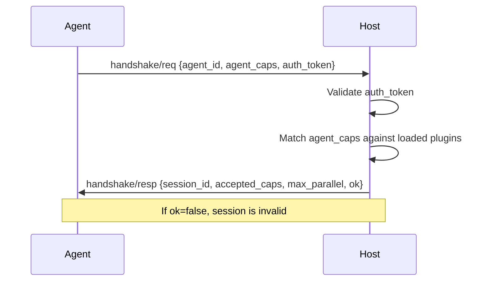

# Handshake

```text
a2e/caps/base/protocol.py — HandshakeRequest, HandshakeResponse, A2ECapability
```

## Overview

The handshake is the **first message exchange** in any A2E session. The agent sends a `HandshakeRequest`, and the host responds with a `HandshakeResponse` that includes capability negotiation results.

## Flow



## HandshakeRequest

| Field | Type | Required | Description |
|-------|------|----------|-------------|
| `type` | `str` | Yes | `"handshake/req"` |
| `id` | `str` | Yes | Request UUID |
| `a2e` | `str` | Yes | `"1.0"` |
| `ts` | `float` | Yes | Timestamp |
| `agent_id` | `str` | Yes | Agent identifier |
| `agent_caps` | `list[str]` | Yes | Requested capability names |
| `auth_token` | `str` | Yes | Authentication token |

### agent_caps Values

Must be a subset of the `A2ECapability` enum values:

| Value | Capability |
|-------|-----------|
| `"skill"` | Skill execution |
| `"tools"` | Tool execution |
| `"toolkits"` | Toolkit management |
| `"env"` | RL environment |
| `"proc"` | Process management |
| `"memory"` | Memory operations |
| `"learning"` | Learning/feedback |
| `"chains"` | Chain pipeline execution |
| `"mcp"` | MCP bridge |
| `"multi_agent"` | Multi-agent coordination (future) |

## HandshakeResponse

| Field | Type | Required | Description |
|-------|------|----------|-------------|
| `type` | `str` | Yes | `"handshake/resp"` |
| `id` | `str` | Yes | Response UUID |
| `a2e` | `str` | Yes | `"1.0"` |
| `ts` | `float` | Yes | Timestamp |
| `req_id` | `str` | Yes | Echoes request ID |
| `session_id` | `str` | Yes | New session UUID |
| `accepted_caps` | `list[Capability]` | Yes | Negotiated capabilities |
| `max_parallel` | `int` | Yes | Max concurrent RPCs (default: 4) |
| `ok` | `bool` | Yes | Whether handshake succeeded |
| `reason` | `str` | No | Failure reason if `ok=false` |

### Capability Object

| Field | Type | Description |
|-------|------|-------------|
| `capability` | `A2ECapability` | Capability name |
| `enabled` | `bool` | Whether this capability is available |
| `metadata` | `dict` | Capability-specific metadata |

## Rejection Reasons

| Reason | Description |
|--------|-------------|
| `"auth_failed"` | Invalid auth_token |
| `"version_mismatch"` | Incompatible protocol version |
| `"no_caps"` | No requested capabilities are available |
| `"server_error"` | Internal server error |

## Example

```json
{"a2e":"1.0","type":"handshake/req","id":"a1b2c3d4","ts":1716123456.789,"agent_id":"my-agent","agent_caps":["tools","memory","env"],"auth_token":"dev-secret"}
```

```json
{"a2e":"1.0","type":"handshake/resp","id":"e5f6g7h8","ts":1716123456.890,"req_id":"a1b2c3d4","session_id":"s1k2l3m4","accepted_caps":[{"capability":"tools","enabled":true,"metadata":{}},{"capability":"memory","enabled":true,"metadata":{}},{"capability":"env","enabled":true,"metadata":{}}],"max_parallel":4,"ok":true}
```
