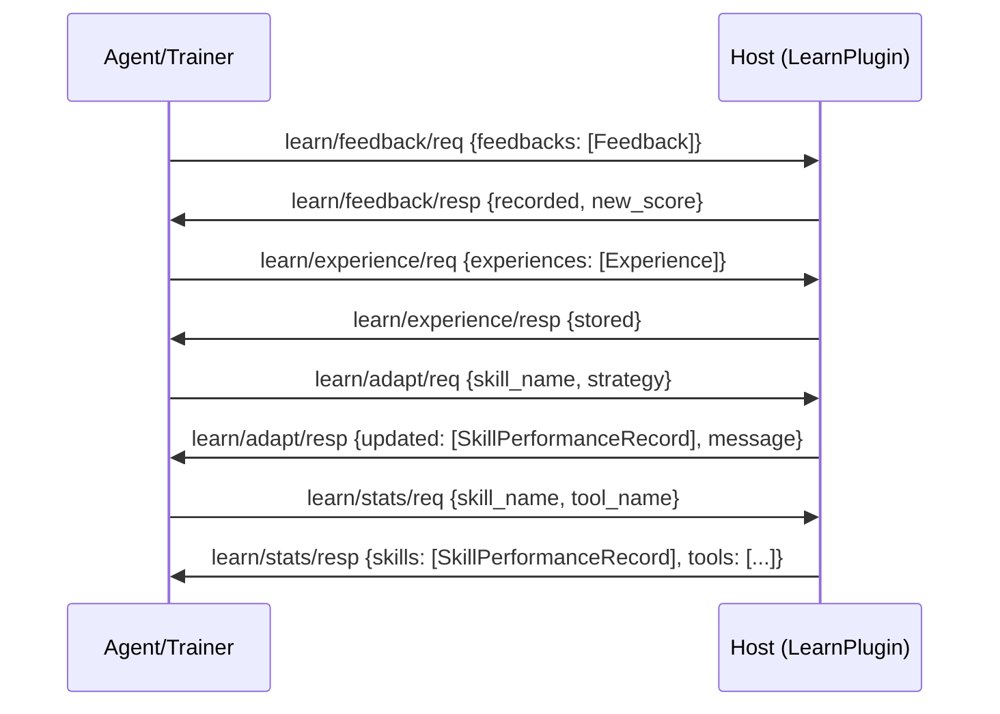

# Learning Capability Specification

## Capability Identity

| Property | Value |
|----------|-------|
| Enum | `A2ECapability.LEARNING` |
| String | `"learning"` |
| Plugin Type | `LearnPlugin` |
| Namespace | `learn/*` |
| Message Count | 8 |

## Overview

The **learning** capability provides the agent's feedback, experience replay, and adaptive routing subsystem. It enables three core primitives:

1. **feedback** — Human or environment reward signals attached to agent turns
2. **experience** — Store (state, action, reward, next_state, done) tuples for RL-style replay
3. **adapt** — Request that the host updates skill routing weights based on accumulated data
4. **stats** — Query performance statistics for skills and tools

**Cross-capability integration:**
- `env/step` reward signals can be auto-forwarded to `learn/feedback`
- Experience tuples can be auto-recorded from `env/step` interactions
- Adapt results influence skill selection in `skill/discover`

## Protocol Flow



## Message Types (8)

### Feedback (2)

#### learn/feedback/req — LearnFeedbackRequest

Agent (or external trainer) → Host. Submit feedback signals.

| Field | Type | Required | Default | Description |
|-------|------|----------|---------|-------------|
| `type` | `str` | Yes | `"learn/feedback/req"` | Message type |
| `id` | `str` | Yes | auto | Message UUID |
| `version` | `str` | Yes | `"1.0"` | Protocol version |
| `ts` | `float` | Yes | auto | Timestamp |
| `feedbacks` | `list[Feedback]` | Yes | — | List of feedback signals |

#### learn/feedback/resp — LearnFeedbackResponse

Host → Agent.

| Field | Type | Required | Default | Description |
|-------|------|----------|---------|-------------|
| `type` | `str` | Yes | `"learn/feedback/resp"` | Message type |
| `id` | `str` | Yes | auto | Message UUID |
| `version` | `str` | Yes | `"1.0"` | Protocol version |
| `ts` | `float` | Yes | auto | Timestamp |
| `req_id` | `str` | Yes | `""` | Echoes request ID |
| `recorded` | `int` | Yes | `0` | Number of feedbacks recorded |
| `new_score` | `float` or `None` | No | `None` | Updated running skill score if available |

### Experience (2)

#### learn/experience/req — LearnExperienceRequest

Agent → Host. Store experience tuples for later replay.

| Field | Type | Required | Default | Description |
|-------|------|----------|---------|-------------|
| `type` | `str` | Yes | `"learn/experience/req"` | Message type |
| `id` | `str` | Yes | auto | Message UUID |
| `version` | `str` | Yes | `"1.0"` | Protocol version |
| `ts` | `float` | Yes | auto | Timestamp |
| `experiences` | `list[Experience]` | No | `[]` | Experience tuples to store |

#### learn/experience/resp — LearnExperienceResponse

Host → Agent.

| Field | Type | Required | Default | Description |
|-------|------|----------|---------|-------------|
| `type` | `str` | Yes | `"learn/experience/resp"` | Message type |
| `id` | `str` | Yes | auto | Message UUID |
| `version` | `str` | Yes | `"1.0"` | Protocol version |
| `ts` | `float` | Yes | auto | Timestamp |
| `req_id` | `str` | Yes | `""` | Echoes request ID |
| `stored` | `int` | Yes | `0` | Number of experiences stored |

### Adapt (2) — Online Fine-tuning Hook

#### learn/adapt/req — LearnAdaptRequest

Agent → Host. Request that the host updates skill routing weights based on accumulated feedback and experiences.

| Field | Type | Required | Default | Description |
|-------|------|----------|---------|-------------|
| `type` | `str` | Yes | `"learn/adapt/req"` | Message type |
| `id` | `str` | Yes | auto | Message UUID |
| `version` | `str` | Yes | `"1.0"` | Protocol version |
| `ts` | `float` | Yes | auto | Timestamp |
| `skill_name` | `str` | No | `""` | Specific skill (empty = adapt all) |
| `strategy` | `str` | No | `"ucb1"` | Adaptation strategy (see below) |

**Adaptation strategies:**

| Strategy | Description |
|----------|-------------|
| `ucb1` | Upper Confidence Bound — balances exploration/exploitation |
| `epsilon_greedy` | Epsilon-greedy — mostly exploit, occasionally explore |
| `softmax` | Softmax/Boltzmann — probability proportional to value |
| `custom` | Host-defined custom strategy |

#### learn/adapt/resp — LearnAdaptResponse

Host → Agent.

| Field | Type | Required | Default | Description |
|-------|------|----------|---------|-------------|
| `type` | `str` | Yes | `"learn/adapt/resp"` | Message type |
| `id` | `str` | Yes | auto | Message UUID |
| `version` | `str` | Yes | `"1.0"` | Protocol version |
| `ts` | `float` | Yes | auto | Timestamp |
| `req_id` | `str` | Yes | `""` | Echoes request ID |
| `updated` | `list[dict]` | Yes | `[]` | List of updated SkillPerformanceRecords |
| `message` | `str` | Yes | `""` | Human-readable status message |

### Stats (2) — Performance Query

#### learn/stats/req — LearnStatsRequest

Agent → Host. Query performance statistics for skills and tools.

| Field | Type | Required | Default | Description |
|-------|------|----------|---------|-------------|
| `type` | `str` | Yes | `"learn/stats/req"` | Message type |
| `id` | `str` | Yes | auto | Message UUID |
| `version` | `str` | Yes | `"1.0"` | Protocol version |
| `ts` | `float` | Yes | auto | Timestamp |
| `skill_name` | `str` | No | `""` | Filter by skill (empty = all) |
| `tool_name` | `str` | No | `""` | Filter by tool (empty = all) |

#### learn/stats/resp — LearnStatsResponse

Host → Agent.

| Field | Type | Required | Default | Description |
|-------|------|----------|---------|-------------|
| `type` | `str` | Yes | `"learn/stats/resp"` | Message type |
| `id` | `str` | Yes | auto | Message UUID |
| `version` | `str` | Yes | `"1.0"` | Protocol version |
| `ts` | `float` | Yes | auto | Timestamp |
| `req_id` | `str` | Yes | `""` | Echoes request ID |
| `skills` | `list[dict]` | Yes | `[]` | List of SkillPerformanceRecords |
| `tools` | `list[dict]` | Yes | `[]` | List of tool performance records |

## Data Models

### Feedback

A single feedback signal attached to an agent turn or skill call.

| Field | Type | Required | Default | Description |
|-------|------|----------|---------|-------------|
| `feedback_id` | `str` | No | auto (`b_{ns}`) | Unique feedback identifier |
| `correlation_id` | `str` | No | `""` | Ties to agent turn |
| `session_id` | `str` | No | `""` | Session identifier |
| `rated_turn` | `RatedTurn` | No | `None` | The turn that was rated |
| `polarity` | `FeedbackPolarity` | Yes | — | Signal polarity |
| `score` | `float` | No | `0.0` | Normalized score: -1.0 to +1.0 |
| `dimension` | `FeedbackDimension` | No | `HELPFULNESS` | Rating dimension |
| `confidence` | `float` | No | `1.0` | Confidence weight (0.0-1.0) |
| `comment` | `str` | No | `""` | Human-readable comment |
| `correction` | `str` | No | `""` | Required for CORRECTIVE polarity |
| `correction_span` | `tuple[int, int]` | No | `None` | Character range for correction |
| `source` | `FeedbackSource` | No | `HUMAN` | Who provided the feedback |
| `annotator_id` | `str` | No | `""` | Annotator identifier |
| `ts` | `float` | No | auto | Feedback timestamp |

**Validation rule:** `CORRECTIVE` polarity MUST include a `correction` string (enforced by `@model_validator`).

### FeedbackPolarity

| Value | Description |
|-------|-------------|
| `positive` | Positive feedback |
| `negative` | Negative feedback |
| `neutral` | Neutral/observation feedback |
| `corrective` | "You should have done X instead" — requires `correction` field |

### FeedbackDimension

| Value | Description |
|-------|-------------|
| `correctness` | Is the answer correct? |
| `helpfulness` | Is the response helpful? |
| `safety` | Is the response safe? |
| `tone` | Is the tone appropriate? |
| `plan_quality` | Is the plan/strategy good? |

### FeedbackSource

| Value | Description |
|-------|-------------|
| `human` | Human annotator |
| `env` | Environment signal (test pass/fail, tool error, etc.) |
| `self` | Model self-critique |

### RatedTurn

Captures enough context to reconstruct a training pair later.

| Field | Type | Required | Default | Description |
|-------|------|----------|---------|-------------|
| `prompt` | `str` | Yes | — | Full prompt sent to model/skill |
| `response` | `str` | Yes | — | The response that was rated |
| `model` | `str` | Yes | — | Model identifier |
| `environment` | `Any` | No | `None` | Environment context |
| `version` | `str` | No | `None` | Version identifier |

### Experience

An RL-style (s, a, r, s', done) tuple for replay.

| Field | Type | Required | Default | Description |
|-------|------|----------|---------|-------------|
| `experience_id` | `str` | No | auto UUID | Unique experience identifier |
| `state` | `dict` | No | `{}` | Serialized agent context before action |
| `action` | `dict` | No | `{}` | `{skill_name/tool_name, input}` |
| `reward` | `float` | No | `0.0` | Scalar reward from environment |
| `next_state` | `dict` | No | `{}` | Serialized agent context after action |
| `done` | `bool` | No | `False` | Whether episode ended |
| `episode_id` | `str` | No | `""` | Episode identifier |
| `step` | `int` | No | `0` | Step number within episode |
| `ts` | `float` | No | auto | Experience timestamp |

### SkillPerformanceRecord

Rolling performance stats tracked per skill, used for adaptive routing.

| Field | Type | Required | Default | Description |
|-------|------|----------|---------|-------------|
| `skill_name` | `str` | Yes | — | Skill identifier |
| `calls_total` | `int` | No | `0` | Total calls |
| `calls_success` | `int` | No | `0` | Successful calls |
| `calls_failed` | `int` | No | `0` | Failed calls |
| `avg_duration_ms` | `float` | No | `0.0` | Average duration |
| `avg_score` | `float` | No | `0.0` | Mean feedback score (-1 to +1) |
| `last_called` | `float` | No | `0.0` | Last call timestamp |
| `p95_duration_ms` | `float` | No | `0.0` | 95th percentile duration |

## Feedback Derivation Methods

### to_preference_pair()

Generates a DPO (Direct Preference Optimization) training pair from CORRECTIVE feedback:

```python
{
    "prompt": rated_turn.prompt,
    "chosen": correction,        # what should have been done
    "rejected": rated_turn.response,  # what was actually done
    "dimension": dimension.value,
    "model_version": rated_turn.model_version,
    "confidence": confidence,
}
```

Returns `None` if polarity is not CORRECTIVE or no rated_turn/correction.

### to_reward_sample()

Generates a reward model training sample:

```python
{
    "prompt": rated_turn.prompt,
    "response": rated_turn.response,
    "score": score,              # -1.0 to +1.0
    "dimension": dimension.value,
    "weight": confidence,
    "source": source.value,
}
```

Returns `None` if no rated_turn.

## Wire Examples

### Submit Feedback

```json
{"type":"learn/feedback/req","id":"lf1","version":"1.0","ts":1716123456.789,"feedbacks":[{"feedback_id":"b_1716123456789","correlation_id":"turn-42","session_id":"s1","rated_turn":{"prompt":"Summarize this article","response":"The article discusses...","model":"agent-v2.3.1"},"polarity":"corrective","score":-0.5,"dimension":"helpfulness","confidence":0.9,"comment":"Too verbose","correction":"Provide a concise 2-sentence summary","source":"human","annotator_id":"user1","ts":1716123456.789}]}
```

```json
{"type":"learn/feedback/resp","id":"lf2","version":"1.0","ts":1716123456.900,"req_id":"lf1","recorded":1,"new_score":0.72}
```

### Store Experience

```json
{"type":"learn/experience/req","id":"le1","version":"1.0","ts":1716123457.100,"experiences":[{"experience_id":"exp_abc","state":{"page":"home"},"action":{"tool_name":"click","input":{"selector":"#btn"}},"reward":0.5,"next_state":{"page":"result"},"done":false,"episode_id":"ep_1","step":1,"ts":1716123457.100}]}
```

```json
{"type":"learn/experience/resp","id":"le2","version":"1.0","ts":1716123457.200,"req_id":"le1","stored":1}
```

### Adapt Skill Routing

```json
{"type":"learn/adapt/req","id":"la1","version":"1.0","ts":1716123458.100,"skill_name":"code_review","strategy":"ucb1"}
```

```json
{"type":"learn/adapt/resp","id":"la2","version":"1.0","ts":1716123458.500,"req_id":"la1","updated":[{"skill_name":"code_review","calls_total":50,"calls_success":42,"calls_failed":8,"avg_duration_ms":1200,"avg_score":0.82,"p95_duration_ms":2500,"last_called":1716123450.0}],"message":"Adapted routing weights using UCB1"}
```

### Query Stats

```json
{"type":"learn/stats/req","id":"ls1","version":"1.0","ts":1716123459.100,"skill_name":"","tool_name":""}
```

## Security Considerations

1. **Feedback integrity**: Feedback from `env` source must not be spoofable by the agent
2. **Score bounds**: Scores must be validated to [-1.0, +1.0] range
3. **Correction validation**: CORRECTIVE feedback without `correction` is rejected by the model validator
4. **Experience volume limits**: Host should enforce storage limits for experience tuples
5. **Adapt strategy restriction**: Host may limit which adaptation strategies are allowed
