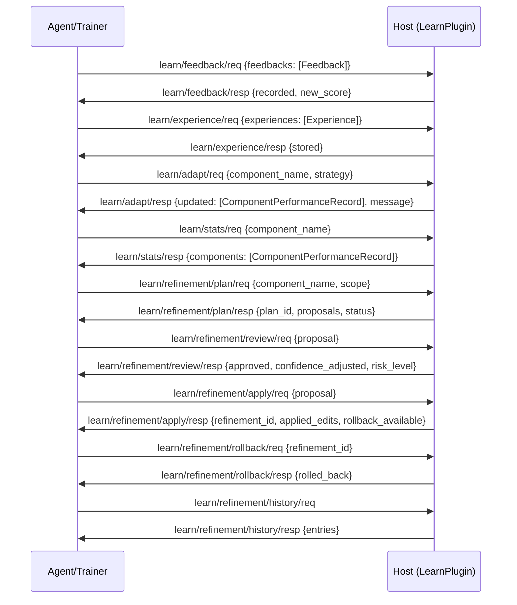

# Learning Capability Specification

## Capability Identity

|| Property | Value |
||----------|-------|
|| Enum | `A2ECapability.LEARNING` |
|| String | `"learning"` |
|| Plugin Type | `LearnPlugin` |
|| Namespace | `learn/*` |
|| Message Count | 18 |

## Overview

The **learning** capability provides the agent's feedback, experience replay, and adaptive routing subsystem. It enables three core primitives:

1. **feedback** — Human or environment reward signals attached to agent turns
2. **experience** — Store (state, action, reward, next_state, done) tuples for RL-style replay
3. **adapt** — Request that the host updates component routing weights based on accumulated data
4. **stats** — Query performance statistics for components
5. **refine** — Fine-grained refinement control (plan, review, apply, rollback, history)

**Cross-capability integration:**
- `env/step` reward signals can be auto-forwarded to `learn/feedback`
- Experience tuples can be auto-recorded from `env/step` interactions
- Adapt results influence component selection in `skill/discover`

## Protocol Flow


```mermaid
sequenceDiagram
    participant A as Agent/Trainer
    participant H as Host (LearnPlugin)

    A->>H: learn/feedback/req {feedbacks: [Feedback]}
    H->>A: learn/feedback/resp {recorded, new_score}

    A->>H: learn/experience/req {experiences: [Experience]}
    H->>A: learn/experience/resp {stored}

    A->>H: learn/adapt/req {component_name, strategy}
    H->>A: learn/adapt/resp {updated: [ComponentPerformanceRecord], message}

    A->>H: learn/stats/req {component_name}
    H->>A: learn/stats/resp {components: [ComponentPerformanceRecord]}

    A->>H: learn/refinement/plan/req {component_name, scope}
    H->>A: learn/refinement/plan/resp {plan_id, proposals, status}

    A->>H: learn/refinement/review/req {proposal}
    H->>A: learn/refinement/review/resp {approved, confidence_adjusted, risk_level}

    A->>H: learn/refinement/apply/req {proposal}
    H->>A: learn/refinement/apply/resp {refinement_id, applied_edits, rollback_available}

    A->>H: learn/refinement/rollback/req {refinement_id}
    H->>A: learn/refinement/rollback/resp {rolled_back}

    A->>H: learn/refinement/history/req
    H->>A: learn/refinement/history/resp {entries}
```

## Message Types (18)

### Feedback (2)

#### learn/feedback/req — LearnFeedbackRequest

Agent (or external trainer) → Host. Submit feedback signals.

|| Field | Type | Required | Default | Description |
||-------|------|----------|---------|-------------|
|| `type` | `str` | Yes | `"learn/feedback/req"` | Message type |
|| `id` | `str` | Yes | auto | Message UUID |
|| `version` | `str` | Yes | `"1.0"` | Protocol version |
|| `ts` | `float` | Yes | auto | Timestamp |
|| `feedbacks` | `list[Feedback]` | Yes | — | List of feedback signals |

#### learn/feedback/resp — LearnFeedbackResponse

Host → Agent.

|| Field | Type | Required | Default | Description |
||-------|------|----------|---------|-------------|
|| `type` | `str` | Yes | `"learn/feedback/resp"` | Message type |
|| `id` | `str` | Yes | auto | Message UUID |
|| `version` | `str` | Yes | `"1.0"` | Protocol version |
|| `ts` | `float` | Yes | auto | Timestamp |
|| `req_id` | `str` | Yes | `""` | Echoes request ID |
|| `recorded` | `int` | Yes | `0` | Number of feedbacks recorded |
|| `new_score` | `float` or `None` | No | `None` | Updated running component score if available |

### Experience (2)

#### learn/experience/req — LearnExperienceRequest

Agent → Host. Store experience tuples for later replay.

|| Field | Type | Required | Default | Description |
||-------|------|----------|---------|-------------|
|| `type` | `str` | Yes | `"learn/experience/req"` | Message type |
|| `id` | `str` | Yes | auto | Message UUID |
|| `version` | `str` | Yes | `"1.0"` | Protocol version |
|| `ts` | `float` | Yes | auto | Timestamp |
|| `experiences` | `list[Experience]` | No | `[]` | Experience tuples to store |

#### learn/experience/resp — LearnExperienceResponse

Host → Agent.

|| Field | Type | Required | Default | Description |
||-------|------|----------|---------|-------------|
|| `type` | `str` | Yes | `"learn/experience/resp"` | Message type |
|| `id` | `str` | Yes | auto | Message UUID |
|| `version` | `str` | Yes | `"1.0"` | Protocol version |
|| `ts` | `float` | Yes | auto | Timestamp |
|| `req_id` | `str` | Yes | `""` | Echoes request ID |
|| `stored` | `int` | Yes | `0` | Number of experiences stored |

### Adapt (2) — Fire-and-Forget Optimization

#### learn/adapt/req — LearnAdaptRequest

Agent → Host. Request that the host updates component routing weights based on accumulated feedback and experiences. The server handles the full plan → review → apply → stats workflow internally.

|| Field | Type | Required | Default | Description |
||-------|------|----------|---------|-------------|
|| `type` | `str` | Yes | `"learn/adapt/req"` | Message type |
|| `id` | `str` | Yes | auto | Message UUID |
|| `version` | `str` | Yes | `"1.0"` | Protocol version |
|| `ts` | `float` | Yes | auto | Timestamp |
|| `component_name` | `str` | No | `""` | Specific component (empty = adapt all) |
|| `strategy` | `str` | No | `"ppo"` | Adaptation strategy (see below) |

**Adaptation strategies:**

|| Strategy | Description |
||----------|-------------|
|| `ppo` | Proximal Policy Optimization — policy gradient with clipping |
|| `ucb1` | Upper Confidence Bound — balances exploration/exploitation |
|| `epsilon_greedy` | Epsilon-greedy — mostly exploit, occasionally explore |
|| `softmax` | Softmax/Boltzmann — probability proportional to value |
|| `custom` | Host-defined custom strategy |

#### learn/adapt/resp — LearnAdaptResponse

Host → Agent.

|| Field | Type | Required | Default | Description |
||-------|------|----------|---------|-------------|
|| `type` | `str` | Yes | `"learn/adapt/resp"` | Message type |
|| `id` | `str` | Yes | auto | Message UUID |
|| `version` | `str` | Yes | `"1.0"` | Protocol version |
|| `ts` | `float` | Yes | auto | Timestamp |
|| `req_id` | `str` | Yes | `""` | Echoes request ID |
|| `updated` | `list[dict]` | Yes | `[]` | List of updated ComponentPerformanceRecords |
|| `message` | `str` | Yes | `""` | Human-readable status message |

### Stats (2) — Performance Query

#### learn/stats/req — LearnStatsRequest

Agent → Host. Query performance statistics for components.

|| Field | Type | Required | Default | Description |
||-------|------|----------|---------|-------------|
|| `type` | `str` | Yes | `"learn/stats/req"` | Message type |
|| `id` | `str` | Yes | auto | Message UUID |
|| `version` | `str` | Yes | `"1.0"` | Protocol version |
|| `ts` | `float` | Yes | auto | Timestamp |
|| `component_name` | `str` | No | `""` | Filter by component (empty = all) |

#### learn/stats/resp — LearnStatsResponse

Host → Agent.

|| Field | Type | Required | Default | Description |
||-------|------|----------|---------|-------------|
|| `type` | `str` | Yes | `"learn/stats/resp"` | Message type |
|| `id` | `str` | Yes | auto | Message UUID |
|| `version` | `str` | Yes | `"1.0"` | Protocol version |
|| `ts` | `float` | Yes | auto | Timestamp |
|| `req_id` | `str` | Yes | `""` | Echoes request ID |
|| `components` | `list[dict]` | Yes | `[]` | List of ComponentPerformanceRecords |

### Refinement Plan (2)

#### learn/refinement/plan/req — LearnRefinementPlanRequest

Agent → Host. Generate refinement proposals from accumulated feedback.

|| Field | Type | Required | Default | Description |
||-------|------|----------|---------|-------------|
|| `type` | `str` | Yes | `"learn/refinement/plan/req"` | Message type |
|| `id` | `str` | Yes | auto | Message UUID |
|| `version` | `str` | Yes | `"1.0"` | Protocol version |
|| `ts` | `float` | Yes | auto | Timestamp |
|| `component_name` | `str` | No | `""` | Target component (empty = all) |
|| `scope` | `str` | No | `"local"` | Scope of refinement |

#### learn/refinement/plan/resp — LearnRefinementPlanResponse

Host → Agent.

|| Field | Type | Required | Default | Description |
||-------|------|----------|---------|-------------|
|| `type` | `str` | Yes | `"learn/refinement/plan/resp"` | Message type |
|| `id` | `str` | Yes | auto | Message UUID |
|| `version` | `str` | Yes | `"1.0"` | Protocol version |
|| `ts` | `float` | Yes | auto | Timestamp |
|| `req_id` | `str` | Yes | `""` | Echoes request ID |
|| `plan_id` | `str` | Yes | — | Unique plan identifier |
|| `proposals` | `list[dict]` | Yes | `[]` | Refinement proposals |
|| `status` | `str` | Yes | — | Plan status (`ready`, `empty`, etc.) |

### Refinement Apply (2)

#### learn/refinement/apply/req — LearnRefinementApplyRequest

Agent → Host. Apply a refinement proposal atomically with before-snapshot for rollback.

|| Field | Type | Required | Default | Description |
||-------|------|----------|---------|-------------|
|| `type` | `str` | Yes | `"learn/refinement/apply/req"` | Message type |
|| `id` | `str` | Yes | auto | Message UUID |
|| `version` | `str` | Yes | `"1.0"` | Protocol version |
|| `ts` | `float` | Yes | auto | Timestamp |
|| `proposal` | `dict` | Yes | — | The proposal to apply |

#### learn/refinement/apply/resp — LearnRefinementApplyResponse

Host → Agent.

|| Field | Type | Required | Default | Description |
||-------|------|----------|---------|-------------|
|| `type` | `str` | Yes | `"learn/refinement/apply/resp"` | Message type |
|| `id` | `str` | Yes | auto | Message UUID |
|| `version` | `str` | Yes | `"1.0"` | Protocol version |
|| `ts` | `float` | Yes | auto | Timestamp |
|| `req_id` | `str` | Yes | `""` | Echoes request ID |
|| `refinement_id` | `str` | Yes | — | Unique refinement identifier |
|| `applied_edits` | `int` | Yes | `0` | Number of edits applied |
|| `failed_edits` | `int` | Yes | `0` | Number of edits that failed |
|| `rollback_available` | `bool` | Yes | `False` | Whether rollback is available |
|| `error` | `str` | Yes | `""` | Error message if any |

### Refinement Rollback (2)

#### learn/refinement/rollback/req — LearnRefinementRollbackRequest

Agent → Host. Rollback a previously applied refinement.

|| Field | Type | Required | Default | Description |
||-------|------|----------|---------|-------------|
|| `type` | `str` | Yes | `"learn/refinement/rollback/req"` | Message type |
|| `id` | `str` | Yes | auto | Message UUID |
|| `version` | `str` | Yes | `"1.0"` | Protocol version |
|| `ts` | `float` | Yes | auto | Timestamp |
|| `refinement_id` | `str` | Yes | — | The refinement to rollback |

#### learn/refinement/rollback/resp — LearnRefinementRollbackResponse

Host → Agent.

|| Field | Type | Required | Default | Description |
||-------|------|----------|---------|-------------|
|| `type` | `str` | Yes | `"learn/refinement/rollback/resp"` | Message type |
|| `id` | `str` | Yes | auto | Message UUID |
|| `version` | `str` | Yes | `"1.0"` | Protocol version |
|| `ts` | `float` | Yes | auto | Timestamp |
|| `req_id` | `str` | Yes | `""` | Echoes request ID |
|| `refinement_id` | `str` | Yes | — | The refinement that was rolled back |
|| `rolled_back` | `bool` | Yes | `False` | Whether rollback succeeded |
|| `error` | `str` | Yes | `""` | Error message if any |

### Refinement Review (2)

#### learn/refinement/review/req — LearnRefinementReviewRequest

Agent → Host. Auto-review a refinement proposal (confidence, conflicts, history).

|| Field | Type | Required | Default | Description |
||-------|------|----------|---------|-------------|
|| `type` | `str` | Yes | `"learn/refinement/review/req"` | Message type |
|| `id` | `str` | Yes | auto | Message UUID |
|| `version` | `str` | Yes | `"1.0"` | Protocol version |
|| `ts` | `float` | Yes | auto | Timestamp |
|| `proposal` | `dict` | Yes | — | The proposal to review |

#### learn/refinement/review/resp — LearnRefinementReviewResponse

Host → Agent.

|| Field | Type | Required | Default | Description |
||-------|------|----------|---------|-------------|
|| `type` | `str` | Yes | `"learn/refinement/review/resp"` | Message type |
|| `id` | `str` | Yes | auto | Message UUID |
|| `version` | `str` | Yes | `"1.0"` | Protocol version |
|| `ts` | `float` | Yes | auto | Timestamp |
|| `req_id` | `str` | Yes | `""` | Echoes request ID |
|| `approved` | `bool` | Yes | `False` | Whether the proposal is approved |
|| `confidence_adjusted` | `bool` | Yes | `False` | Whether confidence was adjusted |
|| `reasons` | `list[str]` | Yes | `[]` | Review reasons |
|| `risk_level` | `str` | Yes | `"low"` | Risk level (`low`, `medium`, `high`) |

### Refinement History (2)

#### learn/refinement/history/req — LearnRefinementHistoryRequest

Agent → Host. Load refinement history.

|| Field | Type | Required | Default | Description |
||-------|------|----------|---------|-------------|
|| `type` | `str` | Yes | `"learn/refinement/history/req"` | Message type |
|| `id` | `str` | Yes | auto | Message UUID |
|| `version` | `str` | Yes | `"1.0"` | Protocol version |
|| `ts` | `float` | Yes | auto | Timestamp |

#### learn/refinement/history/resp — LearnRefinementHistoryResponse

Host → Agent.

|| Field | Type | Required | Default | Description |
||-------|------|----------|---------|-------------|
|| `type` | `str` | Yes | `"learn/refinement/history/resp"` | Message type |
|| `id` | `str` | Yes | auto | Message UUID |
|| `version` | `str` | Yes | `"1.0"` | Protocol version |
|| `ts` | `float` | Yes | auto | Timestamp |
|| `req_id` | `str` | Yes | `""` | Echoes request ID |
|| `entries` | `list[dict]` | Yes | `[]` | Refinement history entries |

## Data Models

### Feedback

A single feedback signal attached to an agent turn or component call.

|| Field | Type | Required | Default | Description |
||-------|------|----------|---------|-------------|
|| `feedback_id` | `str` | No | auto (`b_{ns}`) | Unique feedback identifier |
|| `correlation_id` | `str` | No | `""` | Ties to agent turn |
|| `session_id` | `str` | No | `""` | Session identifier |
|| `rated_turn` | `RatedTurn` | No | `None` | The turn that was rated |
|| `polarity` | `FeedbackPolarity` | Yes | — | Signal polarity |
|| `score` | `float` | No | `0.0` | Normalized score: -1.0 to +1.0 |
|| `dimension` | `FeedbackDimension` | No | `HELPFULNESS` | Rating dimension |
|| `confidence` | `float` | No | `1.0` | Confidence weight (0.0-1.0) |
|| `comment` | `str` | No | `""` | Human-readable comment |
|| `correction` | `str` | No | `""` | Required for CORRECTIVE polarity |
|| `correction_span` | `tuple[int, int]` | No | `None` | Character range for correction |
|| `source` | `FeedbackSource` | No | `HUMAN` | Who provided the feedback |
|| `annotator_id` | `str` | No | `""` | Annotator identifier |
|| `ts` | `float` | No | auto | Feedback timestamp |

**Validation rule:** `CORRECTIVE` polarity MUST include a `correction` string (enforced by `@model_validator`).

### FeedbackPolarity

|| Value | Description |
||-------|-------------|
|| `positive` | Positive feedback |
|| `negative` | Negative feedback |
|| `neutral` | Neutral/observation feedback |
|| `corrective` | "You should have done X instead" — requires `correction` field |

### FeedbackDimension

|| Value | Description |
||-------|-------------|
|| `correctness` | Is the answer correct? |
|| `helpfulness` | Is the response helpful? |
|| `safety` | Is the response safe? |
|| `tone` | Is the tone appropriate? |
|| `plan_quality` | Is the plan/strategy good? |

### FeedbackSource

|| Value | Description |
||-------|-------------|
|| `human` | Human annotator |
|| `env` | Environment signal (test pass/fail, tool error, etc.) |
|| `self` | Model self-critique |

### RatedTurn

Captures enough context to reconstruct a training pair later.

|| Field | Type | Required | Default | Description |
||-------|------|----------|---------|-------------|
|| `prompt` | `str` | Yes | — | Full prompt sent to model/component |
|| `response` | `str` | Yes | — | The response that was rated |
|| `model` | `str` | Yes | — | Model identifier |
|| `environment` | `Any` | No | `None` | Environment context |
|| `version` | `str` | No | `None` | Version identifier |

### Experience

An RL-style (s, a, r, s', done) tuple for replay.

|| Field | Type | Required | Default | Description |
||-------|------|----------|---------|-------------|
|| `experience_id` | `str` | No | auto UUID | Unique experience identifier |
|| `state` | `dict` | No | `{}` | Serialized agent context before action |
|| `action` | `dict` | No | `{}` | `{component_name, input}` |
|| `reward` | `float` | No | `0.0` | Scalar reward from environment |
|| `next_state` | `dict` | No | `{}` | Serialized agent context after action |
|| `done` | `bool` | No | `False` | Whether episode ended |
|| `episode_id` | `str` | No | `""` | Episode identifier |
|| `step` | `int` | No | `0` | Step number within episode |
|| `ts` | `float` | No | auto | Experience timestamp |

### ComponentPerformanceRecord

Rolling performance stats tracked per component, used for adaptive routing (replaces `SkillPerformanceRecord`).

|| Field | Type | Required | Default | Description |
||-------|------|----------|---------|-------------|
|| `component_name` | `str` | Yes | — | Component identifier (skill, tool, subagent, toolkit) |
|| `calls_total` | `int` | No | `0` | Total calls |
|| `calls_success` | `int` | No | `0` | Successful calls |
|| `calls_failed` | `int` | No | `0` | Failed calls |
|| `avg_duration_ms` | `float` | No | `0.0` | Average duration |
|| `avg_score` | `float` | No | `0.0` | Mean feedback score (-1 to +1) |
|| `last_called` | `float` | No | `0.0` | Last call timestamp |
|| `p95_duration_ms` | `float` | No | `0.0` | 95th percentile duration |

## Feedback Derivation Methods

### to_preference_pair()

Generates a DPO (Direct Preference Optimization) training pair from CORRECTIVE feedback:

```python
{
    "prompt": rated_turn.prompt,
    "chosen": correction,        # what should have been done
    "rejected": rated_turn.response,  # what was actually done
    "dimension": dimension.value,
    "model_version": rated_turn.model_version,
    "confidence": confidence,
}
```

Returns `None` if polarity is not CORRECTIVE or no rated_turn/correction.

### to_reward_sample()

Generates a reward model training sample:

```python
{
    "prompt": rated_turn.prompt,
    "response": rated_turn.response,
    "score": score,              # -1.0 to +1.0
    "dimension": dimension.value,
    "weight": confidence,
    "source": source.value,
}
```

Returns `None` if no rated_turn.

## Wire Examples

### Submit Feedback

```json
{"type":"learn/feedback/req","id":"lf1","version":"1.0","ts":1716123456.789,"feedbacks":[{"feedback_id":"b_1716123456789","correlation_id":"turn-42","session_id":"s1","rated_turn":{"prompt":"Summarize this article","response":"The article discusses...","model":"agent-v2.3.1"},"polarity":"corrective","score":-0.5,"dimension":"helpfulness","confidence":0.9,"comment":"Too verbose","correction":"Provide a concise 2-sentence summary","source":"human","annotator_id":"user1","ts":1716123456.789}]}
```

```json
{"type":"learn/feedback/resp","id":"lf2","version":"1.0","ts":1716123456.900,"req_id":"lf1","recorded":1,"new_score":0.72}
```

### Store Experience

```json
{"type":"learn/experience/req","id":"le1","version":"1.0","ts":1716123457.100,"experiences":[{"experience_id":"exp_abc","state":{"page":"home"},"action":{"component_name":"click","input":{"selector":"#btn"}},"reward":0.5,"next_state":{"page":"result"},"done":false,"episode_id":"ep_1","step":1,"ts":1716123457.100}]}
```

```json
{"type":"learn/experience/resp","id":"le2","version":"1.0","ts":1716123457.200,"req_id":"le1","stored":1}
```

### Adapt Component Routing (Fire-and-Forget)

```json
{"type":"learn/adapt/req","id":"la1","version":"1.0","ts":1716123458.100,"component_name":"","strategy":"ppo"}
```

```json
{"type":"learn/adapt/resp","id":"la2","version":"1.0","ts":1716123458.500,"req_id":"la1","updated":[{"component_name":"code_review","calls_total":50,"calls_success":42,"calls_failed":8,"avg_duration_ms":1200,"avg_score":0.82,"p95_duration_ms":2500,"last_called":1716123450.0}],"message":"Adapted routing weights using PPO"}
```

### Query Stats

```json
{"type":"learn/stats/req","id":"ls1","version":"1.0","ts":1716123459.100,"component_name":""}
```

### Refinement Plan

```json
{"type":"learn/refinement/plan/req","id":"lr1","version":"1.0","ts":1716123460.100,"component_name":"my-tool","scope":"local"}
```

```json
{"type":"learn/refinement/plan/resp","id":"lr2","version":"1.0","ts":1716123460.500,"req_id":"lr1","plan_id":"plan-123","proposals":[{"target":"router_weight","op":"update","path":"router.weights.my-tool","old_value":0.5,"new_value":0.7}],"status":"ready"}
```

### Refinement Review

```json
{"type":"learn/refinement/review/req","id":"lr3","version":"1.0","ts":1716123461.100,"proposal":{"target":"router_weight","op":"update","path":"router.weights.my-tool","old_value":0.5,"new_value":0.7}}
```

```json
{"type":"learn/refinement/review/resp","id":"lr4","version":"1.0","ts":1716123461.500,"req_id":"lr3","approved":true,"confidence_adjusted":false,"reasons":[],"risk_level":"low"}
```

### Refinement Apply

```json
{"type":"learn/refinement/apply/req","id":"lr5","version":"1.0","ts":1716123462.100,"proposal":{"target":"router_weight","op":"update","path":"router.weights.my-tool","old_value":0.5,"new_value":0.7}}
```

```json
{"type":"learn/refinement/apply/resp","id":"lr6","version":"1.0","ts":1716123462.500,"req_id":"lr5","refinement_id":"ref-456","applied_edits":1,"failed_edits":0,"rollback_available":true,"error":""}
```

### Refinement Rollback

```json
{"type":"learn/refinement/rollback/req","id":"lr7","version":"1.0","ts":1716123463.100,"refinement_id":"ref-456"}
```

```json
{"type":"learn/refinement/rollback/resp","id":"lr8","version":"1.0","ts":1716123463.500,"req_id":"lr7","refinement_id":"ref-456","rolled_back":true,"error":""}
```

### Refinement History

```json
{"type":"learn/refinement/history/req","id":"lr9","version":"1.0","ts":1716123464.100}
```

```json
{"type":"learn/refinement/history/resp","id":"lr10","version":"1.0","ts":1716123464.500,"req_id":"lr9","entries":[]}
```

## Security Considerations

1. **Feedback integrity**: Feedback from `env` source must not be spoofable by the agent
2. **Score bounds**: Scores must be validated to [-1.0, +1.0] range
3. **Correction validation**: CORRECTIVE feedback without `correction` is rejected by the model validator
4. **Experience volume limits**: Host should enforce storage limits for experience tuples
5. **Adapt strategy restriction**: Host may limit which adaptation strategies are allowed
6. **Refinement safety**: Applied edits should be validated before execution; rollback must be available for every apply

### See also

- [Learning capability overview](/capabilities/learn) — the client-facing API, usage patterns, and `adapt()` vs `refine()` guidance for this protocol
- [Environment capability](/capabilities/env) — how the host scores agent actions and feeds rewards into `learn/experience`
- [Message Types](/protocol-spec/message-types) — shared protocol conventions, framing, and error semantics used by all learn messages

This page is the wire contract for the learn capability: 18 message types covering feedback, experience replay, component adaptation, and the refinable plan → review → apply → rollback workflow. Validation rules (score bounds, CORRECTIVE-requires-correction, apply-with-rollback) are enforced at the model layer described in the overview.
