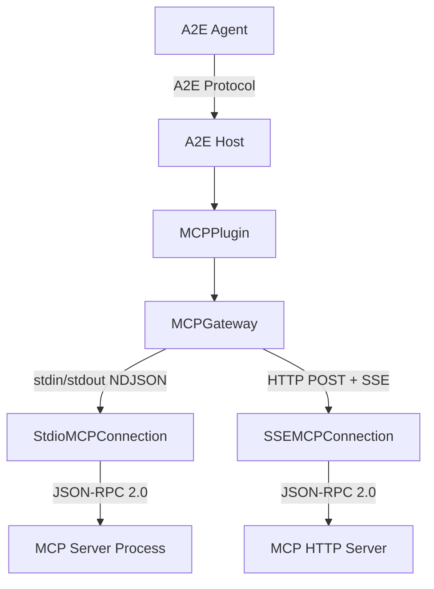
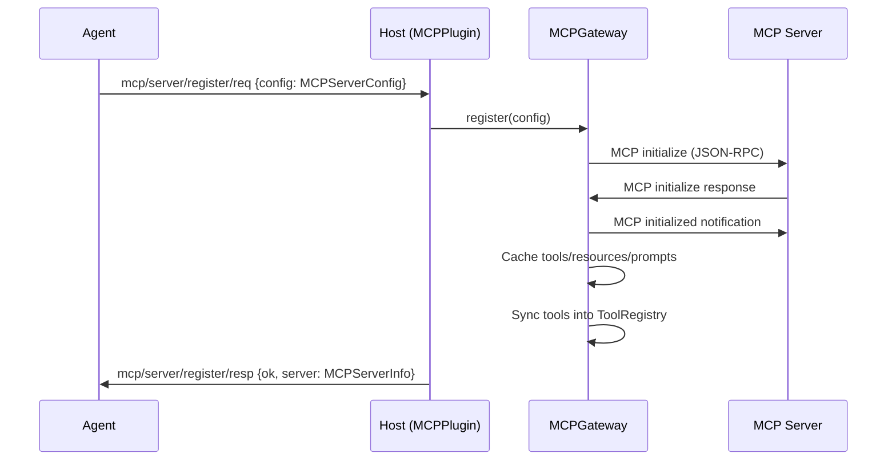

# MCP Bridge Capability Specification

## Capability Identity

| Property | Value |
|----------|-------|
| Enum | `A2ECapability.MCP` |
| String | `"mcp"` |
| Plugin Type | `MCPPlugin` |
| Plugin Priority | `10` |
| Namespace | `mcp/*` |
| Message Count | 20 |

## Overview

The **MCP (Model Context Protocol) Bridge** connects A2E to the external MCP ecosystem. It acts as a gateway between A2E agents and MCP servers, exposing MCP tools, resources, prompts, and sampling through the A2E protocol. A2E acts as an MCP *client* — connecting to one or more MCP servers (over stdio subprocess or HTTP+SSE) and proxying their capabilities:

- **MCP Tools** → appear in `tool/list/resp` with `source="mcp"`, callable via `tool/call/req` (transparent)
- **MCP Resources** → `mcp/resource/list` + `mcp/resource/read`
- **MCP Prompts** → `mcp/prompt/list` + `mcp/prompt/get`
- **MCP Sampling** → `mcp/sample/req` (server asks agent to run LLM)
- **MCP Roots** → `mcp/root/list` (agent exposes accessible paths to servers)

## Architecture



## Protocol Flow — Server Registration



## Message Types (20)

### Server Management (7)

#### mcp/server/list/req — MCPServerListRequest

Agent → Host. List all registered MCP servers and their status.

| Field | Type | Required | Default | Description |
|-------|------|----------|---------|-------------|
| `type` | `str` | Yes | `"mcp/server/list/req"` | Message type |
| `id` | `str` | Yes | auto | Message UUID |
| `version` | `str` | Yes | `"1.0"` | Protocol version |
| `ts` | `float` | Yes | auto | Timestamp |
| `status_filter` | `str` | No | `""` | Filter by server status (empty = all) |

#### mcp/server/list/resp — MCPServerListResponse

Host → Agent.

| Field | Type | Required | Default | Description |
|-------|------|----------|---------|-------------|
| `type` | `str` | Yes | `"mcp/server/list/resp"` | Message type |
| `id` | `str` | Yes | auto | Message UUID |
| `version` | `str` | Yes | `"1.0"` | Protocol version |
| `ts` | `float` | Yes | auto | Timestamp |
| `req_id` | `str` | Yes | `""` | Echoes request ID |
| `servers` | `list[dict]` | Yes | `[]` | List of MCPServerInfo objects |

#### mcp/server/register/req — MCPServerRegisterRequest

Agent → Host. Register and connect to a new MCP server.

| Field | Type | Required | Default | Description |
|-------|------|----------|---------|-------------|
| `type` | `str` | Yes | `"mcp/server/register/req"` | Message type |
| `id` | `str` | Yes | auto | Message UUID |
| `version` | `str` | Yes | `"1.0"` | Protocol version |
| `ts` | `float` | Yes | auto | Timestamp |
| `config` | `dict` | Yes | `{}` | MCPServerConfig (see below) |

#### mcp/server/register/resp — MCPServerRegisterResponse

Host → Agent.

| Field | Type | Required | Default | Description |
|-------|------|----------|---------|-------------|
| `type` | `str` | Yes | `"mcp/server/register/resp"` | Message type |
| `id` | `str` | Yes | auto | Message UUID |
| `version` | `str` | Yes | `"1.0"` | Protocol version |
| `ts` | `float` | Yes | auto | Timestamp |
| `req_id` | `str` | Yes | `""` | Echoes request ID |
| `ok` | `bool` | Yes | `False` | Whether registration succeeded |
| `server` | `dict` | No | `{}` | MCPServerInfo (on success) |
| `error` | `str` | No | `""` | Error message (on failure) |

#### mcp/server/unregister/req — MCPServerUnregisterRequest

Agent → Host. Disconnect and remove an MCP server.

| Field | Type | Required | Default | Description |
|-------|------|----------|---------|-------------|
| `type` | `str` | Yes | `"mcp/server/unregister/req"` | Message type |
| `id` | `str` | Yes | auto | Message UUID |
| `version` | `str` | Yes | `"1.0"` | Protocol version |
| `ts` | `float` | Yes | auto | Timestamp |
| `server_id` | `str` | Yes | `""` | Server to unregister |

#### mcp/server/unregister/resp — MCPServerUnregisterResponse

Host → Agent.

| Field | Type | Required | Default | Description |
|-------|------|----------|---------|-------------|
| `type` | `str` | Yes | `"mcp/server/unregister/resp"` | Message type |
| `id` | `str` | Yes | auto | Message UUID |
| `version` | `str` | Yes | `"1.0"` | Protocol version |
| `ts` | `float` | Yes | auto | Timestamp |
| `req_id` | `str` | Yes | `""` | Echoes request ID |
| `ok` | `bool` | Yes | `False` | Whether unregistration succeeded |
| `server_id` | `str` | Yes | `""` | Unregistered server ID |

#### mcp/server/push — MCPServerPush

Host → Agent (server-initiated). Forwarded MCP notification.

| Field | Type | Required | Default | Description |
|-------|------|----------|---------|-------------|
| `type` | `str` | Yes | `"mcp/server/push"` | Message type |
| `id` | `str` | Yes | auto | Message UUID |
| `version` | `str` | Yes | `"1.0"` | Protocol version |
| `ts` | `float` | Yes | auto | Timestamp |
| `server_id` | `str` | Yes | `""` | Source MCP server |
| `method` | `str` | Yes | `""` | MCP notification method |
| `params` | `dict` | No | `{}` | Notification parameters |

**Forwarded MCP notification methods:**

| Method | Description |
|--------|-------------|
| `notifications/tools/list_changed` | Tool list has changed, re-sync needed |
| `notifications/resources/list_changed` | Resource list changed |
| `notifications/resources/updated` | A specific resource was updated |
| `notifications/prompts/list_changed` | Prompt list changed |
| `notifications/progress` | Progress update from server |
| `notifications/message` | Log message from server |

### Resources (6)

#### mcp/resource/list/req — MCPResourceListRequest

Agent → Host. List resources across all (or one) MCP server(s).

| Field | Type | Required | Default | Description |
|-------|------|----------|---------|-------------|
| `type` | `str` | Yes | `"mcp/resource/list/req"` | Message type |
| `id` | `str` | Yes | auto | Message UUID |
| `version` | `str` | Yes | `"1.0"` | Protocol version |
| `ts` | `float` | Yes | auto | Timestamp |
| `server_id` | `str` | No | `""` | Filter by server (empty = all) |
| `cursor` | `str` | No | `""` | Pagination cursor |

#### mcp/resource/list/resp — MCPResourceListResponse

Host → Agent.

| Field | Type | Required | Default | Description |
|-------|------|----------|---------|-------------|
| `type` | `str` | Yes | `"mcp/resource/list/resp"` | Message type |
| `id` | `str` | Yes | auto | Message UUID |
| `version` | `str` | Yes | `"1.0"` | Protocol version |
| `ts` | `float` | Yes | auto | Timestamp |
| `req_id` | `str` | Yes | `""` | Echoes request ID |
| `resources` | `list[dict]` | Yes | `[]` | List of MCPResource objects |
| `next_cursor` | `str` | No | `""` | Next page cursor |

#### mcp/resource/read/req — MCPResourceReadRequest

Agent → Host. Read a resource by URI.

| Field | Type | Required | Default | Description |
|-------|------|----------|---------|-------------|
| `type` | `str` | Yes | `"mcp/resource/read/req"` | Message type |
| `id` | `str` | Yes | auto | Message UUID |
| `version` | `str` | Yes | `"1.0"` | Protocol version |
| `ts` | `float` | Yes | auto | Timestamp |
| `uri` | `str` | Yes | `""` | Resource URI |
| `server_id` | `str` | No | `""` | Server hint (auto-routed if empty) |

#### mcp/resource/read/resp — MCPResourceReadResponse

Host → Agent.

| Field | Type | Required | Default | Description |
|-------|------|----------|---------|-------------|
| `type` | `str` | Yes | `"mcp/resource/read/resp"` | Message type |
| `id` | `str` | Yes | auto | Message UUID |
| `version` | `str` | Yes | `"1.0"` | Protocol version |
| `ts` | `float` | Yes | auto | Timestamp |
| `req_id` | `str` | Yes | `""` | Echoes request ID |
| `contents` | `list[dict]` | Yes | `[]` | List of MCPResourceContent blocks |
| `server_id` | `str` | No | `""` | Originating server |
| `error` | `str` | No | `""` | Error if read failed |

#### mcp/resource/subscribe/req — MCPResourceSubscribeRequest

Agent → Host. Subscribe to change notifications for a resource URI.

| Field | Type | Required | Default | Description |
|-------|------|----------|---------|-------------|
| `type` | `str` | Yes | `"mcp/resource/subscribe/req"` | Message type |
| `id` | `str` | Yes | auto | Message UUID |
| `version` | `str` | Yes | `"1.0"` | Protocol version |
| `ts` | `float` | Yes | auto | Timestamp |
| `uri` | `str` | Yes | `""` | Resource URI to subscribe |
| `server_id` | `str` | No | `""` | Server hint |

#### mcp/resource/subscribe/resp — MCPResourceSubscribeResponse

Host → Agent.

| Field | Type | Required | Default | Description |
|-------|------|----------|---------|-------------|
| `type` | `str` | Yes | `"mcp/resource/subscribe/resp"` | Message type |
| `id` | `str` | Yes | auto | Message UUID |
| `version` | `str` | Yes | `"1.0"` | Protocol version |
| `ts` | `float` | Yes | auto | Timestamp |
| `req_id` | `str` | Yes | `""` | Echoes request ID |
| `ok` | `bool` | Yes | `False` | Subscription status |
| `error` | `str` | No | `""` | Error if subscription failed |

### Prompts (4)

#### mcp/prompt/list/req — MCPPromptListRequest

Agent → Host. List all prompt templates.

| Field | Type | Required | Default | Description |
|-------|------|----------|---------|-------------|
| `type` | `str` | Yes | `"mcp/prompt/list/req"` | Message type |
| `id` | `str` | Yes | auto | Message UUID |
| `version` | `str` | Yes | `"1.0"` | Protocol version |
| `ts` | `float` | Yes | auto | Timestamp |
| `server_id` | `str` | No | `""` | Filter by server (empty = all) |
| `cursor` | `str` | No | `""` | Pagination cursor |

#### mcp/prompt/list/resp — MCPPromptListResponse

Host → Agent.

| Field | Type | Required | Default | Description |
|-------|------|----------|---------|-------------|
| `type` | `str` | Yes | `"mcp/prompt/list/resp"` | Message type |
| `id` | `str` | Yes | auto | Message UUID |
| `version` | `str` | Yes | `"1.0"` | Protocol version |
| `ts` | `float` | Yes | auto | Timestamp |
| `req_id` | `str` | Yes | `""` | Echoes request ID |
| `prompts` | `list[dict]` | Yes | `[]` | List of MCPPrompt objects |
| `next_cursor` | `str` | No | `""` | Next page cursor |

#### mcp/prompt/get/req — MCPPromptGetRequest

Agent → Host. Render a prompt template with argument values.

| Field | Type | Required | Default | Description |
|-------|------|----------|---------|-------------|
| `type` | `str` | Yes | `"mcp/prompt/get/req"` | Message type |
| `id` | `str` | Yes | auto | Message UUID |
| `version` | `str` | Yes | `"1.0"` | Protocol version |
| `ts` | `float` | Yes | auto | Timestamp |
| `name` | `str` | Yes | `""` | Prompt template name |
| `arguments` | `dict` | No | `{}` | Argument values |
| `server_id` | `str` | No | `""` | Server hint |

#### mcp/prompt/get/resp — MCPPromptGetResponse

Host → Agent. Returns LLM-ready messages.

| Field | Type | Required | Default | Description |
|-------|------|----------|---------|-------------|
| `type` | `str` | Yes | `"mcp/prompt/get/resp"` | Message type |
| `id` | `str` | Yes | auto | Message UUID |
| `version` | `str` | Yes | `"1.0"` | Protocol version |
| `ts` | `float` | Yes | auto | Timestamp |
| `req_id` | `str` | Yes | `""` | Echoes request ID |
| `description` | `str` | No | `""` | Prompt description |
| `messages` | `list[dict]` | Yes | `[]` | List of MCPPromptMessage objects |
| `server_id` | `str` | No | `""` | Originating server |
| `error` | `str` | No | `""` | Error if rendering failed |

### Sampling (2) — Server-initiated LLM Call

#### mcp/sample/req — MCPSamplingRequest

Host → Agent (server-initiated). MCP server requests an LLM completion.

| Field | Type | Required | Default | Description |
|-------|------|----------|---------|-------------|
| `type` | `str` | Yes | `"mcp/sample/req"` | Message type |
| `id` | `str` | Yes | auto | Message UUID |
| `version` | `str` | Yes | `"1.0"` | Protocol version |
| `ts` | `float` | Yes | auto | Timestamp |
| `server_id` | `str` | Yes | `""` | Originating MCP server |
| `mcp_request_id` | `str` | Yes | `""` | MCP JSON-RPC request ID |
| `messages` | `list[dict]` | Yes | `[]` | LLM message history |
| `model_preferences` | `dict` | No | `{}` | Model preference hints |
| `system_prompt` | `str` | No | `""` | System prompt override |
| `include_context` | `str` | No | `"none"` | Context inclusion: `none`, `thisServer`, `allServers` |
| `temperature` | `float` | No | `1.0` | Sampling temperature |
| `max_tokens` | `int` | No | `1024` | Max tokens to generate |
| `stop_sequences` | `list[str]` | No | `[]` | Stop sequences |
| `metadata` | `dict` | No | `{}` | Additional metadata |

#### mcp/sample/resp — MCPSamplingResponse

Agent → Host. Forwarded back to the originating MCP server.

| Field | Type | Required | Default | Description |
|-------|------|----------|---------|-------------|
| `type` | `str` | Yes | `"mcp/sample/resp"` | Message type |
| `id` | `str` | Yes | auto | Message UUID |
| `version` | `str` | Yes | `"1.0"` | Protocol version |
| `ts` | `float` | Yes | auto | Timestamp |
| `req_id` | `str` | Yes | `""` | Echoes request ID |
| `server_id` | `str` | Yes | `""` | Target MCP server |
| `mcp_request_id` | `str` | Yes | `""` | MCP JSON-RPC request ID |
| `role` | `str` | Yes | `"assistant"` | Response role |
| `content` | `dict` | Yes | `{}` | Response content: `{"type": "text", "text": "..."}` |
| `model` | `str` | No | `""` | Model used |
| `stop_reason` | `str` | No | `""` | `endTurn`, `stopSequence`, `maxTokens` |
| `error` | `str` | No | `""` | Error if agent refused |

### Roots (2) — Agent filesystem exposure

#### mcp/root/list/req — MCPRootsListRequest

Host → Agent (server-initiated). MCP server asking for roots.

| Field | Type | Required | Default | Description |
|-------|------|----------|---------|-------------|
| `type` | `str` | Yes | `"mcp/root/list/req"` | Message type |
| `id` | `str` | Yes | auto | Message UUID |
| `version` | `str` | Yes | `"1.0"` | Protocol version |
| `ts` | `float` | Yes | auto | Timestamp |
| `server_id` | `str` | Yes | `""` | Requesting MCP server |
| `mcp_request_id` | `str` | Yes | `""` | MCP JSON-RPC request ID |

#### mcp/root/list/resp — MCPRootsListResponse

Agent → Host. Roots the agent exposes.

| Field | Type | Required | Default | Description |
|-------|------|----------|---------|-------------|
| `type` | `str` | Yes | `"mcp/root/list/resp"` | Message type |
| `id` | `str` | Yes | auto | Message UUID |
| `version` | `str` | Yes | `"1.0"` | Protocol version |
| `ts` | `float` | Yes | auto | Timestamp |
| `req_id` | `str` | Yes | `""` | Echoes request ID |
| `server_id` | `str` | Yes | `""` | Target MCP server |
| `mcp_request_id` | `str` | Yes | `""` | MCP JSON-RPC request ID |
| `roots` | `list[dict]` | Yes | `[]` | List of MCPRoot objects |

## Data Models

### MCPServerConfig

| Field | Type | Required | Default | Description |
|-------|------|----------|---------|-------------|
| `server_id` | `str` | No | auto hex[:8] | Unique server identifier |
| `name` | `str` | No | `""` | Display name |
| `transport` | `MCPTransport` | No | `"stdio"` | Transport type: `stdio`, `sse`, `ws` |
| `cmd` | `list[str]` | No | `[]` | Stdio command + args |
| `cwd` | `str` | No | `""` | Working directory (stdio) |
| `env` | `dict` | No | `{}` | Environment variables (stdio) |
| `url` | `str` | No | `""` | HTTP/SSE/WS URL |
| `headers` | `dict` | No | `{}` | HTTP headers (SSE/WS) |
| `timeout` | `int` | No | `300` | Request timeout in seconds |
| `auto_reconnect` | `bool` | No | `True` | Auto-reconnect on disconnect |
| `tool_allow_list` | `list[str]` | No | `[]` | Allowed tool names (empty = all) |
| `resource_allow_list` | `list[str]` | No | `[]` | Allowed resource URIs (empty = all) |

### MCPServerInfo

| Field | Type | Description |
|-------|------|-------------|
| `server_id` | `str` | Unique identifier |
| `name` | `str` | Display name |
| `transport` | `str` | Transport type |
| `status` | `MCPServerStatus` | `connecting`, `ready`, `error`, `disconnected` |
| `mcp_version` | `str` | MCP protocol version |
| `server_name` | `str` | MCP server software name |
| `server_version` | `str` | MCP server software version |
| `tools_count` | `int` | Number of exposed tools |
| `resources_count` | `int` | Number of exposed resources |
| `prompts_count` | `int` | Number of exposed prompts |
| `last_ping_ms` | `float` | Last ping latency |
| `error` | `str` | Last error message |
| `connected_at` | `float` | Connection timestamp |

### MCPResource

| Field | Type | Description |
|-------|------|-------------|
| `uri` | `str` | Resource URI |
| `name` | `str` | Display name |
| `description` | `str` | Description |
| `mime_type` | `str` | MIME type |
| `server_id` | `str` | Originating server |
| `annotations` | `dict` | MCP annotations |

### MCPResourceContent

| Field | Type | Description |
|-------|------|-------------|
| `uri` | `str` | Resource URI |
| `mime_type` | `str` | MIME type (default: `text/plain`) |
| `text` | `str` | Text content |
| `blob` | `str` | Base64-encoded binary content |
| `type` | `str` | Content type: `text` or `blob` |

### MCPPrompt

| Field | Type | Description |
|-------|------|-------------|
| `name` | `str` | Prompt template name |
| `description` | `str` | Description |
| `server_id` | `str` | Originating server |
| `arguments` | `list[dict]` | Argument definitions: `{name, description, required}` |

### MCPPromptMessage

| Field | Type | Description |
|-------|------|-------------|
| `role` | `str` | `user` or `assistant` |
| `content` | `dict` | Structured content: `{type: "text"|"image"|"resource", text: str, ...}` |

### MCPRoot

| Field | Type | Description |
|-------|------|-------------|
| `uri` | `str` | Filesystem root URI |
| `name` | `str` | Display name |

## Error Codes — MCPErrorCode

| Code | Enum Value | Description | Retryable |
|------|------------|-------------|-----------|
| `mcp_server_not_found` | `MCP_SERVER_NOT_FOUND` | Server ID not registered | No |
| `mcp_server_unavailable` | `MCP_SERVER_UNAVAILABLE` | Server not connected | Yes |
| `mcp_tool_not_found` | `MCP_TOOL_NOT_FOUND` | Tool not found on any server | No |
| `mcp_resource_not_found` | `MCP_RESOURCE_NOT_FOUND` | Resource URI not found | No |
| `mcp_prompt_not_found` | `MCP_PROMPT_NOT_FOUND` | Prompt name not found | No |
| `mcp_transport_error` | `MCP_TRANSPORT_ERROR` | Transport connection error | Yes |
| `mcp_protocol_error` | `MCP_PROTOCOL_ERROR` | MCP protocol violation | No |
| `mcp_sampling_refused` | `MCP_SAMPLING_REFUSED` | Agent refused LLM sampling | No |
| `mcp_capability_missing` | `MCP_CAPABILITY_MISSING` | MCP capability not available | No |

## Connection Types

### MCPConnection (ABC)

Base class providing JSON-RPC 2.0 helpers, request/response correlation, and caching.

| Method | Description |
|--------|-------------|
| `call(method, params, timeout)` | JSON-RPC request |
| `notify(method, params)` | JSON-RPC notification |
| `_do_initialize()` | MCP handshake (initialize + initialized + cache) |
| `call_tool(tool_name, arguments)` | MCP `tools/call` |
| `read_resource(uri)` | MCP `resources/read` |
| `get_prompt(name, arguments)` | MCP `prompts/get` |

### StdioMCPConnection

Spawns subprocess, NDJSON over stdin/stdout, daemon reader threads, auto-reconnect.

### SSEMCPConnection

HTTP+SSE transport. First SSE "endpoint" event provides the POST URL. Posts JSON-RPC to that URL.

## Tool Syncing

When a server is registered, its tools are synced into the host's `ToolRegistry` with **namespaced names**:

```python
def _sync_tools(self, conn):
    for tool in conn.tools:
        namespaced_name = f"{conn.server_id}__{tool.name}"
        self.tool_registry.register(namespaced_name, tool, runner=conn.call_tool)
```

MCP tools become callable via the standard `tool/call/req` — the agent does not need to know the tool is MCP-backed.

## Push Callbacks

| Callback | Trigger | Action |
|----------|---------|--------|
| `_on_push` | MCP notification received | Forward as `MCPServerPush`, re-sync on `tools/list_changed` |
| `_on_sampling` | MCP `createMessage` request | Forward to A2E agent as `MCPSamplingRequest` |
| `_on_roots_req` | MCP `roots/list` request | Immediately respond with configured roots list |

## Wire Examples

### Register a Stdio MCP Server

```json
{"type":"mcp/server/register/req","id":"r1s2t3","version":"1.0","ts":1716123456.789,"config":{"server_id":"fs","name":"filesystem","transport":"stdio","cmd":["npx","-y","@modelcontextprotocol/server-filesystem","/tmp"],"cwd":"","env":{},"url":"","headers":{},"timeout":300,"auto_reconnect":true,"tool_allow_list":[],"resource_allow_list":[]}}
```

```json
{"type":"mcp/server/register/resp","id":"u4v5w6","version":"1.0","ts":1716123457.200,"req_id":"r1s2t3","ok":true,"server":{"server_id":"fs","name":"filesystem","transport":"stdio","status":"ready","tools_count":5,"resources_count":0,"prompts_count":0},"error":""}
```

### List Resources

```json
{"type":"mcp/resource/list/req","id":"x7y8z9","version":"1.0","ts":1716123458.100,"server_id":"","cursor":""}
```

### Get a Prompt

```json
{"type":"mcp/prompt/get/req","id":"a0b1c2","version":"1.0","ts":1716123459.100,"name":"code_review","arguments":{"language":"python"},"server_id":"reviewer"}
```

## Security Considerations

1. **Tool allow lists**: `tool_allow_list` and `resource_allow_list` restrict what the agent can access
2. **Transport isolation**: Stdio connections run in subprocesses; SSE connections use HTTP
3. **Sampling opt-in**: Agent may refuse LLM sampling requests (returns `mcp_sampling_refused`)
4. **Auto-reconnect**: Configurable; may be disabled for security-sensitive environments
5. **Root exposure**: Agent explicitly controls which filesystem paths are visible to MCP servers
