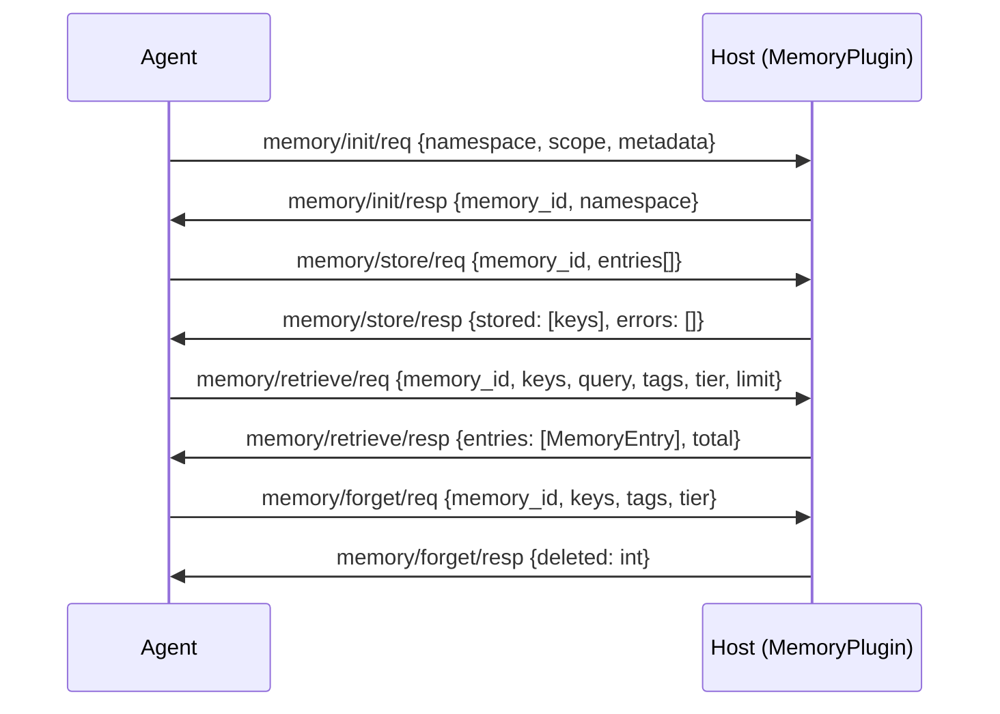

# Memory Capability Specification

## Capability Identity

| Property | Value |
|----------|-------|
| Enum | `A2ECapability.MEMORY` |
| String | `"memory"` |
| Plugin Type | `MemoryPlugin` |
| Namespace | `memory/*` |
| Message Count | 8 |

## Overview

The **memory** capability provides the agent's episodic and semantic memory store. Memories are key-value blobs with optional vector embeddings for similarity search. The host decides the backend (SQLite, Redis, Chroma, etc.).

**Three memory tiers:**

| Tier | Scope | Persistence | Use Case |
|------|-------|-------------|----------|
| `working` | In-session | Lost on disconnect | Scratch pad, temporary context |
| `episodic` | Per-agent | Persisted across sessions | Agent-specific knowledge |
| `semantic` | All agents | Persisted, shared | Collective knowledge base |

## Protocol Flow



## Message Types (8)

### memory/init/req — MemoryInitRequest

Agent → Host. Initialize a memory session. Returns a `memory_id` that must be passed to all subsequent store/retrieve/forget requests.

| Field | Type | Required | Default | Description |
|-------|------|----------|---------|-------------|
| `type` | `str` | Yes | `"memory/init/req"` | Message type identifier |
| `id` | `str` | Yes | auto UUID | Message UUID |
| `version` | `str` | Yes | `"1.0"` | Protocol version |
| `ts` | `float` | Yes | auto | Unix epoch timestamp |
| `namespace` | `str` | Yes | — | Logical namespace for the memory session |
| `scope` | `dict` | Yes | `{}` | Scope metadata (e.g., agent identity, environment) |
| `metadata` | `dict` | No | `{}` | Additional init parameters |

### memory/init/resp — MemoryInitResponse

Host → Agent. Confirms session creation and returns the `memory_id`.

| Field | Type | Required | Default | Description |
|-------|------|----------|---------|-------------|
| `type` | `str` | Yes | `"memory/init/resp"` | Message type identifier |
| `id` | `str` | Yes | auto UUID | Message UUID |
| `version` | `str` | Yes | `"1.0"` | Protocol version |
| `ts` | `float` | Yes | auto | Unix epoch timestamp |
| `req_id` | `str` | Yes | `""` | Echoes request ID |
| `memory_id` | `str` | Yes | — | Unique session identifier for all subsequent memory operations |
| `namespace` | `str` | Yes | — | Echoes the requested namespace |

### memory/store/req — MemoryStoreRequest

Agent → Host. Write one or more memory entries.

| Field | Type | Required | Default | Description |
|-------|------|----------|---------|-------------|
| `type` | `str` | Yes | `"memory/store/req"` | Message type identifier |
| `id` | `str` | Yes | auto UUID | Message UUID |
| `version` | `str` | Yes | `"1.0"` | Protocol version |
| `ts` | `float` | Yes | auto | Unix epoch timestamp |
| `memory_id` | `str` | Yes | — | Session identifier from init |
| `entries` | `list[dict]` | Yes | `[]` | List of MemoryEntry dicts |

### memory/store/resp — MemoryStoreResponse

Host → Agent. Confirms which entries were stored.

| Field | Type | Required | Default | Description |
|-------|------|----------|---------|-------------|
| `type` | `str` | Yes | `"memory/store/resp"` | Message type identifier |
| `id` | `str` | Yes | auto UUID | Message UUID |
| `version` | `str` | Yes | `"1.0"` | Protocol version |
| `ts` | `float` | Yes | auto | Unix epoch timestamp |
| `req_id` | `str` | Yes | `""` | Echoes request ID |
| `stored` | `list[dict]` | Yes | `[]` | Keys that were successfully written |
| `errors` | `list[str]` | Yes | `[]` | Errors for entries that failed |

### memory/retrieve/req — MemoryRetrieveRequest

Agent → Host. Retrieve memory entries. Supply `keys` for exact lookup, `query` for similarity search, or `tags` to filter. All fields are ANDed when multiple are set.

| Field | Type | Required | Default | Description |
|-------|------|----------|---------|-------------|
| `type` | `str` | Yes | `"memory/retrieve/req"` | Message type identifier |
| `id` | `str` | Yes | auto UUID | Message UUID |
| `version` | `str` | Yes | `"1.0"` | Protocol version |
| `ts` | `float` | Yes | auto | Unix epoch timestamp |
| `memory_id` | `str` | Yes | — | Session identifier from init |
| `keys` | `list[dict]` | No | `[]` | Exact key lookup |
| `query` | `str` | No | `""` | Semantic similarity search query |
| `tags` | `list[str]` | No | `[]` | Filter by tag |
| `tier` | `str` | No | `""` | Filter by tier (empty = all) |
| `limit` | `int` | No | `10` | Maximum entries to return |
| `min_score` | `float` | No | `0.0` | Minimum relevance score threshold |

### memory/retrieve/resp — MemoryRetrieveResponse

Host → Agent. Returns matching memory entries.

| Field | Type | Required | Default | Description |
|-------|------|----------|---------|-------------|
| `type` | `str` | Yes | `"memory/retrieve/resp"` | Message type identifier |
| `id` | `str` | Yes | auto UUID | Message UUID |
| `version` | `str` | Yes | `"1.0"` | Protocol version |
| `ts` | `float` | Yes | auto | Unix epoch timestamp |
| `req_id` | `str` | Yes | `""` | Echoes request ID |
| `entries` | `list[dict]` | Yes | `[]` | List of MemoryEntry dicts |
| `total` | `int` | Yes | `0` | Total matching entries (before limit) |

### memory/forget/req — MemoryForgetRequest

Agent → Host. Delete memory entries by key or tag.

| Field | Type | Required | Default | Description |
|-------|------|----------|---------|-------------|
| `type` | `str` | Yes | `"memory/forget/req"` | Message type identifier |
| `id` | `str` | Yes | auto UUID | Message UUID |
| `version` | `str` | Yes | `"1.0"` | Protocol version |
| `ts` | `float` | Yes | auto | Unix epoch timestamp |
| `memory_id` | `str` | Yes | — | Session identifier from init |
| `keys` | `list[dict]` | No | `[]` | Keys to delete |
| `tags` | `list[str]` | No | `[]` | Delete all entries matching these tags |
| `tier` | `str` | No | `"episodic"` | Tier to operate on |

### memory/forget/resp — MemoryForgetResponse

Host → Agent. Confirms deletion.

| Field | Type | Required | Default | Description |
|-------|------|----------|---------|-------------|
| `type` | `str` | Yes | `"memory/forget/resp"` | Message type identifier |
| `id` | `str` | Yes | auto UUID | Message UUID |
| `version` | `str` | Yes | `"1.0"` | Protocol version |
| `ts` | `float` | Yes | auto | Unix epoch timestamp |
| `req_id` | `str` | Yes | `""` | Echoes request ID |
| `deleted` | `int` | Yes | `0` | Number of entries deleted |

## Data Models

### MemoryEntry

| Field | Type | Required | Default | Description |
|-------|------|----------|---------|-------------|
| `key` | `dict` | Yes | — | Composite key for the entry |
| `content` | `Any` | Yes | — | JSON-serializable content |
| `tier` | `str` | Yes | — | Memory tier: `working`, `episodic`, `semantic` |
| `tags` | `list[str]` | No | `[]` | Classification tags |
| `source` | `str` | No | `""` | Source identifier (e.g., `"turn-42"`, `"skill:text_summarizer"`) |
| `score` | `float` | No | `1.0` | Relevance/importance weight (0.0-1.0) |
| `ttl` | `int` | No | `0` | Time-to-live in seconds; 0 = no expiry |
| `created_at` | `float` | No | auto | Creation timestamp |
| `updated_at` | `float` | No | auto | Last update timestamp |

### MemoryTier

| Value | Description |
|-------|-------------|
| `working` | In-session, lost on disconnect. Scratch pad. |
| `episodic` | Persisted per-agent across sessions. Agent-specific knowledge. |
| `semantic` | Shared across all agents. Collective knowledge base. |

## Error Codes — MemoryErrorCode

| Code | Enum Value | Description | Retryable |
|------|------------|-------------|-----------|
| `memory_full` | `MEMORY_FULL` | Storage limit reached | No |
| `memory_not_found` | `MEMORY_NOT_FOUND` | Requested key not found | No |

## Wire Examples

### Initialize Memory Session

```json
{"type":"memory/init/req","id":"m0a","version":"1.0","ts":1716123456.500,"namespace":"agent-session-1","scope":{"agent":"assistant"},"metadata":{"version":"1.0"}}
```

```json
{"type":"memory/init/resp","id":"m0b","version":"1.0","ts":1716123456.550,"req_id":"m0a","memory_id":"a1b2c3d4-e5f6-7890-abcd-ef1234567890","namespace":"agent-session-1"}
```

### Store Memory

```json
{"type":"memory/store/req","id":"m1","version":"1.0","ts":1716123456.789,"memory_id":"a1b2c3d4-e5f6-7890-abcd-ef1234567890","entries":[{"key":{"agent":"a1","topic":"prefs"},"content":{"language":"python","style":"concise"},"tier":"episodic","tags":["preferences"],"source":"turn-1","score":0.9,"ttl":0}]}
```

```json
{"type":"memory/store/resp","id":"m2","version":"1.0","ts":1716123456.800,"req_id":"m1","stored":[{"agent":"a1","topic":"prefs"}],"errors":[]}
```

### Retrieve by Similarity Search

```json
{"type":"memory/retrieve/req","id":"m3","version":"1.0","ts":1716123457.100,"memory_id":"a1b2c3d4-e5f6-7890-abcd-ef1234567890","keys":[],"query":"user coding preferences","tags":[],"tier":"","limit":5,"min_score":0.5}
```

### Forget by Tag

```json
{"type":"memory/forget/req","id":"m4","version":"1.0","ts":1716123458.100,"memory_id":"a1b2c3d4-e5f6-7890-abcd-ef1234567890","keys":[],"tags":["temp"],"tier":"working"}
```

```json
{"type":"memory/forget/resp","id":"m5","version":"1.0","ts":1716123458.200,"req_id":"m4","deleted":3}
```

## Security Considerations

1. **Tier isolation**: Working memory is agent-scoped; semantic memory is shared — access control needed
2. **TTL enforcement**: Expired entries must be garbage-collected by the host
3. **Storage limits**: `memory_full` error prevents unbounded storage
4. **Content size limits**: Host should enforce per-entry size limits
5. **Embedding privacy**: Vector embeddings for similarity search must not leak sensitive content
