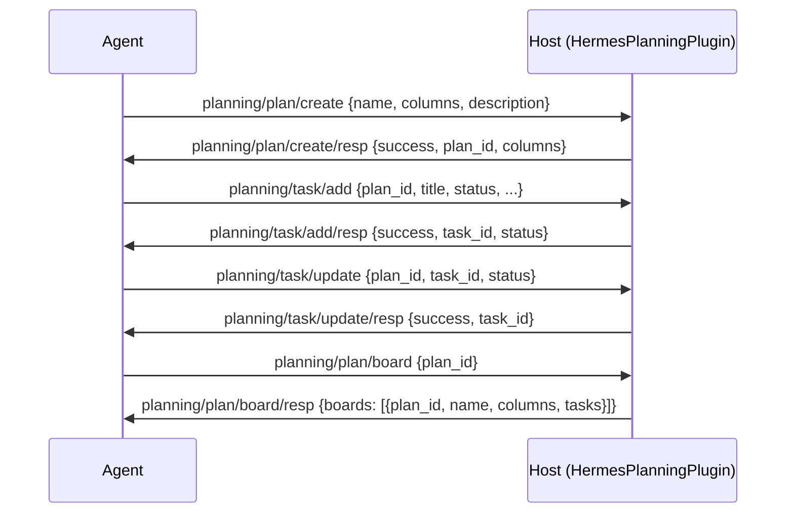

# Planning Capability Specification

## Capability Identity

| Property | Value |
|----------|-------|
| Enum | `A2ECapability.PLANNING` |
| String | `"planning"` |
| Plugin Type | `HermesPlanningPlugin` (extends `A2EPlugin`) |
| Namespace | `planning/*` |
| Message Count | 6 |

## Overview

The **planning** capability provides a generic planning primitive. Plans contain tasks with configurable status columns. A kanban board is one concrete view — tasks grouped by their `status` column. The same task/status model supports any column-based workflow (waterfall phases, OKR trees, sprints).

## Protocol Flow — Create Plan and Add Tasks



## Message Types (6)

### planning/plan/create — PlanCreateRequest

Agent → Host. Create a new plan with an optional column vocabulary.

| Field | Type | Required | Default | Description |
|-------|------|----------|---------|-------------|
| `type` | `str` | Yes | `"planning/plan/create"` | Message type |
| `id` | `str` | Yes | auto | Message UUID |
| `version` | `str` | Yes | `"1.0"` | Protocol version |
| `ts` | `float` | Yes | auto | Timestamp |
| `name` | `str` | No | `"default"` | Plan display name |
| `columns` | `list[str]` | No | `[]` | Column vocabulary (empty = `["backlog", "todo", "in_progress", "done"]`) |
| `description` | `str` | No | `""` | Plan description |

#### PlanCreateResponse

Host → Agent.

| Field | Type | Required | Default | Description |
|-------|------|----------|---------|-------------|
| `type` | `str` | Yes | `"planning/plan/create/resp"` | Message type |
| `id` | `str` | Yes | auto | Message UUID |
| `req_id` | `str` | No | `""` | Echo of request ID |
| `success` | `bool` | Yes | `False` | Whether the plan was created |
| `plan_id` | `str` | Yes | `""` | The new plan ID |
| `columns` | `list[str]` | Yes | `[]` | The resolved column vocabulary |

### planning/plan/list — PlanListRequest

Agent → Host. List all plans.

| Field | Type | Required | Default | Description |
|-------|------|----------|---------|-------------|
| `type` | `str` | Yes | `"planning/plan/list"` | Message type |
| `id` | `str` | Yes | auto | Message UUID |

#### PlanListResponse

Host → Agent.

| Field | Type | Required | Default | Description |
|-------|------|----------|---------|-------------|
| `type` | `str` | Yes | `"planning/plan/list/resp"` | Message type |
| `id` | `str` | Yes | auto | Message UUID |
| `req_id` | `str` | No | `""` | Echo of request ID |
| `plans` | `list[dict]` | Yes | `[]` | List of `{plan_id, name, columns}` dicts |

### planning/task/add — TaskAddRequest

Agent → Host. Add a task to a plan.

| Field | Type | Required | Default | Description |
|-------|------|----------|---------|-------------|
| `type` | `str` | Yes | `"planning/task/add"` | Message type |
| `id` | `str` | Yes | auto | Message UUID |
| `plan_id` | `str` | Yes | — | Parent plan ID |
| `title` | `str` | Yes | — | Task title |
| `status` | `str` | No | `"backlog"` | Task status |
| `description` | `str` | No | `""` | Task description |
| `assignee` | `str` | No | `""` | Assigned user/agent |
| `deps` | `list[str]` | No | `[]` | Task dependencies |
| `metadata` | `dict` | No | `{}` | Arbitrary metadata |

#### TaskAddResponse

Host → Agent.

| Field | Type | Required | Default | Description |
|-------|------|----------|---------|-------------|
| `type` | `str` | Yes | `"planning/task/add/resp"` | Message type |
| `id` | `str` | Yes | auto | Message UUID |
| `req_id` | `str` | No | `""` | Echo of request ID |
| `success` | `bool` | Yes | `False` | Whether the task was added |
| `task_id` | `str` | Yes | `""` | The new task ID |
| `status` | `str` | Yes | `""` | The assigned status |

### planning/task/update — TaskUpdateRequest

Agent → Host. Update a task's status, assignee, or dependencies.

| Field | Type | Required | Default | Description |
|-------|------|----------|---------|-------------|
| `type` | `str` | Yes | `"planning/task/update"` | Message type |
| `id` | `str` | Yes | auto | Message UUID |
| `plan_id` | `str` | Yes | — | Parent plan ID |
| `task_id` | `str` | Yes | — | Task ID to update |
| `status` | `str` | No | `""` | New status (empty = no change) |
| `assignee` | `str` | No | `""` | New assignee |
| `deps` | `list[str]` | No | `[]` | New dependency list |

#### TaskUpdateResponse

Host → Agent.

| Field | Type | Required | Default | Description |
|-------|------|----------|---------|-------------|
| `type` | `str` | Yes | `"planning/task/update/resp"` | Message type |
| `id` | `str` | Yes | auto | Message UUID |
| `req_id` | `str` | No | `""` | Echo of request ID |
| `success` | `bool` | Yes | `False` | Whether the update succeeded |
| `task_id` | `str` | Yes | `""` | The updated task ID |

### planning/task/list — TaskListRequest

Agent → Host. List tasks, optionally filtered by plan and/or status.

| Field | Type | Required | Default | Description |
|-------|------|----------|---------|-------------|
| `type` | `str` | Yes | `"planning/task/list"` | Message type |
| `id` | `str` | Yes | auto | Message UUID |
| `plan_id` | `str` | No | `""` | Filter by plan (empty = all plans) |
| `status` | `str` | No | `""` | Filter by status (empty = all statuses) |

#### TaskListResponse

Host → Agent.

| Field | Type | Required | Default | Description |
|-------|------|----------|---------|-------------|
| `type` | `str` | Yes | `"planning/task/list/resp"` | Message type |
| `id` | `str` | Yes | auto | Message UUID |
| `req_id` | `str` | No | `""` | Echo of request ID |
| `tasks` | `list[dict]` | Yes | `[]` | List of `{task_id, title, status, assignee, plan_id}` dicts |

### planning/plan/board — PlanBoardRequest

Agent → Host. Get the kanban-style board view (tasks grouped by status column).

| Field | Type | Required | Default | Description |
|-------|------|----------|---------|-------------|
| `type` | `str` | Yes | `"planning/plan/board"` | Message type |
| `id` | `str` | Yes | auto | Message UUID |
| `plan_id` | `str` | No | `""` | Filter by plan (empty = all plans, one board each) |

#### PlanBoardResponse

Host → Agent.

| Field | Type | Required | Default | Description |
|-------|------|----------|---------|-------------|
| `type` | `str` | Yes | `"planning/plan/board/resp"` | Message type |
| `id` | `str` | Yes | auto | Message UUID |
| `req_id` | `str` | No | `""` | Echo of request ID |
| `boards` | `list[dict]` | Yes | `[]` | Board views, each with `plan_id`, `name`, `columns`, `tasks` |

Each board's `tasks` groups tasks by column: `{"backlog": [...], "todo": [...], "in_progress": [...], "done": [...]}`.

## Error Codes

| Error | Condition |
|-------|-----------|
| `invalid_message` | Unrecognized planning message type |
| `runtime_error` | SQLite or internal error |

## Plugin Contract

The `HermesPlanningPlugin` extends `A2EPlugin` directly (not through an SDK abstract base):

### `supported_messages()`

Returns a dict mapping `PlanningMessageType` enum values to request model classes:

```python
{
    PlanningMessageType.PLAN_CREATE: PlanCreateRequest,
    PlanningMessageType.PLAN_LIST: PlanListRequest,
    PlanningMessageType.TASK_ADD: TaskAddRequest,
    PlanningMessageType.TASK_UPDATE: TaskUpdateRequest,
    PlanningMessageType.TASK_LIST: TaskListRequest,
    PlanningMessageType.PLAN_BOARD: PlanBoardRequest,
}
```

### `handle(msg)`

Dispatches by message type to one of six handler methods:

| Handler | Message Type | Returns |
|---------|-------------|---------|
| `_create_plan` | `planning/plan/create` | `PlanCreateResponse` |
| `_list_plans` | `planning/plan/list` | `PlanListResponse` |
| `_add_task` | `planning/task/add` | `TaskAddResponse` |
| `_update_task` | `planning/task/update` | `TaskUpdateResponse` |
| `_list_tasks` | `planning/task/list` | `TaskListResponse` |
| `_board` | `planning/plan/board` | `PlanBoardResponse` |

### Storage

- SQLite database at `config["ROOT"]/planning.db`
- Two tables: `plans` (plan_id, name, columns, description, created_at) and `tasks` (task_id, plan_id, title, status, description, assignee, deps, metadata, created_at)
- Thread-safe via `threading.RLock()`

## Config Example

```yaml
plugins:
  - name: planning
    type: planning
    cls: a2e.caps.planning.plugin.HermesPlanningPlugin
    metadata:
      enabled: true
      priority: 0
      ROOT: "/tmp/a2e/planning"
```

## Wire Example

```json
// Agent → Host: Create a plan
{"type": "planning/plan/create", "id": "...", "name": "release", "columns": ["backlog", "todo", "in_progress", "done"], "description": "ship it"}

// Host → Agent: Plan created
{"type": "planning/plan/create/resp", "id": "...", "req_id": "...", "success": true, "plan_id": "abc123", "columns": ["backlog", "todo", "in_progress", "done"]}

// Agent → Host: Add a task
{"type": "planning/task/add", "id": "...", "plan_id": "abc123", "title": "write spec", "status": "todo"}

// Host → Agent: Task added
{"type": "planning/task/add/resp", "id": "...", "req_id": "...", "success": true, "task_id": "def456", "status": "todo"}

// Agent → Host: Get kanban board
{"type": "planning/plan/board", "id": "...", "plan_id": "abc123"}

// Host → Agent: Board view
{"type": "planning/plan/board/resp", "id": "...", "req_id": "...", "boards": [{"plan_id": "abc123", "name": "release", "columns": ["backlog", "todo", "in_progress", "done"], "tasks": {"backlog": [...], "todo": [{"task_id": "def456", "title": "write spec", "status": "todo", "assignee": ""}], "in_progress": [], "done": []}}]}
```

## Security Considerations

- The planning plugin stores data in a local SQLite file. In production, configure `ROOT` to a persistent volume.
- No authentication or authorization — any connected agent can create/update/delete plans and tasks.
- Task metadata is arbitrary JSON — validate content before displaying to users.
- Dependency tracking (`deps`) is advisory only; no cycle detection is performed.