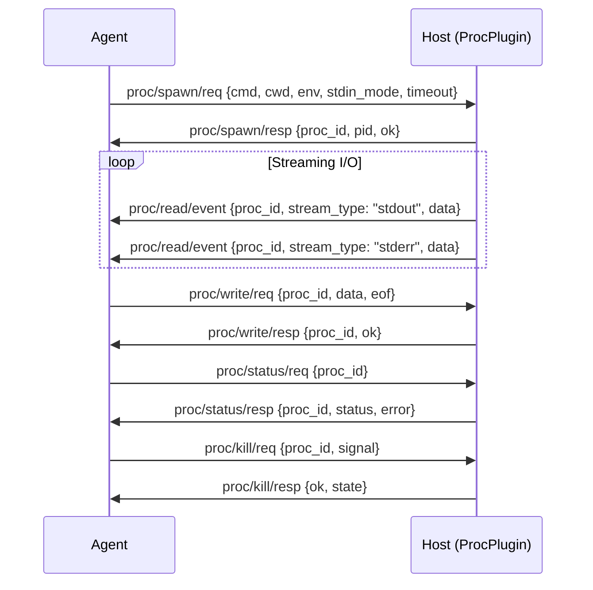

# Process Capability Specification

```text
a2e/caps/proc/protocol.py  — MessageType, ProcSpawn*, ProcWrite*, ProcReadEvent, ProcKill*, ProcStatus*
a2e/caps/proc/plugin.py    — ProcPlugin, ProcSession
```

## Capability Identity

| Property | Value |
|----------|-------|
| Enum | `A2ECapability.PROC` |
| String | `"proc"` |
| Plugin Type | `ProcPlugin` |
| Plugin Priority | `5` |
| Namespace | `proc/*` |
| Message Count | 9 |

## Overview

The **process** capability provides long-running process management. Unlike `tool/call` (which runs to completion), `proc/*` keeps a process alive so the agent can read/write its I/O incrementally. This enables interactive shell sessions, long-running server processes, and streaming command output.

**Key distinction from tools:** Tools are request/response and run to completion. Processes are long-lived, support incremental I/O, and require explicit lifecycle management (spawn, write, kill).

## Protocol Flow



## Message Types (9)

### proc/spawn/req — ProcSpawnRequest

Agent → Host. Spawn a persistent process.

| Field | Type | Required | Default | Description |
|-------|------|----------|---------|-------------|
| `type` | `str` | Yes | `"proc/spawn/req"` | Message type |
| `id` | `str` | Yes | auto | Message UUID |
| `version` | `str` | Yes | `"1.0"` | Protocol version |
| `ts` | `float` | Yes | auto | Timestamp |
| `session_id` | `str` | Yes | `""` | Session from HandshakeResponse |
| `cmd` | `list[str]` | Yes | `[]` | Command + args (must match allowlist) |
| `cwd` | `str` | No | `""` | Working directory (default: host CWD) |
| `env` | `dict[str, str]` | No | `{}` | Additional environment variables |
| `stdin_mode` | `str` | No | `"pipe"` | Stdin mode: `pipe` or `null` |
| `timeout` | `int` | No | `0` | Auto-kill after seconds (0 = no limit) |

### proc/spawn/resp — ProcSpawnResponse

Host → Agent. Returns proc_id for subsequent messages.

| Field | Type | Required | Default | Description |
|-------|------|----------|---------|-------------|
| `type` | `str` | Yes | `"proc/spawn/resp"` | Message type |
| `id` | `str` | Yes | auto | Message UUID |
| `version` | `str` | Yes | `"1.0"` | Protocol version |
| `ts` | `float` | Yes | auto | Timestamp |
| `req_id` | `str` | Yes | `""` | Echoes request ID |
| `proc_id` | `str` | Yes | `""` | Process identifier (UUID) |
| `ok` | `bool` | Yes | `False` | Whether spawn succeeded |
| `pid` | `int` | No | `None` | OS process ID |
| `error` | `str` | No | `""` | Error message on failure |

### proc/write/req — ProcWriteRequest

Agent → Host. Write a chunk to the process's stdin.

| Field | Type | Required | Default | Description |
|-------|------|----------|---------|-------------|
| `type` | `str` | Yes | `"proc/write/req"` | Message type |
| `id` | `str` | Yes | auto | Message UUID |
| `version` | `str` | Yes | `"1.0"` | Protocol version |
| `ts` | `float` | Yes | auto | Timestamp |
| `proc_id` | `str` | Yes | `""` | Target process |
| `data` | `str` | Yes | `""` | UTF-8 text (use base64 for binary) |
| `eof` | `bool` | No | `False` | Close stdin after this write |

### proc/write/resp — ProcWriteResponse

Host → Agent.

| Field | Type | Required | Default | Description |
|-------|------|----------|---------|-------------|
| `type` | `str` | Yes | `"proc/write/resp"` | Message type |
| `id` | `str` | Yes | auto | Message UUID |
| `version` | `str` | Yes | `"1.0"` | Protocol version |
| `ts` | `float` | Yes | auto | Timestamp |
| `req_id` | `str` | Yes | `""` | Echoes request ID |
| `proc_id` | `str` | Yes | `""` | Target process |
| `ok` | `bool` | Yes | `False` | Whether write succeeded |
| `pid` | `int` | No | `0` | OS process ID |
| `error` | `str` | No | `""` | Error message on failure |

### proc/read/event — ProcReadEvent

Host → Agent (server-initiated). Chunk of process stdout/stderr. Extends `A2EEvent`.

| Field | Type | Required | Default | Description |
|-------|------|----------|---------|-------------|
| `type` | `str` | Yes | `"proc/read/event"` | Message type |
| `id` | `str` | Yes | auto | Message UUID |
| `version` | `str` | Yes | `"1.0"` | Protocol version |
| `ts` | `float` | Yes | auto | Timestamp |
| `proc_id` | `str` | Yes | `""` | Source process |
| `stream_type` | `str` | Yes | `"stdout"` | Stream: `stdout`, `stderr`, `killed` |
| `data` | `str` | Yes | — | JSON-encoded data (text line, or exit code) |
| `req_id` | `str` | Yes | `""` | Correlates to original spawn request |

**`data` payload shapes by stream_type:**

| Stream Type | Data Shape | Description |
|-------------|------------|-------------|
| `stdout` | `{"text": str}` or `{"code": int}` | Output line or exit code 0 |
| `stderr` | `{"text": str}` or `{"code": int}` | Error line or non-zero exit code |
| `killed` | `{}` | Process was killed |

### proc/kill/req — ProcKillRequest

Agent → Host. Terminate a process.

| Field | Type | Required | Default | Description |
|-------|------|----------|---------|-------------|
| `type` | `str` | Yes | `"proc/kill/req"` | Message type |
| `id` | `str` | Yes | auto | Message UUID |
| `version` | `str` | Yes | `"1.0"` | Protocol version |
| `ts` | `float` | Yes | auto | Timestamp |
| `proc_id` | `str` | Yes | `""` | Process to terminate |
| `signal` | `str` | No | `"SIGTERM"` | Signal: `SIGTERM`, `SIGKILL`, `SIGINT` |

### proc/kill/resp — ProcKillResponse

Host → Agent.

| Field | Type | Required | Default | Description |
|-------|------|----------|---------|-------------|
| `type` | `str` | Yes | `"proc/kill/resp"` | Message type |
| `id` | `str` | Yes | auto | Message UUID |
| `version` | `str` | Yes | `"1.0"` | Protocol version |
| `ts` | `float` | Yes | auto | Timestamp |
| `req_id` | `str` | Yes | `""` | Echoes request ID |
| `ok` | `bool` | Yes | `False` | Whether kill succeeded |
| `state` | `str` | No | `""` | Final ProcState |

### proc/status/req — ProcStatusRequest

Agent → Host. Query process status.

| Field | Type | Required | Default | Description |
|-------|------|----------|---------|-------------|
| `type` | `str` | Yes | `"proc/status/req"` | Message type |
| `id` | `str` | Yes | auto | Message UUID |
| `version` | `str` | Yes | `"1.0"` | Protocol version |
| `ts` | `float` | Yes | auto | Timestamp |
| `proc_id` | `str` | Yes | `""` | Process to query (empty = all procs in session) |

### proc/status/resp — ProcStatusResponse

Host → Agent.

| Field | Type | Required | Default | Description |
|-------|------|----------|---------|-------------|
| `type` | `str` | Yes | `"proc/status/resp"` | Message type |
| `id` | `str` | Yes | auto | Message UUID |
| `version` | `str` | Yes | `"1.0"` | Protocol version |
| `ts` | `float` | Yes | auto | Timestamp |
| `req_id` | `str` | Yes | `""` | Echoes request ID |
| `proc_id` | `str` | Yes | — | Process identifier |
| `status` | `str` | Yes | — | Current status |
| `error` | `str` | Yes | — | Error message (if any) |

## Data Models

### ProcState

| Value | Description |
|-------|-------------|
| `running` | Process is actively running |
| `stopped` | Process has been stopped |
| `crashed` | Process crashed unexpectedly |
| `timedout` | Process exceeded timeout limit |

**Plugin-internal statuses:**

| Value | Description |
|-------|-------------|
| `running` | Active and streaming output |
| `completed` | Exited with code 0 |
| `failed` | Exited with non-zero code |
| `killed` | Terminated by kill request |
| `not_found` | Session ID not found |
| `error` | Internal error |

### ProcStatus

| Field | Type | Description |
|-------|------|-------------|
| `proc_id` | `str` | Process identifier |
| `cmd` | `str` | Command that was executed |
| `state` | `str` | ProcState value |
| `pid` | `int` | OS process ID |
| `exit_code` | `int` or `None` | Exit code (when process has terminated) |
| `started_at` | `float` | Start timestamp |

### ProcSession (internal)

| Field | Type | Description |
|-------|------|-------------|
| `proc_id` | `str` | Process identifier |
| `process` | `subprocess.Popen` | OS subprocess handle |
| `req_id` | `str` | Original spawn request ID |
| `status` | `str` | Current status string |
| `error` | `str` or `None` | Error message |

## Error Codes — ProcMCPError

| Code | Enum Value | Description | Retryable |
|------|------------|-------------|-----------|
| `unknown_proc` | `UNKNOWN_PROC` | Process ID not found | No |
| `proc_dead` | `PROC_DEAD` | Process has already exited | No |
| `proc_limit` | `PROC_LIMIT` | Session process quota exceeded | No |

## Command Allowlist

The ProcPlugin enforces a command allowlist. By default:

```python
ALLOWED_COMMANDS = {"python3", "bash", "ls"}
```

Commands are validated by checking `cmd[0]` against the allowlist. Hosts can customize the allowlist via config:

```python
self.allowed_commands = config.get("ALLOWED_COMMANDS", ALLOWED_COMMANDS)
```

## Execution Model

1. **Spawn**: `subprocess.Popen` with `stdin=PIPE`, `stdout=PIPE`, `stderr=PIPE`, `text=True`, `shell=False`
2. **Stream readers**: Daemon threads read stdout/stderr line-by-line, emitting `ProcReadEvent` for each line
3. **Wait thread**: Daemon thread calls `proc.wait()`, then emits final exit code event
4. **Write**: Direct `proc.stdin.write()` + `flush()`
5. **Kill**: `proc.terminate()` with status set to `"killed"`

## Wire Examples

### Spawn a Python Process

```json
{"type":"proc/spawn/req","id":"p1","version":"1.0","ts":1716123456.789,"session_id":"s1","cmd":["python3","-i"],"cwd":"","env":{},"stdin_mode":"pipe","timeout":0}
```

```json
{"type":"proc/spawn/resp","id":"p2","version":"1.0","ts":1716123456.900,"req_id":"p1","proc_id":"proc_abc123","ok":true,"pid":12345,"error":""}
```

### Write to stdin

```json
{"type":"proc/write/req","id":"p3","version":"1.0","ts":1716123457.100,"proc_id":"proc_abc123","data":"print('hello')\n","eof":false}
```

### Read Output (server-initiated)

```json
{"type":"proc/read/event","id":"p4","version":"1.0","ts":1716123457.150,"proc_id":"proc_abc123","stream_type":"stdout","data":"{\"text\":\"hello\\n\"}","req_id":"p1"}
```

### Kill Process

```json
{"type":"proc/kill/req","id":"p5","version":"1.0","ts":1716123458.100,"proc_id":"proc_abc123","signal":"SIGTERM"}
```

```json
{"type":"proc/kill/resp","id":"p6","version":"1.0","ts":1716123458.200,"req_id":"p5","ok":true,"state":"killed"}
```

## Security Considerations

1. **Command allowlist**: Only pre-approved commands can be spawned (default: `python3`, `bash`, `ls`)
2. **No shell injection**: `shell=False` in Popen prevents shell metacharacter injection
3. **Process quota**: `proc_limit` error prevents fork bombs
4. **Timeout enforcement**: Auto-kill prevents zombie processes
5. **Session isolation**: Processes are scoped to sessions; cannot access other sessions' processes
6. **Stdin mode**: `null` mode disables stdin for processes that don't need it
