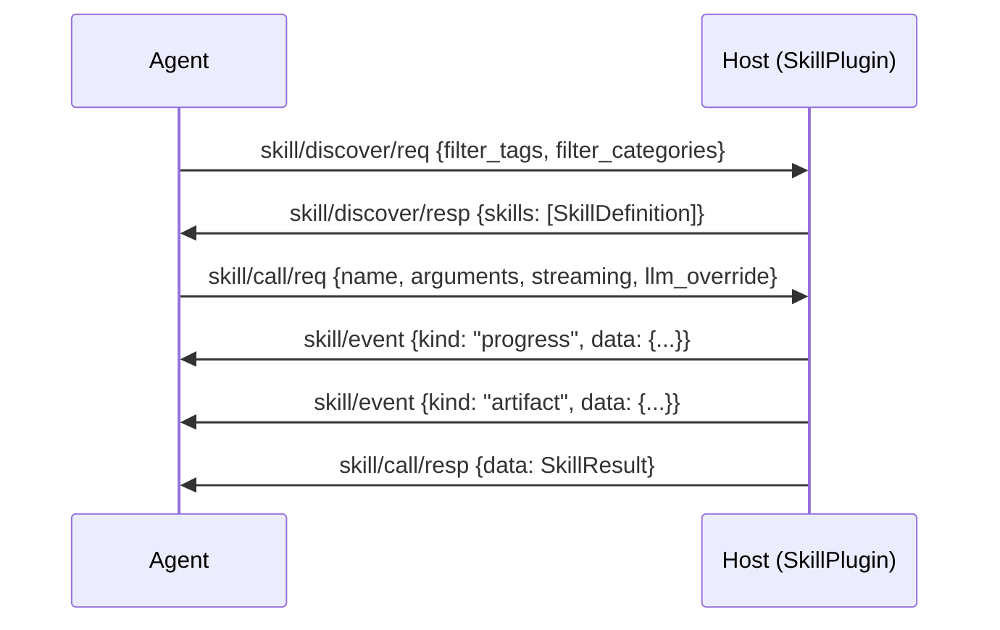

# Skills Capability Specification

```text
a2e/caps/skills/protocol.py  — MessageType, SkillDefinition, SkillDiscover*, SkillCall*, SkillEvent, SkillResult
a2e/caps/skills/plugin.py    — SkillPlugin
```

## Capability Identity

| Property | Value |
|----------|-------|
| Enum | `A2ECapability.SKILL` |
| String | `"skill"` |
| Plugin Type | `SkillPlugin` |
| Namespace | `skill/*` |
| Message Count | 5 |

## Overview

The **skills** capability provides multi-step, LLM-driven agentic execution units. Unlike tools (which are stateless primitives), skills are complex workflows that may involve multiple LLM calls, tool invocations, and conditional logic. Skills are inspired by MCP/JSON-RPC 2.0 and optimized for sandboxed, multi-turn agentic loops where skills may live in Docker containers.

**Key distinctions from tools:**
- Skills are multi-turn; tools are single-turn
- Skills may stream intermediate events; tools optionally stream
- Skills may use LLMs; tools are pure computation
- Skills have natural language instructions for agent selection
- Skills declare their tool and toolkit dependencies

## Protocol Flow



## Message Types (5)

### skill/discover/req — SkillDiscoverRequest

Agent → Host. Discover available skills.

| Field | Type | Required | Default | Description |
|-------|------|----------|---------|-------------|
| `type` | `str` | Yes | `"skill/discover/req"` | Message type identifier |
| `id` | `str` | Yes | auto UUID | Message UUID |
| `version` | `str` | Yes | `"1.0"` | Protocol version |
| `ts` | `float` | Yes | auto | Unix epoch timestamp |
| `filter_tags` | `list[str]` | No | `[]` | Filter by tags (OR logic) |
| `filter_categories` | `list[str]` | No | `[]` | Filter by category |

### skill/discover/resp — SkillDiscoverResponse

Host → Agent. Returns all matching skill manifests.

| Field | Type | Required | Default | Description |
|-------|------|----------|---------|-------------|
| `type` | `str` | Yes | `"skill/discover/resp"` | Message type identifier |
| `id` | `str` | Yes | auto UUID | Message UUID |
| `version` | `str` | Yes | `"1.0"` | Protocol version |
| `ts` | `float` | Yes | auto | Unix epoch timestamp |
| `req_id` | `str` | Yes | `""` | Echoes request ID |
| `skills` | `list[SkillDefinition]` | Yes | `[]` | Available skill definitions |

### skill/call/req — SkillCallRequest

Agent → Host. Execute a skill.

| Field | Type | Required | Default | Description |
|-------|------|----------|---------|-------------|
| `type` | `str` | Yes | `"skill/call/req"` | Message type identifier |
| `id` | `str` | Yes | auto UUID | Message UUID |
| `version` | `str` | Yes | `"1.0"` | Protocol version |
| `ts` | `float` | Yes | auto | Unix epoch timestamp |
| `name` | `str` | Yes | `""` | Must match SkillDefinition.name |
| `arguments` | `dict[str, Any]` | Yes | `{}` | Input arguments validated against skill.input_schema |
| `correlation_id` | `str` | No | `""` | Ties to agent turn/trajectory |
| `timeout` | `int` | No | `60` | Per-call wall-clock limit (seconds) |
| `streaming` | `bool` | No | `True` | Emit SkillEvent messages during execution |
| `llm_override` | `LLMConfig` | No | `None` | Override model/provider for this invocation |
| `metadata` | `dict` | No | `{}` | Additional metadata |

### skill/call/resp — SkillCallResponse

Host → Agent. Final result of skill execution.

| Field | Type | Required | Default | Description |
|-------|------|----------|---------|-------------|
| `type` | `str` | Yes | `"skill/call/resp"` | Message type identifier |
| `id` | `str` | Yes | auto UUID | Message UUID |
| `version` | `str` | Yes | `"1.0"` | Protocol version |
| `ts` | `float` | Yes | auto | Unix epoch timestamp |
| `req_id` | `str` | Yes | `""` | Echoes request ID |
| `name` | `str` | Yes | `""` | Skill that was executed |
| `data` | `SkillResult` | No | `None` | Skill execution result |
| `error` | `dict` | No | `None` | Transport-level error: `{code, message, retryable}` |
| `created_at` | `float` | No | auto | Result creation timestamp |

### skill/event — SkillEvent

Host → Agent. Zero or more streaming events during skill execution. Extends `A2EEvent`.

| Field | Type | Required | Default | Description |
|-------|------|----------|---------|-------------|
| `type` | `str` | Yes | `"skill/event"` | Message type identifier |
| `id` | `str` | Yes | auto UUID | Message UUID |
| `version` | `str` | Yes | `"1.0"` | Protocol version |
| `ts` | `float` | Yes | auto | Unix epoch timestamp |
| `kind` | `str` | Yes | — | Event kind (see Event Kinds below) |
| `req_id` | `str` | Yes | `""` | Correlates to SkillCallRequest ID |
| `data` | `dict` | Yes | `{}` | Event payload |
| `seq` | `int` | Yes | `0` | Monotonic sequence number |

**Event kinds and their `data` shapes:**

| Kind | Data Shape | Description |
|------|------------|-------------|
| `progress` | `{ "pct": int, "message": str }` | Progress update |
| `artifact` | `{ "name": str, "mime": str, "chunk": str, "final": bool }` | Incremental data chunk |
| `log` | `{ "level": str, "message": str }` | Debug log line |
| `status` | `{ "message": str }` | One-liner status update |

## Data Models

### SkillDefinition

| Field | Type | Required | Default | Description |
|-------|------|----------|---------|-------------|
| `name` | `str` | Yes | — | Unique skill name |
| `version` | `str` | Yes | — | Skill version |
| `description` | `str` | Yes | — | Human-readable description |
| `triggers` | `list[str]` | Yes | — | Trigger phrases for auto-invocation |
| `tools` | `list[Any]` | No | `None` | Tool dependencies |
| `toolkits` | `list[Any]` | No | `None` | Toolkit dependencies |
| `status` | `SkillStatus` | Yes | — | `Created`, `Blocked`, `Published`, `Archived` |
| `input_schema` | `dict` | No | `{}` | JSON Schema for input arguments |
| `output_schema` | `dict` | No | `{}` | JSON Schema for output |
| `instructions` | `str` | No | `None` | Natural language instructions (critical for agent selection) |
| `file_path` | `str` | No | `None` | Path to skill definition file |
| `llm_config` | `LLMConfig` | No | `None` | Default LLM configuration |
| `arguments` | `list[str]` | No | `{}` | Default arguments |
| `when_to_use` | `str` | Yes | — | Guidance on when the agent should use this skill |
| `argument_hint` | `str` | Yes | — | Hint for argument construction |
| `source` | `str` | Yes | — | Origin: `user`, `system`, or `project` |
| `category` | `str` | No | `None` | Classification category |
| `tags` | `list[str]` | No | `None` | Classification tags |
| `max_turns` | `int` | No | `None` | Maximum agentic turns |
| `timeout_seconds` | `int` | No | `None` | Timeout for skill execution |
| `icon` | `str` | No | `None` | Icon for UI |
| `metadata` | `dict` | No | `None` | Additional metadata |

### LLMConfig

| Field | Type | Required | Default | Description |
|-------|------|----------|---------|-------------|
| `provider_name` | `str` | Yes | — | LLM provider name |
| `provider_credentials` | `dict` | Yes | — | Provider credentials/API keys |
| `provider_config` | `dict` | No | `None` | Provider-specific configuration |
| `is_default` | `bool` | No | `False` | Whether this is the default config |

### SkillResult

| Field | Type | Required | Default | Description |
|-------|------|----------|---------|-------------|
| `success` | `bool` | Yes | — | Whether execution succeeded |
| `data` | `Any` | No | `None` | Result data |
| `summary` | `Any` | No | `None` | Human-readable summary |
| `truncated` | `bool` | No | `False` | Output was truncated |
| `error` | `str` | No | `None` | Error message |
| `error_code` | `str` | No | `None` | Machine-readable error code |
| `duration_ms` | `int` | Yes | — | Execution time in milliseconds |
| `events` | `list[SkillEvent]` | No | `[]` | Collected streaming events |

### SkillStatus

| Value | Description |
|-------|-------------|
| `Created` | Skill is created but not yet available |
| `Blocked` | Skill is blocked (missing dependencies) |
| `Published` | Skill is available for use |
| `Archived` | Skill is archived and unavailable |

## Error Codes — SkillErrorCode

| Code | Enum Value | Description | Retryable |
|------|------------|-------------|-----------|
| `unknown_skill` | `UNKNOWN_SKILL` | Skill name not found | No |
| `skill_error` | `SKILL_ERROR` | Skill execution failed | Yes |
| `runtime_error` | `RUNTIME_ERROR` | General runtime failure | Depends |

**Additional ErrorCode values** (protocol-level):

| Code | Description |
|------|-------------|
| `parse_error` | Message could not be parsed |
| `invalid_message` | Message type not recognized |
| `schema_violation` | Input didn't match skill schema |
| `timeout` | Skill execution timed out |
| `out_of_memory` | Sandbox OOM |
| `sandbox_crash` | Sandbox process crashed |
| `unauthorized` | Agent not authorized for this skill |
| `version_mismatch` | Protocol version mismatch |

## Plugin Contract — SkillPlugin

```python
class SkillPlugin(A2EPlugin):
    def __init__(self, host_instance, config):
        super().setup(host_instance, config)

    @abstractmethod
    def _list_skills(self) -> list[SkillDefinition]:
        """Must return skill manifest. Override in subclass."""

    @abstractmethod
    def _execute_skill(self, name: str, arguments: dict, context: dict) -> SkillResult:
        """Execute skill logic. Override in subclass.
        context contains: emit_event, llm_override, metadata, streaming"""

    def discover(self, msg: SkillDiscoverRequest) -> list[SkillDefinition]:
        """Filter skills by tags and categories."""

    def call(self, msg: SkillCallRequest) -> SkillCallResponse:
        """Execute skill with streaming support."""
```

**Handler dispatch:**
- `SkillDiscoverRequest` → calls `discover(msg)` with tag/category filtering
- `SkillCallRequest` → calls `call(msg)` with streaming event aggregation

**Streaming support:** The `call()` method provides an `emit_event` callback in the execution context, allowing skills to stream intermediate results. Events are:
1. Pushed to the agent via `self.push(evt)`
2. Aggregated into the `events` field of `SkillResult`

## Wire Examples

### Discover Skills

```json
{"type":"skill/discover/req","id":"sd1","version":"1.0","ts":1716123456.789,"filter_tags":["coding"],"filter_categories":[]}
```

```json
{"type":"skill/discover/resp","id":"sd2","version":"1.0","ts":1716123456.900,"req_id":"sd1","skills":[{"name":"code_review","version":"1.0.0","description":"Review code for quality and security","triggers":["review code","code review"],"tools":null,"toolkits":null,"status":"Published","input_schema":{"type":"object","properties":{"code":{"type":"string"}},"required":["code"]},"output_schema":{},"instructions":"Review the provided code...","when_to_use":"Use when code needs quality review","argument_hint":"Provide the code to review","source":"system","category":"development","tags":["coding","review"],"max_turns":10,"timeout_seconds":120}]}
```

### Call Skill (with streaming)

```json
{"type":"skill/call/req","id":"sc1","version":"1.0","ts":1716123457.100,"name":"code_review","arguments":{"code":"def add(a, b): return a + b"},"correlation_id":"","timeout":60,"streaming":true,"llm_override":null,"metadata":{}}
```

```json
{"type":"skill/event","id":"se1","version":"1.0","ts":1716123457.200,"kind":"progress","req_id":"sc1","data":{"pct":30,"message":"Analyzing code structure..."},"seq":0}
```

```json
{"type":"skill/call/resp","id":"sc2","version":"1.0","ts":1716123458.500,"req_id":"sc1","name":"code_review","data":{"success":true,"data":{"issues":[]},"summary":"No issues found","duration_ms":1400},"created_at":1716123458.500}
```

## Security Considerations

1. **Sandboxing**: Skills may run in Docker containers for isolation
2. **LLM override restriction**: Host may restrict `llm_override` to approved providers
3. **Timeout enforcement**: Per-call timeout prevents runaway skill execution
4. **Credential isolation**: LLM credentials in `llm_override` must be scoped
5. **Input schema validation**: Arguments validated against `input_schema` before execution
