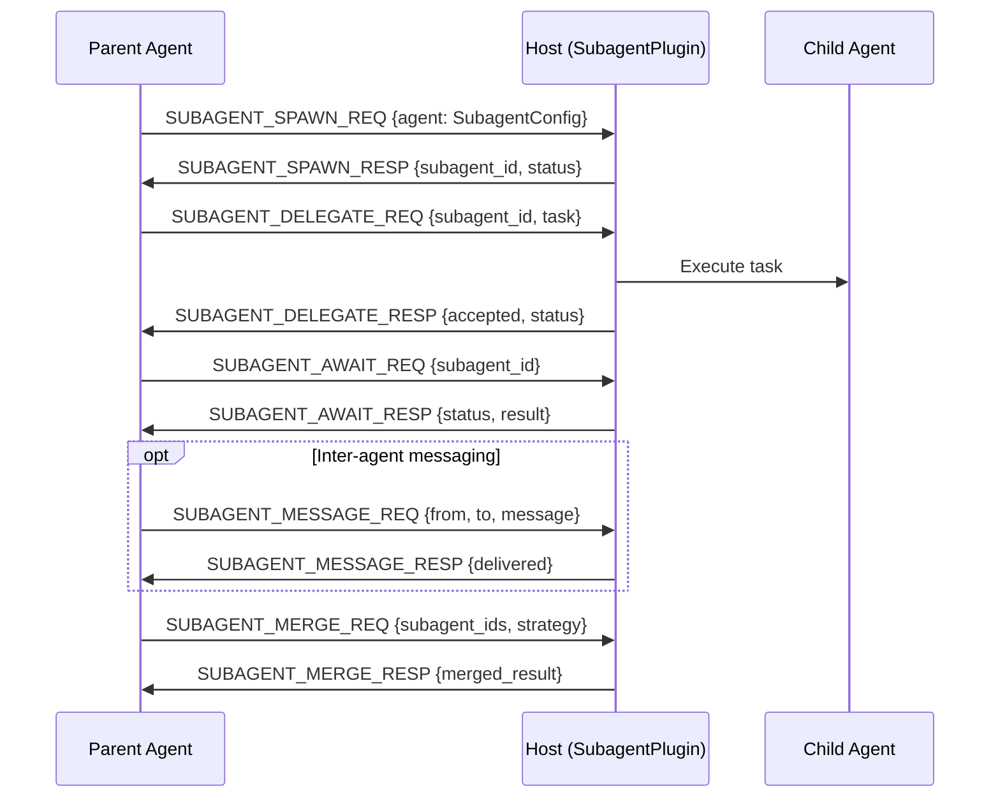

# Subagents Capability Specification

```text
a2e/caps/subagents/protocol.py  — 12 message types, SubagentConfig, TaskDefinition, SubagentInfo
a2e/caps/subagents/plugin.py    — SubagentPlugin, SubagentRuntime
```

## Capability Identity

| Property | Value |
|----------|-------|
| Enum | `A2ECapability.MULTI_AGENT` |
| String | `"multi_agent"` |
| Plugin Type | `SubagentPlugin` |
| Namespace | `SUBAGENT_*` (uppercase) |
| Message Count | 12 |

## Overview

The **subagents** capability provides multi-agent orchestration — spawning, delegating tasks to, communicating with, and merging results from child agents. Subagents run as independent agent instances with their own model, system prompt, capabilities, and execution scope.

**Key concepts:**
- **Spawn** — Create a new subagent with a specific configuration
- **Delegate** — Assign a task to a spawned subagent
- **Await** — Block until a subagent completes its task
- **Message** — Send inter-agent messages between subagents
- **List** — Query all active subagents
- **Cancel/Terminate** — Stop a running subagent
- **Merge** — Combine results from multiple subagents

**Isolation model:**
- Memory: `shared`, `isolated`, or `snapshot` scope
- Tools: `shared`, `restricted`, or `isolated` scope
- Depth limit: Prevents infinite nesting

## Protocol Flow



## Message Types (12)

### Spawn (2)

#### SUBAGENT_SPAWN_REQ — SubagentSpawnRequest

Parent → Host. Create a new subagent instance.

| Field | Type | Required | Default | Description |
|-------|------|----------|---------|-------------|
| `type` | `str` | Yes | `"SUBAGENT_SPAWN_REQ"` | Message type |
| `agent` | `SubagentConfig` | Yes | — | Subagent configuration |
| `parent_agent_id` | `str` | No | `None` | Parent agent identifier |
| `root_agent_id` | `str` | No | `None` | Root agent (for multi-level nesting) |

#### SUBAGENT_SPAWN_RESP — SubagentSpawnResponse

Host → Parent.

| Field | Type | Required | Default | Description |
|-------|------|----------|---------|-------------|
| `type` | `str` | Yes | `"SUBAGENT_SPAWN_RESP"` | Message type |
| `subagent_id` | `str` | Yes | — | Assigned subagent identifier (`sub_{hex[:8]}`) |
| `status` | `SubagentStatus` | Yes | — | Initial status (`READY`) |

### Delegate (2)

#### SUBAGENT_DELEGATE_REQ — SubagentDelegateRequest

Parent → Host. Assign a task to a subagent.

| Field | Type | Required | Default | Description |
|-------|------|----------|---------|-------------|
| `type` | `str` | Yes | `"SUBAGENT_DELEGATE_REQ"` | Message type |
| `subagent_id` | `str` | Yes | — | Target subagent |
| `task` | `TaskDefinition` | Yes | — | Task to execute |

#### SUBAGENT_DELEGATE_RESP — SubagentDelegateResponse

Host → Parent.

| Field | Type | Required | Default | Description |
|-------|------|----------|---------|-------------|
| `type` | `str` | Yes | `"SUBAGENT_DELEGATE_RESP"` | Message type |
| `accepted` | `bool` | No | `True` | Whether the task was accepted |
| `status` | `SubagentStatus` | Yes | — | Subagent status after delegation |

### Await (2)

#### SUBAGENT_AWAIT_REQ — SubagentAwaitRequest

Parent → Host. Block until subagent completes.

| Field | Type | Required | Default | Description |
|-------|------|----------|---------|-------------|
| `type` | `str` | Yes | `"SUBAGENT_AWAIT_REQ"` | Message type |
| `subagent_id` | `str` | Yes | — | Subagent to wait for |

#### SUBAGENT_AWAIT_RESP — SubagentAwaitResponse

Host → Parent.

| Field | Type | Required | Default | Description |
|-------|------|----------|---------|-------------|
| `type` | `str` | Yes | `"SUBAGENT_AWAIT_RESP"` | Message type |
| `subagent_id` | `str` | Yes | — | Subagent identifier |
| `status` | `SubagentStatus` | Yes | — | Final status |
| `result` | `dict[str, Any]` | No | `None` | Task result |
| `error` | `str` | No | `None` | Error message if failed |

### Message (2) — Inter-agent Communication

#### SUBAGENT_MESSAGE_REQ — SubagentMessageRequest

Agent → Host. Send a message between subagents.

| Field | Type | Required | Default | Description |
|-------|------|----------|---------|-------------|
| `type` | `str` | Yes | `"SUBAGENT_MESSAGE_REQ"` | Message type |
| `from_subagent_id` | `str` | Yes | — | Sender subagent |
| `to_subagent_id` | `str` | Yes | — | Recipient subagent |
| `message` | `SubagentMessagePayload` | Yes | — | Message payload |

#### SUBAGENT_MESSAGE_RESP — SubagentMessageResponse

Host → Sender.

| Field | Type | Required | Default | Description |
|-------|------|----------|---------|-------------|
| `type` | `str` | Yes | `"SUBAGENT_MESSAGE_RESP"` | Message type |
| `delivered` | `bool` | No | `True` | Whether message was delivered |

### List (2)

#### SUBAGENT_LIST_REQ — SubagentListRequest

Agent → Host. List all subagents.

| Field | Type | Required | Default | Description |
|-------|------|----------|---------|-------------|
| `type` | `str` | Yes | `"SUBAGENT_LIST_REQ"` | Message type |

#### SUBAGENT_LIST_RESP — SubagentListResponse

Host → Agent.

| Field | Type | Required | Default | Description |
|-------|------|----------|---------|-------------|
| `type` | `str` | Yes | `"SUBAGENT_LIST_RESP"` | Message type |
| `subagents` | `list[SubagentInfo]` | Yes | — | List of active subagents |

### Cancel/Terminate (2) — No Response Messages

#### SUBAGENT_CANCEL_REQ — SubagentCancelRequest

Agent → Host. Request graceful cancellation of a subagent.

| Field | Type | Required | Default | Description |
|-------|------|----------|---------|-------------|
| `type` | `str` | Yes | `"SUBAGENT_CANCEL_REQ"` | Message type |
| `subagent_id` | `str` | Yes | — | Subagent to cancel |

#### SUBAGENT_TERMINATE_REQ — SubagentTerminateRequest

Agent → Host. Forcefully terminate a subagent.

| Field | Type | Required | Default | Description |
|-------|------|----------|---------|-------------|
| `type` | `str` | Yes | `"SUBAGENT_TERMINATE_REQ"` | Message type |
| `subagent_id` | `str` | Yes | — | Subagent to terminate |

### Merge (2)

#### SUBAGENT_MERGE_REQ — SubagentMergeRequest

Agent → Host. Merge results from multiple subagents.

| Field | Type | Required | Default | Description |
|-------|------|----------|---------|-------------|
| `type` | `str` | Yes | `"SUBAGENT_MERGE_REQ"` | Message type |
| `subagent_ids` | `list[str]` | Yes | — | Subagents to merge |
| `strategy` | `str` | No | `"hierarchical_summary"` | Merge strategy |

**Merge strategies:**

| Strategy | Description |
|----------|-------------|
| `hierarchical_summary` | Parent summarizes child results |
| `voting` | Majority vote across results |
| `custom` | Host-defined merge strategy |

#### SUBAGENT_MERGE_RESP — SubagentMergeResponse

Host → Agent.

| Field | Type | Required | Default | Description |
|-------|------|----------|---------|-------------|
| `type` | `str` | Yes | `"SUBAGENT_MERGE_RESP"` | Message type |
| `merged_result` | `dict[str, Any]` | Yes | — | Merged output |

### Events (1) — Server-initiated

#### SUBAGENT_EVENT — SubagentEvent

Host → Agent. Subagent lifecycle event.

| Field | Type | Required | Default | Description |
|-------|------|----------|---------|-------------|
| `type` | `str` | Yes | `"SUBAGENT_EVENT"` | Message type |
| `subagent_id` | `str` | Yes | — | Source subagent |
| `event` | `str` | Yes | — | Event type identifier |
| `content` | `dict[str, Any]` | No | `{}` | Event payload |

## Data Models

### SubagentConfig

| Field | Type | Required | Default | Description |
|-------|------|----------|---------|-------------|
| `name` | `str` | Yes | — | Subagent name |
| `role` | `str` | No | `None` | Role descriptor |
| `model` | `str` | Yes | — | LLM model identifier |
| `system_prompt` | `str` | No | `None` | Custom system prompt |
| `capabilities` | `list[str]` | No | `[]` | Enabled capabilities |
| `memory_scope` | `MemoryScope` | No | `SHARED` | Memory isolation level |
| `tool_scope` | `ToolScope` | No | `RESTRICTED` | Tool access level |
| `max_steps` | `int` | No | `40` | Maximum agent steps |
| `timeout_seconds` | `int` | No | `600` | Execution timeout |
| `metadata` | `dict[str, Any]` | No | `{}` | Additional metadata |

### TaskDefinition

| Field | Type | Required | Default | Description |
|-------|------|----------|---------|-------------|
| `name` | `str` | Yes | — | Task name |
| `instruction` | `str` | Yes | — | Task instruction for the subagent |
| `success_criteria` | `list[str]` | No | `[]` | Criteria for task completion |
| `metadata` | `dict[str, Any]` | No | `{}` | Additional task metadata |

### SubagentInfo

| Field | Type | Required | Default | Description |
|-------|------|----------|---------|-------------|
| `subagent_id` | `str` | Yes | — | Subagent identifier |
| `name` | `str` | Yes | — | Display name |
| `status` | `SubagentStatus` | Yes | — | Current status |
| `parent_agent_id` | `str` | No | `None` | Parent agent |
| `root_agent_id` | `str` | No | `None` | Root agent |
| `depth` | `int` | No | `0` | Nesting depth |
| `config` | `SubagentConfig` | Yes | — | Full configuration |

### SubagentMessagePayload

| Field | Type | Required | Default | Description |
|-------|------|----------|---------|-------------|
| `type` | `str` | Yes | — | Message type identifier |
| `content` | `Any` | Yes | — | Message content |

### SourceRef

| Field | Type | Required | Default | Description |
|-------|------|----------|---------|-------------|
| `session_id` | `str` | No | `None` | Session reference |
| `trajectory_id` | `str` | No | `None` | Trajectory reference |
| `turn_id` | `str` | No | `None` | Turn reference |

## Enumerations

### SubagentStatus

| Value | Description |
|-------|-------------|
| `READY` | Spawned but not yet executing a task |
| `RUNNING` | Actively executing a delegated task |
| `WAITING` | Waiting for input or another subagent |
| `COMPLETED` | Task finished successfully |
| `FAILED` | Task finished with error |
| `CANCELLED` | Task was gracefully cancelled |
| `TERMINATED` | Task was forcefully terminated |

### MemoryScope

| Value | Description |
|-------|-------------|
| `shared` | Subagent shares parent's memory |
| `isolated` | Subagent has its own memory namespace |
| `snapshot` | Subagent gets a copy of parent's memory at spawn time |

### ToolScope

| Value | Description |
|-------|-------------|
| `shared` | Full access to parent's tools |
| `restricted` | Limited tool access (host policy) |
| `isolated` | Completely separate tool namespace |

## Execution Model

### SubagentRuntime

Each subagent is managed by a `SubagentRuntime` instance:

| Field | Type | Description |
|-------|------|-------------|
| `subagent_id` | `str` | Unique identifier |
| `config` | `SubagentConfig` | Configuration |
| `parent_agent_id` | `str` or `None` | Parent reference |
| `root_agent_id` | `str` or `None` | Root reference |
| `depth` | `int` | Nesting depth |
| `status` | `SubagentStatus` | Current status |
| `result` | `dict` or `None` | Task result |
| `task_handle` | `asyncio.Task` or `None` | Running task handle |

### Lifecycle

1. **Spawn**: Create runtime, set status = `READY`
2. **Delegate**: Create `asyncio.Task` for `run_task()`, set status = `RUNNING`
3. **Execute**: Agent adapter runs the task
4. **Complete**: Set status = `COMPLETED`, store result
5. **Fail**: Set status = `FAILED`, store error
6. **Cancel**: Cancel `asyncio.Task`, set status = `CANCELLED`
7. **Terminate**: Cancel `asyncio.Task`, set status = `TERMINATED`

## Wire Examples

### Spawn and Delegate

```json
{"type":"SUBAGENT_SPAWN_REQ","agent":{"name":"researcher","role":"research","model":"claude-3.5-sonnet","system_prompt":"You are a research assistant","capabilities":["tools","memory"],"memory_scope":"isolated","tool_scope":"restricted","max_steps":40,"timeout_seconds":600,"metadata":{}},"parent_agent_id":"parent_1","root_agent_id":"parent_1"}
```

```json
{"type":"SUBAGENT_SPAWN_RESP","subagent_id":"sub_a1b2c3d4","status":"READY"}
```

```json
{"type":"SUBAGENT_DELEGATE_REQ","subagent_id":"sub_a1b2c3d4","task":{"name":"research_topic","instruction":"Research the latest developments in quantum computing","success_criteria":["Include at least 3 recent papers","Provide a summary"],"metadata":{}}}
```

```json
{"type":"SUBAGENT_DELEGATE_RESP","accepted":true,"status":"RUNNING"}
```

### Await Result

```json
{"type":"SUBAGENT_AWAIT_REQ","subagent_id":"sub_a1b2c3d4"}
```

```json
{"type":"SUBAGENT_AWAIT_RESP","subagent_id":"sub_a1b2c3d4","status":"COMPLETED","result":{"summary":"Quantum computing advances in 2024 include...","papers":["paper1","paper2","paper3"]},"error":null}
```

### Merge Results

```json
{"type":"SUBAGENT_MERGE_REQ","subagent_ids":["sub_a1b2c3d4","sub_e5f6g7h8"],"strategy":"hierarchical_summary"}
```

```json
{"type":"SUBAGENT_MERGE_RESP","merged_result":{"summary":"Combined findings from researcher and coder agents..."}}
```

## Security Considerations

1. **Depth limiting**: Host must enforce maximum nesting depth to prevent recursive spawning
2. **Memory isolation**: `isolated` and `snapshot` scopes prevent cross-agent data leakage
3. **Tool restriction**: `restricted` and `isolated` scopes limit dangerous tool access
4. **Timeout enforcement**: `timeout_seconds` prevents runaway subagents
5. **Step limiting**: `max_steps` prevents infinite agent loops
6. **Cancellation propagation**: Cancel requests must propagate to all child subagents
7. **Resource quotas**: Host should enforce per-session subagent count limits
