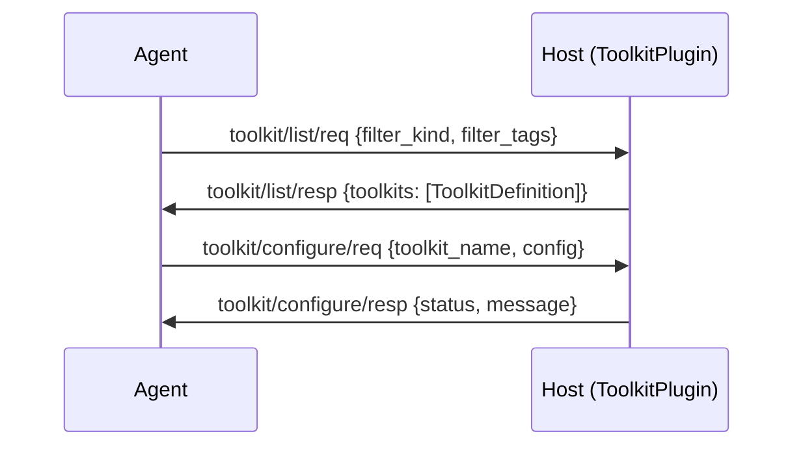

# Toolkits Capability Specification

## Capability Identity

| Property | Value |
|----------|-------|
| Enum | `A2ECapability.TOOLKITS` |
| String | `"toolkits"` |
| Plugin Type | `ToolkitPlugin` (abstract) |
| Namespace | `toolkit/*` |
| Message Count | 4 |

## Overview

The **toolkits** capability manages bundled collections of related tools — toolkits. A toolkit groups logically related tools (e.g., "filesystem", "database", "browser") and provides a configuration schema for credentials and settings. Unlike individual tools (which are stateless primitives), toolkits require initialization before their tools can be used, and they may carry credentials, API keys, or environment-specific configuration.

## Protocol Flow



## Message Types (4)

### toolkit/list/req — ToolkitListRequest

Agent → Host. Enumerate available toolkits.

| Field | Type | Required | Default | Description |
|-------|------|----------|---------|-------------|
| `type` | `str` | Yes | `"toolkit/list/req"` | Message type identifier |
| `id` | `str` | Yes | auto UUID | Message UUID |
| `version` | `str` | Yes | `"1.0"` | Protocol version |
| `ts` | `float` | Yes | auto | Unix epoch timestamp |
| `filter_kind` | `str` | No | `""` | Kind filter (empty = all) |
| `filter_tags` | `list[str]` | No | `[]` | Tag filter list |

### toolkit/list/resp — ToolkitListResponse

Host → Agent. Returns all available toolkit manifests.

| Field | Type | Required | Default | Description |
|-------|------|----------|---------|-------------|
| `type` | `str` | Yes | `"toolkit/list/resp"` | Message type identifier |
| `id` | `str` | Yes | auto UUID | Message UUID |
| `version` | `str` | Yes | `"1.0"` | Protocol version |
| `ts` | `float` | Yes | auto | Unix epoch timestamp |
| `req_id` | `str` | Yes | `""` | Echoes request ID |
| `toolkits` | `list[ToolkitDefinition]` | Yes | `[]` | Available toolkit definitions |

### toolkit/configure/req — ToolkitConfigureRequest

Agent → Host. Configure/initialize a toolkit with schema and credentials.

| Field | Type | Required | Default | Description |
|-------|------|----------|---------|-------------|
| `type` | `str` | Yes | `"toolkit/configure/req"` | Message type identifier |
| `id` | `str` | Yes | auto UUID | Message UUID |
| `version` | `str` | Yes | `"1.0"` | Protocol version |
| `ts` | `float` | Yes | auto | Unix epoch timestamp |
| `session_id` | `str` | Yes | `""` | Session from HandshakeResponse |
| `toolkit_name` | `str` | Yes | `""` | Toolkit to configure |
| `config` | `dict[str, Any]` | Yes | `{}` | Configuration values matching toolkit schema |

### toolkit/configure/resp — ToolkitConfigureResponse

Host → Agent. Acknowledges toolkit configuration.

| Field | Type | Required | Default | Description |
|-------|------|----------|---------|-------------|
| `type` | `str` | Yes | `"toolkit/configure/resp"` | Message type identifier |
| `id` | `str` | Yes | auto UUID | Message UUID |
| `version` | `str` | Yes | `"1.0"` | Protocol version |
| `ts` | `float` | Yes | auto | Unix epoch timestamp |
| `req_id` | `str` | Yes | `""` | Echoes request ID |
| `toolkit_name` | `str` | Yes | `""` | Configured toolkit name |
| `status` | `str` | Yes | `"ok"` | Configuration status: `ok`, `error`, `partial` |
| `message` | `str` | No | `None` | Human-readable status message |

## Data Models

### ToolkitDefinition

| Field | Type | Required | Default | Description |
|-------|------|----------|---------|-------------|
| `name` | `str` | Yes | — | Unique toolkit name |
| `alias` | `str` | No | `""` | Short display alias |
| `description` | `str` | No | `""` | Human-readable description |
| `category` | `str` | No | `""` | Classification category |
| `tags` | `list[str]` | No | `[]` | Classification tags |
| `icon_svg` | `str` | No | `None` | SVG icon for UI rendering |
| `schema` | `dict[str, Any]` | Yes | `{}` | **JSON Schema** for configuration (CRITICAL) |
| `tools` | `list[str]` | Yes | — | List of tool names bundled in this toolkit |
| `configured` | `bool` | No | `False` | Whether the toolkit has been configured |
| `version` | `str` | No | `"1.0.0"` | Toolkit version |

The `schema` field is the most important property — it defines the JSON Schema that the `config` field in `ToolkitConfigureRequest` must conform to. This enables:
- Client-side form generation
- Credential validation before submission
- Environment-specific configuration templates

## Error Handling

Errors are returned as `A2EError` messages with the following patterns:

| Scenario | Error Code | Description |
|----------|------------|-------------|
| Toolkit not found | `RUNTIME_ERROR` | Toolkit name doesn't match any registered toolkit |
| Configuration invalid | `RUNTIME_ERROR` | Config doesn't match toolkit schema |
| Unrecognized message | `INVALID_MESSAGE` | Message type not in toolkit namespace |

## Plugin Contract — ToolkitPlugin

```python
class ToolkitPlugin(A2EPlugin):
    name = "toolkit_plugin"

    @abstractmethod
    def _list_toolkits(self, msg) -> ToolkitListResponse:
        """Must return toolkit list. Override in subclass."""

    @abstractmethod
    def _configure_toolkit(self, msg) -> ToolkitConfigureResponse:
        """Configure a specific toolkit. Override in subclass."""

    def set_push_callback(self, fn):
        """Register push callback for toolkit-initiated events."""

    def emit_event(self, event):
        """Emit a push event to the agent."""
```

**Handler dispatch:**
- `ToolkitListRequest` → calls `_list_toolkits(msg)`
- `ToolkitConfigureRequest` → calls `_configure_toolkit(msg)`

**Push support:** Toolkits can emit server-initiated events (e.g., configuration status changes) via `set_push_callback` and `emit_event`.

## Wire Examples

### List Toolkits

```json
{"type":"toolkit/list/req","id":"tk1","version":"1.0","ts":1716123456.789,"filter_kind":"","filter_tags":[]}
```

```json
{"type":"toolkit/list/resp","id":"tk2","version":"1.0","ts":1716123456.800,"req_id":"tk1","toolkits":[{"name":"filesystem","alias":"fs","description":"File I/O toolkit","category":"io","tags":["fs","files"],"icon_svg":null,"schema":{"type":"object","properties":{"root_dir":{"type":"string","description":"Root directory for file operations"}},"required":["root_dir"]},"tools":["read_file","write_file","list_dir"],"configured":false,"version":"1.0.0"}]}
```

### Configure Toolkit

```json
{"type":"toolkit/configure/req","id":"tk3","version":"1.0","ts":1716123457.100,"session_id":"s1","toolkit_name":"filesystem","config":{"root_dir":"/home/user/workspace"}}
```

```json
{"type":"toolkit/configure/resp","id":"tk4","version":"1.0","ts":1716123457.200,"req_id":"tk3","toolkit_name":"filesystem","status":"ok","message":"Toolkit configured successfully"}
```

## Relationship to Other Capabilities

- **tools**: Toolkits group tools. Once a toolkit is configured, its tools appear in `tool/list/resp` with `toolkit` field set.
- **mcp**: MCP server tools are automatically registered as tools (not toolkits), since MCP manages its own configuration.
- **skills**: Skills may reference toolkits in their `toolkits` field to declare dependencies.

## Security Considerations

1. **Configuration secrets**: Toolkit `config` may contain API keys and credentials — must be encrypted in transit
2. **Schema validation**: Host validates `config` against toolkit `schema` before applying
3. **Capability gating**: Requires `toolkits` capability negotiated during handshake
