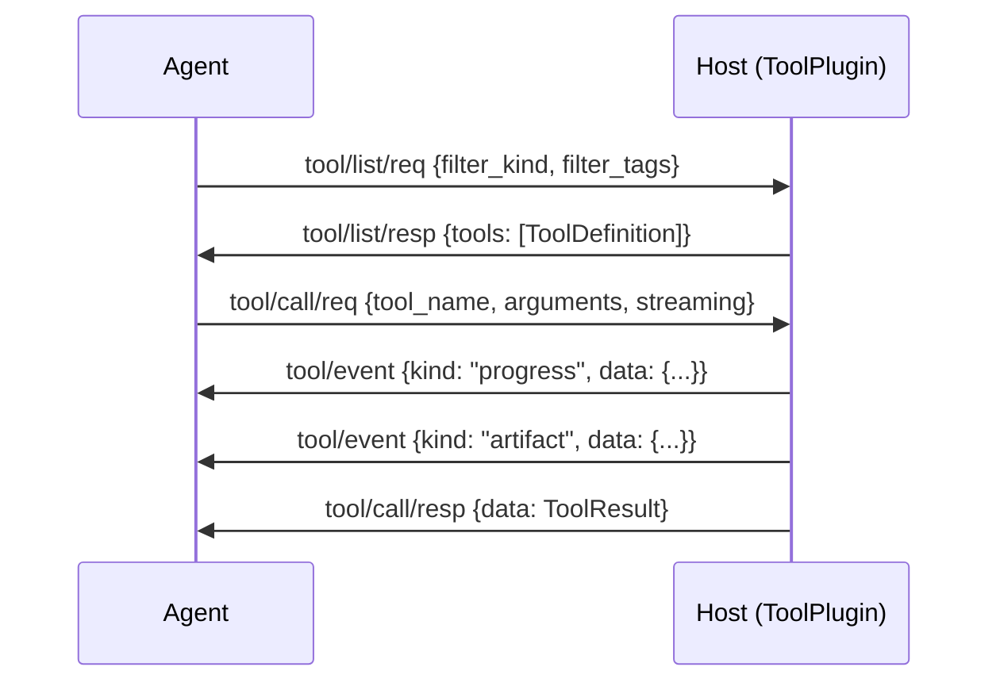

# Tools Capability Specification

## Capability Identity

| Property | Value |
|----------|-------|
| Enum | `A2ECapability.TOOLS` |
| String | `"tools"` |
| Plugin Type | `ToolPlugin` |
| Namespace | `tool/*` |
| Message Count | 5 |

## Overview

The **tools** capability provides native environment tool execution — primitive, stateless operations like file I/O, shell commands, HTTP requests, and code evaluation. Tools are the most fundamental building block for agent interaction with the host environment. Unlike skills (which are multi-step and LLM-driven), tools are synchronous, request/response-based, and optionally streaming.

## Protocol Flow



## Message Types (5)

### tool/list/req — ToolListRequest

Agent → Host. List or search available native tools.

When `query` is empty (default): returns non-deferred tools only (the active set).
When `query` is set: searches tools by name/description/tags, including deferred
ones if `include_deferred` is True.

| Field | Type | Required | Default | Description |
|-------|------|----------|---------|-------------|
| `type` | `str` | Yes | `"tool/list/req"` | Message type identifier |
| `id` | `str` | Yes | auto UUID | Message UUID |
| `version` | `str` | Yes | `"1.0"` | Protocol version |
| `ts` | `float` | Yes | auto | Unix epoch timestamp |
| `filter_kind` | `str` | No | `""` | Tool kind filter (empty = all) |
| `filter_tags` | `list[str]` | No | `[]` | Tag filter list (AND semantics) |
| `query` | `str` | No | `""` | Search query — empty = list mode, non-empty = search mode |
| `include_deferred` | `bool` | No | `False` | Include deferred tools in results (search mode) |

### tool/list/resp — ToolListResponse

Host → Agent. Returns all available tool manifests.

| Field | Type | Required | Default | Description |
|-------|------|----------|---------|-------------|
| `type` | `str` | Yes | `"tool/list/resp"` | Message type identifier |
| `id` | `str` | Yes | auto UUID | Message UUID |
| `version` | `str` | Yes | `"1.0"` | Protocol version |
| `ts` | `float` | Yes | auto | Unix epoch timestamp |
| `req_id` | `str` | Yes | `""` | Echoes request ID |
| `tools` | `list[ToolDefinition]` | Yes | `[]` | Available tool definitions |

### tool/call/req — ToolCallRequest

Agent → Host. Execute a native tool.

| Field | Type | Required | Default | Description |
|-------|------|----------|---------|-------------|
| `type` | `str` | Yes | `"tool/call/req"` | Message type identifier |
| `id` | `str` | Yes | auto UUID | Message UUID |
| `version` | `str` | Yes | `"1.0"` | Protocol version |
| `ts` | `float` | Yes | auto | Unix epoch timestamp |
| `session_id` | `str` | Yes | `""` | Session from HandshakeResponse |
| `tool_name` | `str` | Yes | — | Must match ToolDefinition.name |
| `arguments` | `dict` | Yes | — | Input arguments validated against tool schema |
| `correlation_id` | `str` | No | `""` | Ties this call to an agent turn for tracing |
| `streaming` | `bool` | No | `False` | If True, host emits ToolEvent messages before final resp |
| `timeout` | `int` | No | `30` | Per-call wall-clock limit (seconds) |

### tool/call/resp — ToolCallResponse

Host → Agent. Final result of a tool call.

| Field | Type | Required | Default | Description |
|-------|------|----------|---------|-------------|
| `type` | `str` | Yes | `"tool/call/resp"` | Message type identifier |
| `id` | `str` | Yes | auto UUID | Message UUID |
| `version` | `str` | Yes | `"1.0"` | Protocol version |
| `ts` | `float` | Yes | auto | Unix epoch timestamp |
| `req_id` | `str` | Yes | `""` | Echoes request ID |
| `data` | `ToolResult` | Yes | — | Tool execution result |
| `created_at` | `float` | No | auto | Result creation timestamp |

### tool/event — ToolEvent

Host → Agent. Zero or more streaming events during a tool call. Extends `A2EEvent`.

| Field | Type | Required | Default | Description |
|-------|------|----------|---------|-------------|
| `type` | `str` | Yes | `"tool/event"` | Message type identifier |
| `id` | `str` | Yes | auto UUID | Message UUID |
| `version` | `str` | Yes | `"1.0"` | Protocol version |
| `ts` | `float` | Yes | auto | Unix epoch timestamp |
| `kind` | `str` | Yes | — | Event kind (see below) |
| `req_id` | `str` | Yes | `""` | Correlates to ToolCallRequest ID |
| `data` | `dict` | Yes | `{}` | Event payload |
| `seq` | `int` | Yes | `0` | Monotonic sequence number |

**Event kinds and their `data` shapes:**

| Kind | Data Shape | Description |
|------|------------|-------------|
| `progress` | `{ "pct": int, "message": str }` | Progress update |
| `status` | `{ "message": str }` | One-liner status update |
| `artifact` | `{ "name": str, "mime": str, "chunk": str, "final": bool }` | Partial/incremental data chunk |
| `log` | `{ "level": str, "message": str }` | Debug log line |

## Data Models

### ToolDefinition

| Field | Type | Required | Default | Description |
|-------|------|----------|---------|-------------|
| `name` | `str` | Yes | — | Unique tool name (e.g. `"read_file"`) |
| `description` | `str` | Yes | — | Human-readable description |
| `input_parameters` | `list[ToolParameter]` | No | `[]` | Input parameter schema |
| `output_parameters` | `list[ToolParameter]` | No | `[]` | Output parameter schema |
| `streaming` | `bool` | No | `True` | Supports streaming events |
| `idempotent` | `bool` | No | `False` | Safe to retry on failure |
| `tags` | `list[str]` | No | `[]` | Classification tags |
| `version` | `str` | No | `"1.0.0"` | Tool version |
| `toolkit` | `str` | No | `None` | Parent toolkit name |
| `defer_loading` | `bool` | No | `False` | Exclude from initial list; discoverable via search |

### ToolParameter

| Field | Type | Required | Default | Description |
|-------|------|----------|---------|-------------|
| `name` | `str` | Yes | — | Parameter name |
| `type` | `str` | Yes | — | JSON Schema type: `string`, `integer`, `boolean`, `object`, `array` |
| `description` | `str` | Yes | — | Parameter description |
| `required` | `bool` | No | `False` | Whether this parameter is required |
| `enum` | `list[str]` | No | `None` | Allowed values for enum types |
| `properties` | `dict[str, ToolParameter]` | No | `None` | Nested properties for object types |

### ToolResult

| Field | Type | Required | Default | Description |
|-------|------|----------|---------|-------------|
| `success` | `bool` | Yes | — | Whether execution succeeded |
| `tool_name` | `str` | Yes | — | Tool that produced this result |
| `data` | `Any` | No | `None` | Result data |
| `summary` | `Any` | No | `None` | Human-readable summary |
| `truncated` | `bool` | No | `False` | Output was truncated |
| `exit_code` | `int` | No | `None` | Process exit code (if applicable) |
| `error` | `str` | No | `None` | Error message |
| `error_code` | `str` | No | `None` | Machine-readable error code |
| `duration_ms` | `int` | Yes | — | Execution time in milliseconds |
| `events` | `list[ToolEvent]` | No | `[]` | Collected streaming events |

## Error Codes — ToolErrorCode

| Code | Enum Value | Description | Retryable |
|------|------------|-------------|-----------|
| `unknown_tool` | `UNKNOWN_TOOL` | Tool name not found in registry | No |
| `tool_denied` | `TOOL_DENIED` | Tool not allowed by policy/capability check | No |
| `tool_error` | `TOOL_ERROR` | Tool execution failed | Yes |

## Plugin Contract — ToolPlugin

```python
class ToolPlugin(A2EPlugin):
    name = "base_tool"

    @abstractmethod
    def _list_tools(self) -> list[ToolDefinition]:
        """Must return tool manifest."""

    @abstractmethod
    def _execute_tool(self, tool_name: str, arguments: dict) -> dict:
        """Execute tool logic. Returns JSON-serializable dict.
        Raise exception for failure."""

    def _search_tools(
        self,
        query: str,
        filter_tags: list[str] | None = None,
        tools: list[ToolDefinition] | None = None,
    ) -> list[ToolDefinition]:
        \"\"\"On-demand tool discovery. Default: substring match on name/description/tags.
        Override for BM25, embeddings, or custom search strategies.\"\"\"

    def set_event_callback(self, fn: Callable[[ToolEvent], None]):
        \"\"\"Register streaming event callback.\"\"\"

    def emit(self, kind: str, data: dict):
        \"\"\"Emit streaming event during execution.\"\"\"
```

**Handler dispatch:**
- `ToolListRequest` with empty `query` → calls `_list_tools()`, filters out `defer_loading=True`, returns `ToolListResponse`
- `ToolListRequest` with non-empty `query` → calls `_search_tools(query, filter_tags)` for on-demand discovery, returns `ToolListResponse`
- `ToolCallRequest` → attaches streaming callback, calls `_execute_tool()`, returns `ToolCallResponse` or `A2EError`

**Execution wrapper:** `_execute()` provides safe execution with:
- Error catching and conversion to `A2EError`
- Streaming event emission via `emit()`
- Audit logging via `self.audit_handle()`

## Client API — ToolAPI

```python
from a2e.caps.tools.client import ToolAPI

tools = ToolAPI(client)

# List active (non-deferred) tools — the ~500-token set the model should see
tool_list = tools.list()
# Returns List[ToolDefinition], cached in client._tools_cache

# Search all tools by name/description/tags (including deferred)
search_results = tools.list(query="github", include_deferred=True)
for t in search_results:
    print(f"  {t.name}: {t.description}")

# Filter by tags
network_tools = tools.list(tags=["network"])
print(f"Network tools: {[t.name for t in network_tools]}")

# Call a tool
result = tools.call(
    tool_name="read_file",
    arguments={"path": "/etc/hostname"},
    streaming=False,
    on_event=None,          # Callback for ToolEvents
    timeout=30.0,
    correlation_id=None
)
# Returns ToolResult

if result.success:
    print(result.data)
else:
    print(f"Error: {result.error_code} - {result.error}")
```

## Wire Examples

### List Tools

```json
{"type":"tool/list/req","id":"a1b2c3","version":"1.0","ts":1716123456.789,"filter_kind":"","filter_tags":[]}
```

```json
{"type":"tool/list/resp","id":"d4e5f6","version":"1.0","ts":1716123456.800,"req_id":"a1b2c3","tools":[{"name":"read_file","description":"Read file contents","input_parameters":[{"name":"path","type":"string","description":"File path","required":true}],"output_parameters":[],"streaming":true,"idempotent":true,"tags":["fs"],"version":"1.0.0","toolkit":null}]}
```

### Call Tool (with streaming)

```json
{"type":"tool/call/req","id":"g7h8i9","version":"1.0","ts":1716123457.100,"session_id":"s1k2l3","tool_name":"read_file","arguments":{"path":"/etc/hostname"},"correlation_id":"","streaming":true,"timeout":30}
```

```json
{"type":"tool/event","id":"j0k1l2","version":"1.0","ts":1716123457.150,"kind":"progress","req_id":"g7h8i9","data":{"pct":50,"message":"Reading..."},"seq":0}
```

```json
{"type":"tool/call/resp","id":"m3n4o5","version":"1.0","ts":1716123457.200,"req_id":"g7h8i9","data":{"success":true,"tool_name":"read_file","data":{"content":"my-host"},"duration_ms":100},"created_at":1716123457.200}
```

## Security Considerations

1. **Capability gating**: Tools require the `tools` capability to be negotiated during handshake
2. **Policy enforcement**: Host may deny tool execution via `TOOL_DENIED` error code
3. **Timeout enforcement**: Per-call timeout prevents runaway tool execution (default: 30s)
4. **Input validation**: Arguments validated against ToolParameter schema before execution
5. **Audit trail**: All tool calls are logged via `audit_handle()`
