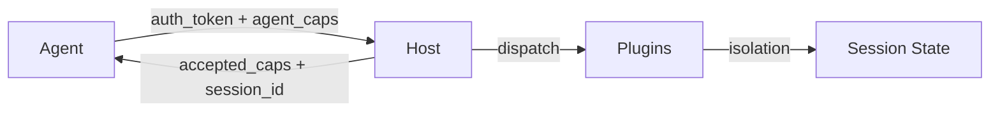

# Security & Trust

A2E's security model, trust boundaries, and hardening guidelines for production deployments.

---

## Trust Model

A2E operates on a **two-party trust model** between an Agent and a Host:



- The **Agent** is trusted after authenticating with a valid `auth_token`
- The **Host** is the authority that decides which capabilities to enable
- **Plugins** execute within the host's trust boundary and have access to session state
- **Sessions** are isolated from each other — one agent cannot access another's state

### Trust Boundaries

| Boundary | Direction | Protection |
|----------|-----------|------------|
| Agent → Host | Inbound | `auth_token` validation during handshake |
| Host → Agent | Outbound | Capability gating — only accepted capabilities are available |
| Session → Session | Lateral | Session isolation — separate executors and state |
| Plugin → Plugin | Lateral | Type registry isolation — plugins only handle their declared types |
| Host → OS | Outbound | Plugin sandboxing (Docker for skills, `shell=False` for proc) |

---

## Authentication

### Current Model: Shared Secret

A2E currently uses a single `auth_token` for authentication:

```yaml
# config.yaml
server:
  auth_token: "dev-secret"
```

During handshake, the client must present this token:

```python
client = A2EClient(
    transport=transport,
    agent_id="my-agent",
    auth_token="dev-secret",
    agent_caps=["tools", "memory"]
)
```

If the token is invalid, the handshake returns `ok=false` with reason `auth_failed`.

### Limitations

- **Single token**: All agents share the same auth token — no per-agent identity
- **No OAuth / mTLS**: No support for industry-standard auth protocols
- **No RBAC**: All authenticated agents get the same access level
- **Token in plaintext**: The auth token is transmitted in the handshake message (use HTTPS in production)

### Production Hardening

For production deployments:

1. **Always use HTTPS** — Put A2E behind a reverse proxy (nginx, Caddy) with TLS termination
2. **Generate strong tokens** — Use `openssl rand -hex 32` or equivalent
3. **Rotate tokens** — Change auth tokens on a regular schedule
4. **Network isolation** — Bind to `127.0.0.1` or use a VPN/private network
5. **Add a reverse proxy** — Handle rate limiting, IP allowlisting, and TLS at the proxy layer

```nginx
# Example: nginx reverse proxy with TLS
server {
    listen 443 ssl;
    ssl_certificate /etc/ssl/a2e.crt;
    ssl_certificate_key /etc/ssl/a2e.key;

    location / {
        proxy_pass http://127.0.0.1:8765;
        proxy_set_header Host $host;
        proxy_set_header X-Real-IP $remote_addr;

        # Rate limiting
        limit_req zone=a2e burst=20 nodelay;
    }
}
```

---

## Transport Security

### HTTP Mode (Production)

When using `HTTPTransport`, all communication flows over HTTP. **Without TLS, everything is in plaintext**, including the auth token and all message payloads.

| Risk | Mitigation |
|------|-----------|
| Eavesdropping | TLS termination via reverse proxy |
| Token exposure | HTTPS only — never send auth over plain HTTP |
| Session hijacking | Bind to localhost + reverse proxy; use short-lived session IDs |
| SSE stream tampering | TLS; validate message integrity in client |

### Direct Mode (Development)

`DirectTransport` operates entirely in-process using Python queues. No data leaves the process, so transport security is not a concern. Use this for:

- Local development and testing
- RL step loops
- In-process agent-environment pairs

---

## Capability-Specific Security

### Tools

| Concern | Protection |
|---------|-----------|
| Unapproved tool execution | `TOOL_DENIED` error for tools not in allowlist |
| Arbitrary code execution | Tools must be explicitly registered — no dynamic execution |
| Input validation | Arguments validated against JSON Schema before execution |

**Best practice**: Register only the tools your agent needs. Avoid tools like `python_eval` that use bare `exec()` in production.

### Memory

| Concern | Protection |
|---------|-----------|
| Cross-session data leakage | Session-scoped working memory; semantic/episodic memory keyed by session |
| Unbounded memory growth | `working_limit`, `episodic_limit`, `semantic_limit` config options |
| Sensitive data storage | Encrypt memory stores at rest (SQLite DB encryption, encrypted filesystem) |

### Skills

| Concern | Protection |
|---------|-----------|
| Arbitrary code execution | Run skills in Docker containers (sandbox isolation) |
| LLM provider access | Restrict `llm_override` to approved providers |
| Credential leakage | Scope LLM credentials in `llm_override` per-skill |
| Runaway execution | Per-call timeout enforcement |

### Processes (Proc)

| Concern | Protection |
|---------|-----------|
| Shell injection | `shell=False` in `Popen` — no shell metacharacter expansion |
| Fork bombs | `proc_limit` error enforces maximum concurrent processes |
| Zombie processes | Auto-kill on timeout; session-scoped process tracking |
| Command allowlist | Only pre-approved commands can be spawned |

### Chains

| Concern | Protection |
|---------|-----------|
| Infinite loops | DAG cycle detection rejects cyclic chains at validation time |
| Resource exhaustion | Node count limits; chain-level timeout enforcement |
| Unbounded parallelism | Thread pool limits; daemon threads with forced termination on timeout |

### Learning

| Concern | Protection |
|---------|-----------|
| Feedback spoofing | `env`-source feedback must not be spoofable by the agent |
| Score manipulation | Scores validated to `[-1.0, +1.0]` range |
| Unbounded storage | Host should enforce experience volume limits |

### Toolkits

| Concern | Protection |
|---------|-----------|
| Configuration secrets | Toolkit `config` may contain API keys — must be encrypted in transit (HTTPS) |
| Schema bypass | Host validates `config` against toolkit JSON Schema before applying |

### MCP Bridge

| Concern | Protection |
|---------|-----------|
| MCP server trust | Only connect to trusted MCP servers; validate server certificates |
| Credential proxying | MCP server credentials are stored on the host, not sent to agents |
| Tool injection | MCP tools are registered as standard A2E tools — subject to same gating |

### Subagents

| Concern | Protection |
|---------|-----------|
| Recursive spawning | Maximum nesting depth enforced by host |
| Memory leakage | `isolated` and `snapshot` scopes prevent cross-agent data access |
| Dangerous tool access | `restricted` and `isolated` scopes limit available tools |
| Infinite loops | `max_steps` and `timeout_seconds` limits |
| Orphaned children | Cancel requests propagate to all child subagents |

---

## Audit & Observability

### Audit Logging

Every plugin handler records an `AuditEntry` with:

| Field | Purpose |
|-------|---------|
| `session_id` | Which session generated the event |
| `req_id` | Correlation to the original request |
| `success` | Whether the handler completed normally |
| `duration_ms` | How long the handler took |
| `error_code` | What went wrong (if anything) |
| `input_bytes` / `output_bytes` | Payload sizes for capacity monitoring |

Audit is **best-effort** — failures are caught and never crash the handler.

```yaml
audit:
  enabled: true
  path: "/var/log/a2e/audit.jsonl"
  rotate:
    max_bytes: 10485760   # 10 MB
    backup_count: 5
  session_id_source: "uuid"  # or "host_id"
```

### Monitoring Recommendations

1. **Watch error rates** — Track `success=false` audit entries; spike in errors may indicate attacks or misconfigurations
2. **Monitor payload sizes** — Unusually large `input_bytes` may indicate injection attempts
3. **Track session lifetimes** — Long-lived sessions may be abandoned connections
4. **Alert on auth failures** — Repeated `auth_failed` handshakes suggest brute-force attempts
5. **Log rotation** — Ensure audit logs don't fill disk; use the built-in `RotatingFileHandler`

---

## Plugin Security Checklist

Before deploying a custom plugin to production, verify:

- [ ] **Input validation** — All handler inputs validated against Pydantic schemas
- [ ] **No bare exec/eval** — Never use `exec()`, `eval()`, or `__import__()` with user input
- [ ] **Resource limits** — Enforce timeouts, size limits, and concurrency caps
- [ ] **No credential leakage** — Never log or expose secrets in error messages or events
- [ ] **Error handling** — Catch all exceptions; return `A2EError` instead of crashing
- [ ] **Audit integration** — Let `audit_handle()` record all invocations
- [ ] **Session isolation** — Never share state between sessions unless explicitly designed
- [ ] **No filesystem escape** — Sandbox file operations to allowed directories
- [ ] **No network escape** — Don't make outbound connections to untrusted hosts
- [ ] **Dependency audit** — Review third-party dependencies for known vulnerabilities

---

## Threat Model Summary

| Threat | Impact | Mitigation |
|--------|--------|-----------|
| Unauthorized access | Agent accesses host without auth | `auth_token` + HTTPS + network isolation |
| Capability escalation | Agent uses capabilities not negotiated | Capability gating; `A2EError` for unauthorized types |
| Cross-session access | Agent reads another session's data | Session isolation; separate executors |
| Code injection | Agent executes arbitrary code | Tool allowlist; `shell=False`; Docker sandboxing |
| Memory exhaustion | Agent fills memory with junk | Per-tier limits (`working_limit`, etc.) |
| Process explosion | Agent spawns unlimited processes | `proc_limit` enforcement; timeouts |
| Chain cycles | Agent submits cyclic DAG | Cycle detection at validation time |
| Credential theft | Agent reads host credentials | Encrypt secrets in transit; no credential logging |
| DoS via large payloads | Agent sends oversized messages | Payload size limits; transport-level constraints |
| MCP server compromise | Compromised MCP server attacks host | Trust only known MCP servers; validate certificates |

---

## Reporting Security Issues

If you discover a security vulnerability in A2E:

1. **Do not** file a public issue
2. Contact the maintainers through the project's security reporting channel
3. Include: affected component, steps to reproduce, and potential impact
4. Allow reasonable time for a response before public disclosure

---

## Roadmap

The following security improvements are planned or under consideration:

- **Per-agent authentication** — Unique credentials per agent identity
- **OAuth 2.0 / mTLS support** — Industry-standard authentication protocols
- **Role-based access control** — Different permission levels for different agents
- **Message signing** — HMAC or digital signatures on protocol messages
- **Encrypted session state** — At-rest encryption for snapshot/restore
- **Network policies** — Fine-grained allowlisting for plugin network access
- **Audit log integrity** — Tamper-evident audit logs (hash chaining)
